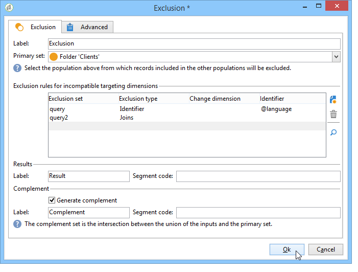

# Esclusione{#exclusion}

Un **Esclusione** L&#39;attività -type crea un oggetto basato su un oggetto principale da cui vengono estratti uno o più oggetti.

Per configurare questa attività, immetti la relativa etichetta e seleziona il set di destinatari principale: la popolazione del set principale ti consente di costruire il risultato. Verranno esclusi i profili condivisi dal set principale e almeno una delle attività iniziali.

>[!NOTE]
>
>Per ulteriori informazioni sulla configurazione e sull’utilizzo dell’attività di esclusione, consulta [Esclusione di una popolazione (esclusione)](targeting-workflows.md#excluding-a-population--exclusion-).

Controlla la **[!UICONTROL Generate complement]** se desideri sfruttare il gruppo rimanente. Il complemento conterrà la popolazione entrante principale meno la popolazione uscente. Verrà quindi aggiunta all’attività una transizione di output aggiuntiva, come segue:

## Esempi di esclusione {#exclusion-examples}

L&#39;esempio seguente cerca di compilare un elenco di destinatari di età compresa tra i 18 e i 30 anni, escludendo i residenti di Parigi.

1. Inserisci e apri un **[!UICONTROL Exclusion]** Attività di tipo -type in seguito a due query. La prima query esegue il targeting dei destinatari che vivono a Parigi. La seconda query esegue il targeting delle persone di età compresa tra i 18 e i 30 anni.
1. Inserisci il set principale. Qui il set principale è **18-30 anni** query. Gli elementi relativi al secondo gruppo saranno esclusi dal risultato finale.
1. Controlla la **[!UICONTROL Generate complement]** se desideri sfruttare i dati che rimangono dopo l’esclusione. In questo caso, il complemento è costituito da beneficiari di età compresa tra i 18 e i 30 anni che vivono a Parigi.
1. Approva la configurazione di esclusione, quindi inserisci nel risultato un’attività di aggiornamento elenco. Se necessario, puoi anche inserire un ulteriore aggiornamento dell’elenco del complemento.
1. Esegui il flusso di lavoro. In questo esempio, il risultato è costituito da destinatari di età compresa tra i 18 e i 30 anni, ma quelli che vivono a Parigi sono esclusi e inviati al complemento.

   

## Parametri di input {#input-parameters}

* tableName
* schema

Ogni evento in entrata deve specificare una destinazione definita da questi parametri.

## Parametri di output {#output-parameters}

* tableName
* schema
* recCount

Questo insieme di tre valori identifica il target risultante dall’esclusione. **[!UICONTROL tableName]** è il nome della tabella che registra gli identificativi target, **[!UICONTROL schema]** è lo schema della popolazione (in genere nms:recipient) e **[!UICONTROL recCount]** è il numero di elementi nella tabella.

La transizione associata al complemento ha gli stessi parametri.
