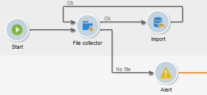

# Raccolta file{#file-collector}

Il **Raccoglitore file** controlla l’arrivo di uno o più file in una directory e attiva la relativa transizione per ogni file ricevuto. Per ogni evento, un **[!UICONTROL filename]** la variabile contiene il nome completo del file ricevuto. I file raccolti vengono spostati in un’altra directory a scopo di archiviazione e per assicurarsi che vengano conteggiati una sola volta.

Per impostazione predefinita, l&#39;agente di raccolta file è un&#39;attività persistente che verifica la presenza di file nei momenti specificati dalla pianificazione.

I file devono trovarsi nel server in cui viene eseguito il modulo wfserver responsabile del flusso di lavoro. Se in una singola istanza vengono distribuiti più moduli wfserver, è necessario specificare l&#39;affinità delle attività che utilizzano questi file o l&#39;affinità complessiva del flusso di lavoro.

## Properties {#properties}

La prima scheda della **[!UICONTROL File collector]** activity (attività) consente di selezionare la directory di origine e, se necessario, filtrare i file raccolti. Le altre schede sono descritte in dettaglio [E-mail in entrata](inbound-emails.md) (**[!UICONTROL Schedule]** e **[!UICONTROL Expiry]** schede).

1. **Download dei file**

   * **[!UICONTROL Directory]**

     Directory contenente i file da scaricare. Questa directory deve essere creata in precedenza sul server: se non esiste, verrà generato un errore.

   * **[!UICONTROL Filter]**

     Vengono considerati solo i file che corrispondono a questo filtro. Gli altri file nella directory vengono ignorati. Se il filtro è vuoto, vengono presi in considerazione tutti i file nella directory. Esempi di filtro: **&#42;.zip**, **import-&#42;.txt**.

   * **[!UICONTROL Stop as soon as a file has been processed]**

     Se questa opzione è abilitata, l’attività termina dopo la ricezione del primo file. Se nella directory sono presenti più file corrispondenti al filtro, ne verrà preso in considerazione solo uno. Questa opzione garantisce che venga inviato un solo evento. Il file preso in considerazione è il primo dell’elenco in ordine alfabetico.

     Per un’attività non pianificata, se nella directory specificata non è presente alcun file corrispondente al filtro e se **[!UICONTROL Process file nonexistence]** non è abilitata, verrà generato un errore.

   * **[!UICONTROL Execution schedule]**

     Determina la frequenza del controllo della presenza di file tramite i parametri della **[!UICONTROL Schedule]** scheda.

1. **Gestione degli errori**

   Sono disponibili le due opzioni seguenti:

   * **[!UICONTROL Process file nonexistence]**

     Questa opzione avvia una transizione speciale ogni volta che nella directory specificata non viene trovato alcun file corrispondente al filtro.

     Se l’attività non è pianificata, questa transizione verrà attivata una sola volta.

   * **[!UICONTROL Processing errors]**

     Questa opzione consente di visualizzare una transizione speciale da attivare in caso di errore. In questo caso, il flusso di lavoro non passa allo stato di errore e continua l’esecuzione

     Gli errori presi in considerazione sono errori del file system (file non spostabile, directory non accessibile, ecc.).

     Questa opzione non elabora gli errori relativi alla configurazione dell’attività, ovvero valori non validi.

1. **Cronologia**

   Consulta la sezione **[!UICONTROL File historization]** fai clic qui: [Download web](web-download.md).

Impossibile determinare l&#39;ordine di elaborazione dei file. Per elaborare un set di file in sequenza, utilizzare **[!UICONTROL Stop as soon as a file has been processed]** e creare un ciclo continuo. In questo caso, i file verranno elaborati in ordine alfabetico. Il **[!UICONTROL Process file nonexistence]** consente di completare l&#39;iterazione.

## Parametri di output {#output-parameters}

* nomefile: nome file completo. Questo è il nome del file dopo che è stato spostato nella directory di storicizzazione. Il percorso è quindi diverso, ma il nome è diverso anche se nella directory esiste già un altro file con lo stesso nome. L’estensione viene mantenuta.
