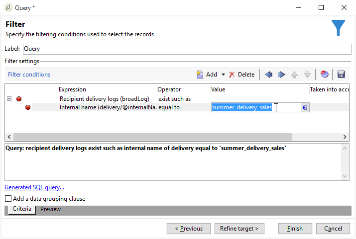

# Filtrare i destinatari duplicati {#filtering-duplicated-recipients}

In questo esempio, vogliamo filtrare i destinatari che compaiono due o più volte in una consegna per recuperare i profili duplicati.

Per creare questo esempio, attieniti alla seguente procedura:

1. Trascina una **[!UICONTROL Query]** in un flusso di lavoro e aprire l’attività.
1. Clic **[!UICONTROL Edit query]** e impostare le dimensioni di destinazione e filtro su **[!UICONTROL Recipients]**.

   

1. Definisci la seguente condizione di filtro per eseguire il targeting dei destinatari esistenti nel registro di consegna. Scegli **Registro di consegna per destinatari (broadlog)** nel **Espressione** , scegli **esistono come** nel **Operatore** colonna.

   

1. Definisci la seguente condizione di filtro per eseguire il targeting della consegna. Scegli **[!UICONTROL Internal name]** nella colonna Espressione e **[!UICONTROL equal to]** nella colonna Operatore.
1. Nella colonna Valore aggiungi il nome interno della consegna di destinazione.

   

1. Con un **[!UICONTROL AND]** operatore, ripeti le stesse operazioni per altre consegne.

   

La transizione in uscita contiene i destinatari duplicati target delle consegne.
