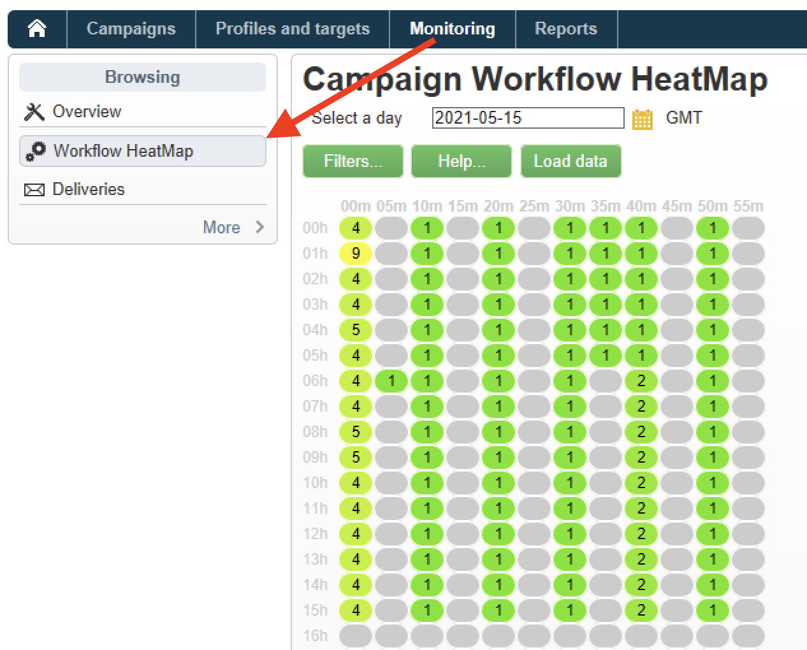

# Flusso di lavoro HeatMap {#workflow-heatmap}

La mappa di calore dei flussi di lavoro di Campaign consiste in una rappresentazione grafica codificata per colori di tutti i flussi di lavoro attualmente in esecuzione. È disponibile solo per **amministratori di campagne**.

## Introduzione a Workflow HeatMap {#about-the-workflow-heatmap}

Grazie a una rapida panoramica sul numero di flussi di lavoro simultanei, Workflow HeatMap consente agli amministratori della piattaforma Adobe Campaign di monitorare il carico sull’istanza e pianificare i flussi di lavoro di conseguenza.

Più precisamente, aiuta gli amministratori di piattaforma a:

* Visualizzare e comprendere i flussi di lavoro simultanei
* Filtrare i flussi di lavoro per durata per vedere quali potrebbero presentare problemi
* Filtra le attività per durata per vedere quali attività possono incontrare problemi
* Trovare facilmente singoli flussi di lavoro e le attività correlate ad essi (con la relativa durata)
* Filtra per tipo di flusso di lavoro: [flussi di lavoro tecnici](technical-workflows.md) o [flussi di lavoro campagne](campaign-workflows.md)
* Cercare un flusso di lavoro specifico da analizzare

>[!NOTE]
>
>Oltre alla **Workflow Heatmap**, puoi creare un flusso di lavoro che ti consenta di monitorare lo stato di un set di flussi di lavoro e inviare messaggi ricorrenti ai supervisori. Per ulteriori informazioni, consulta la [sezione dedicata](workflow-supervision.md).

L&#39;utilizzo di Workflow HeatMap richiede una buona comprensione dei seguenti concetti: [Flussi di lavoro](about-workflows.md), [Attività](activities.md) e [Best practice per i flussi di lavoro](workflow-best-practices.md).

## Personalizzare la Workflow HeatMap {#using-the-heatmap}

>[!NOTE]
>
>Se nel Workflow HeatMap non viene visualizzato alcun dato, fare clic sul pulsante **[!UICONTROL Load data]**.

1. Vai a **[!UICONTROL Monitoring]** e fai clic sul collegamento **[!UICONTROL Workflow HeatMap]** per visualizzare la pagina **[!UICONTROL Campaign Workflow HeatMap]**.

   

1. Fare clic sul calendario per selezionare un giorno.

   Per impostazione predefinita, la pagina mostra l’attività del flusso di lavoro per il giorno corrente. Puoi modificarlo e selezionare un giorno qualsiasi nel passato.

   >[!NOTE]
   > 
   >Per impostazione predefinita, il fuso orario Workflow HeatMap è quello definito per l’utente amministratore corrente. Ad esempio, potrebbe essere utile modificarlo se non ti trovi nella stessa area degli utenti marketing con cui stai lavorando.

1. Fai clic sul pulsante **[!UICONTROL Filters]**.

   

1. Utilizzare il dispositivo di scorrimento per impostare la durata minima da 0 secondi a 1 ora. Questo consente di cercare solo i flussi di lavoro in esecuzione per più di un certo numero di secondi o minuti.

   

1. È inoltre possibile scegliere un workflow specifico dall&#39;elenco a discesa **[!UICONTROL Workflows]**.

   

   >[!NOTE]
   >
   >Il filtro **[!UICONTROL Min duration]** è applicato. Se non riesci a trovare un flusso di lavoro specifico, reimposta la durata minima su 0 in modo che tutti i flussi di lavoro vengano visualizzati nell’elenco.

1. Puoi anche filtrare in base a **[!UICONTROL Workflow type]**:

   * **[!UICONTROL Technical]**: vengono visualizzati solo [flussi di lavoro tecnici incorporati](technical-workflows.md) e [flussi di lavoro di gestione dati](targeting-workflows.md#data-management).
   * **[!UICONTROL Marketing]**: vengono visualizzati solo i flussi di lavoro collegati a una campagna di marketing, noti come [flussi di lavoro campagna](campaign-workflows.md).

1. Per cercare un flusso di lavoro specifico per nome, è inoltre possibile utilizzare il campo **[!UICONTROL Workflow name filter]**.

1. Se sono stati modificati alcuni flussi di lavoro nell&#39;intervallo di tempo compreso tra, fare clic sul pulsante **[!UICONTROL Reload data]** per aggiornare i dati visualizzati nella griglia.

## Interpretare la Workflow HeatMap {#reading-the-heatmap}

La mappa di calore del flusso di lavoro della campagna è una griglia naturalmente leggibile dall’alto a sinistra verso il basso a destra, che consente di trovare le &quot;zone calde&quot; con una gamma di colori da verde a rosso.

* Le celle rosse più scure corrispondono ai periodi in cui è in esecuzione un numero elevato di flussi di lavoro contemporaneamente.
* Le celle grigie corrispondono ai periodi in cui non è in esecuzione alcun flusso di lavoro.

Per informazioni sull&#39;applicazione del codice colore e su come esplorare la mappa di calore, fare clic sul pulsante **[!UICONTROL Help]**.

Ogni riga rappresenta un&#39;ora del giorno e ogni cella rappresenta 5 minuti dell&#39;ora.

La griglia mostra tutti i flussi di lavoro in esecuzione contemporaneamente per ciascuno di questi periodi di 5 minuti.

Nell’esempio seguente, tra le 8.00 e le 8.05 sono in esecuzione tre flussi di lavoro (indipendentemente dalla durata):

1. Fai clic su una cella colorata per visualizzare i dettagli di tutti i flussi di lavoro simultanei in esecuzione durante questo periodo.

   

   Per ogni flusso di lavoro, vengono elencate tutte le attività in esso contenute, con la relativa durata.

1. Fai clic sull’ID o sul nome del flusso di lavoro per aprirlo direttamente.
1. Per tornare alla visualizzazione **[!UICONTROL Campaign Workflow HeatMap]**, fare clic sul pulsante **[!UICONTROL Home]**.

## Casi di utilizzo: utilizza la mappa di calore per eseguire azioni {#use-cases--using-the-heatmap-to-take-actions}

Esistono due casi principali in cui la mappa di calore del flusso di lavoro di Campaign può essere utile.

### Ridurre il numero di flussi di lavoro simultanei {#reducing-the-number-of-concurrent-workflows}

In qualità di amministratore di Campaign, la Workflow HeatMap può aiutarti a comprendere il carico sull’istanza e a pianificare flussi di lavoro esistenti o nuovi nei momenti opportuni.

1. Dalla visualizzazione **[!UICONTROL Campaign Workflow HeatMap]**, fare clic sul pulsante **[!UICONTROL Filters]**.
1. Imposta la durata su alcuni secondi o minuti.
1. Escludi i flussi di lavoro più brevi che non sono significativi aumentando il filtro della durata.

   

1. Esplora i risultati per comprendere il carico sull’istanza e intraprendere le azioni appropriate:

   * Se riscontri problemi di prestazioni e nella griglia sono visualizzate una o più celle rosse, puoi modificare gli orari di inizio di diversi flussi di lavoro. Chiedere agli utenti marketing di spostare manualmente i flussi di lavoro dai periodi di attività (periodi &quot;caldi&quot;) a quelli più disponibili. Questo dovrebbe mantenere un livello stabile di attività durante la giornata.
   * Per evitare picchi e sovraccarichi l’istanza, consulta la HeatMap prima di pianificare nuovi flussi di lavoro e scegli il momento migliore. Per avviare nuovi flussi di lavoro, considera gli intervalli di tempo corrispondenti alle celle grigie o verdi nella griglia.

### Trovare flussi di lavoro a lunga durata che influiscono sulle prestazioni {#finding-long-running-workflows-that-impact-performance}

In qualità di amministratore di Campaign, Workflow HeatMap ti consente di trovare i flussi di lavoro più lunghi che possono rallentare l’attività.

1. Dalla visualizzazione **[!UICONTROL Campaign Workflow HeatMap]**, fare clic sul pulsante **[!UICONTROL Filters]**.
1. Imposta la durata su 1 ora.

   

1. Includi altri risultati diminuendo il filtro **[!UICONTROL Min duration]**.
1. Esplora i risultati per trovare i flussi di lavoro più lunghi, che possono potenzialmente avere un maggiore impatto sulle risorse del server e del database (CPU, RAM, rete, IOPS e così via).
1. Adottare le azioni appropriate:

   * Consiglia agli utenti marketing di suddividere i flussi di lavoro più lunghi per ridurre i tempi di elaborazione.
   * Avvia un’analisi più approfondita su flussi di lavoro specifici e attività specifiche (come JavaScript, importazione, esportazione e così via) per isolare i problemi e risolverli più facilmente.

## Utilizza la mappa di calore per migliorare la pianificazione del flusso di lavoro {#example--using-the-heatmap-to-improve-workflow-planning}

L’esempio seguente mostra come la pianificazione può essere più efficiente e come le prestazioni possono essere migliorate quando si utilizza la mappa di calore del flusso di lavoro di Adobe Campaign.

In questo caso, molti utenti si lamentano delle prestazioni del flusso di lavoro. Devi verificare cosa sta rallentando l’attività e come risolvere il problema.

1. Vai a **[!UICONTROL Monitoring]** e fai clic sul collegamento **[!UICONTROL Workflows]** per visualizzare la pagina **[!UICONTROL Campaign Workflow HeatMap]**.
1. Impostare il filtro **[!UICONTROL Min duration]** su 5 minuti.
1. Impostare il filtro **[!UICONTROL Workflow type]** su **[!UICONTROL Marketing]**.
1. Osservate quanto segue dalla griglia di HeatMap:

   

   * Sono in esecuzione alle 10:00 cinquanta flussi di lavoro per campagne di lunga durata (più di 5 minuti).
   * La maggior parte di essi presenta uno stato in sospeso (per impostazione predefinita, il limite di concorrenza è impostato su 20).
   * I flussi di lavoro in sospeso devono essere riavviati manualmente ogni giorno.
   * Le prestazioni sono basse.

1. Invece di disporre di cinquanta flussi di lavoro a partire dalle ore 10, distribuire gli orari di inizio dei flussi di lavoro in modo uniforme nel resto della giornata.
1. Tornare alla pagina **[!UICONTROL Campaign Workflow HeatMap]** e fare clic sul pulsante **[!UICONTROL Reload data]**.
1. Osserva ora quanto segue:

   

   * Solo diciotto flussi di lavoro per campagne di lunga durata sono ancora in esecuzione alle ore 10.
   * Nessun altro flusso di lavoro è in sospeso (il limite di concorrenza è ancora impostato su 20).
   * Gli orari di inizio del flusso di lavoro sono distribuiti uniformemente nell&#39;arco della giornata.
   * Nessun altro utente si lamenta di problemi di prestazioni.
