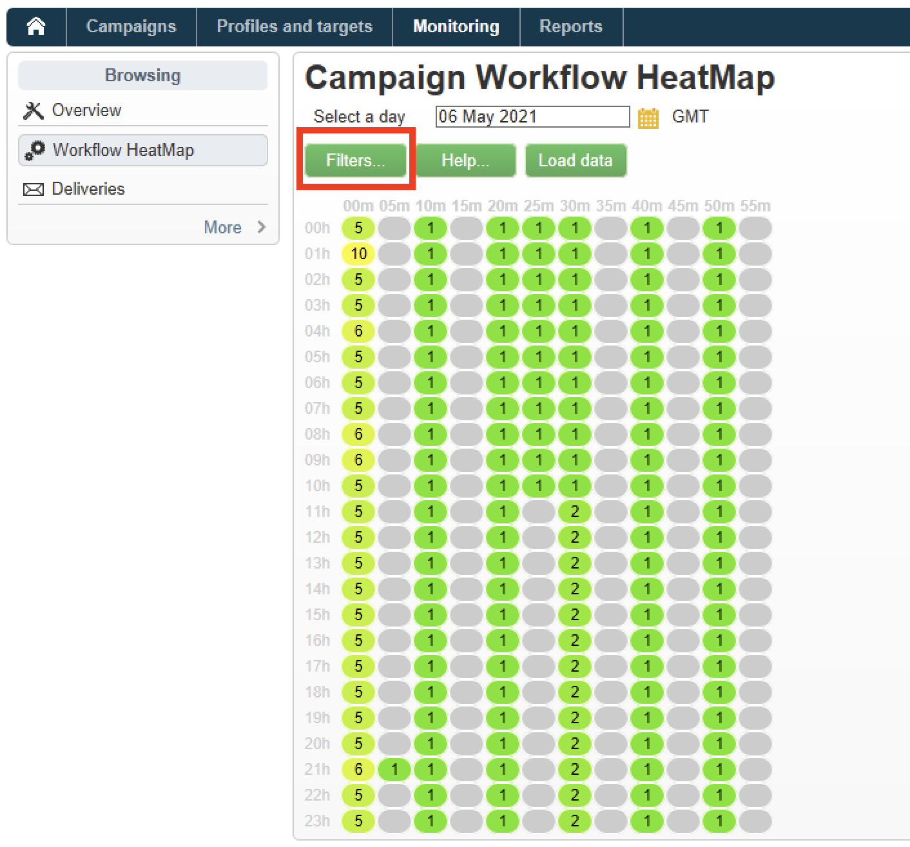

# Flusso di lavoro HeatMap {#workflow-heatmap}

La Workflow HeatMap di Campaign consiste in una rappresentazione grafica codificata per colori di tutti i flussi di lavoro attualmente in esecuzione. È disponibile solo per **Amministratori di Campaign**.

Scopri altri modi per monitorare i processi Campaign in .

## Introduzione a Workflow HeatMap {#about-the-workflow-heatmap}

Fornendo una rapida panoramica sul numero di flussi di lavoro simultanei, Workflow HeatMap consente agli amministratori della piattaforma Adobe Campaign di monitorare il carico sull’istanza e pianificare i flussi di lavoro di conseguenza.

Più precisamente, consente agli amministratori di piattaforma di:

* Visualizzare e comprendere i flussi di lavoro simultanei
* Filtrare i flussi di lavoro per durata per vedere quali potrebbero presentare problemi
* Filtrare le attività per durata per vedere quali attività possono incontrare problemi
* Trovare facilmente singoli flussi di lavoro e le attività correlate ad essi (con la relativa durata)
* Filtra per tipo di flusso di lavoro: [flussi di lavoro tecnici](technical-workflows.md) o [flussi di lavoro delle campagne](campaign-workflows.md)
* Cercare un flusso di lavoro specifico da analizzare

>[!NOTE]
>
>Oltre al **Workflow Heatmap**, puoi creare un flusso di lavoro che ti consenta di monitorare lo stato di un set di flussi di lavoro e inviare messaggi ricorrenti alle autorità di vigilanza. Per ulteriori informazioni, consulta la sezione [sezione dedicata](workflow-supervision.md).

L&#39;utilizzo di Workflow HeatMap richiede una buona comprensione dei seguenti concetti: [Flussi di lavoro](about-workflows.md), [Attività](activities.md) e [Best practice per i flussi di lavoro](workflow-best-practices.md).

## Personalizzare Workflow HeatMap {#using-the-heatmap}

>[!NOTE]
>
>Se non vengono visualizzati dati in Workflow HeatMap, fai clic sul pulsante **[!UICONTROL Load data]** pulsante .

1. Vai a **[!UICONTROL Monitoring]** e fai clic su **[!UICONTROL Workflow HeatMap]** per visualizzare il collegamento **[!UICONTROL Campaign Workflow HeatMap]** pagina.

   

1. Fai clic sul calendario per selezionare un giorno.

   Per impostazione predefinita, la pagina mostra l’attività del flusso di lavoro per il giorno corrente. Puoi modificarlo e selezionare qualsiasi giorno nel passato.

   >[!NOTE]
   >
   >Solo i flussi di lavoro che non sono stati eliminati dal ** .\
   >Per impostazione predefinita, il fuso orario Workflow HeatMap è quello definito per l&#39;utente amministratore corrente. Ad esempio, puoi modificarla se non ti trovi nella stessa area degli utenti di marketing con cui stai lavorando.

1. Fai clic sul pulsante **[!UICONTROL Filters]**.

   

1. Utilizzare il cursore per impostare la durata minima da 0 a 1 ora. Questo consente di cercare solo i flussi di lavoro in esecuzione per più di un certo numero di secondi o minuti.

   

1. Puoi anche scegliere un flusso di lavoro specifico dal **[!UICONTROL Workflows]** elenco a discesa.

   

   >[!NOTE]
   >
   >La **[!UICONTROL Min duration]** viene applicato il filtro . Se non riesci a trovare un flusso di lavoro specifico, reimposta la durata minima su 0 in modo che tutti i flussi di lavoro siano visualizzati nell’elenco.

1. Puoi anche filtrare il **[!UICONTROL Workflow type]** :

   * **[!UICONTROL Technical]** : Solo [flussi di lavoro tecnici incorporati](technical-workflows.md) e [flussi di lavoro di gestione dati](targeting-workflows.md#data-management) vengono visualizzati.
   * **[!UICONTROL Marketing]** : Solo i flussi di lavoro collegati a una campagna di marketing, noti come [flussi di lavoro delle campagne](campaign-workflows.md), vengono visualizzati.

1. Per cercare un flusso di lavoro specifico per nome, puoi anche utilizzare la **[!UICONTROL Workflow name filter]** campo .

1. Se hai modificato alcuni flussi di lavoro nel periodo intercorrente, fai clic sul pulsante **[!UICONTROL Reload data]** per aggiornare i dati visualizzati nella griglia.

## Interpretare Workflow HeatMap {#reading-the-heatmap}

La Workflow HeatMap di Campaign è una griglia leggibile in modo naturale dall’alto a sinistra verso il basso a destra, che consente di trovare le &quot;aree calde&quot; con una gamma di colori da verde a rosso.

* Le celle rosse più scure corrispondono a periodi in cui un numero elevato di flussi di lavoro vengono eseguiti contemporaneamente.
* Le celle grigie corrispondono a periodi in cui non è in esecuzione alcun flusso di lavoro.

Per scoprire come applicare il codice del colore e come navigare nella mappa di calore, fai clic sul pulsante **[!UICONTROL Help]** pulsante .

Ogni riga rappresenta un’ora del giorno e ogni cella rappresenta 5 minuti di quell’ora.

La griglia mostra tutti i flussi di lavoro in esecuzione contemporaneamente per ciascuno di questi periodi di 5 minuti.

Nell’esempio seguente, tra le 8 e le 8:05, sono in esecuzione tre flussi di lavoro (indipendentemente dalla loro durata individuale):

1. Fai clic su una cella colorata per visualizzare i dettagli di tutti i flussi di lavoro simultanei in esecuzione durante questo periodo.

   

   Per ogni flusso di lavoro, vengono elencate tutte le attività che contengono, con la relativa durata.

1. Fai clic sull’ID o sul nome del flusso di lavoro per aprire direttamente un flusso di lavoro.
1. Per tornare al **[!UICONTROL Campaign Workflow HeatMap]** visualizzazione, fai clic su **[!UICONTROL Home]** pulsante .

## Casi di utilizzo: utilizza HeatMap per intraprendere azioni {#use-cases--using-the-heatmap-to-take-actions}

Esistono due casi principali in cui la Workflow HeatMap di Campaign può essere utile.

### Ridurre il numero di flussi di lavoro simultanei {#reducing-the-number-of-concurrent-workflows}

In qualità di amministratore di Campaign, Workflow HeatMap può aiutarti a comprendere il carico sull’istanza e a pianificare i flussi di lavoro esistenti o nuovi in momenti opportuni.

1. Da **[!UICONTROL Campaign Workflow HeatMap]** visualizzazione, fai clic su **[!UICONTROL Filters]** pulsante .
1. Imposta la durata a pochi secondi o qualche minuto.
1. Escludi i flussi di lavoro più brevi che non sono significativi aumentando il filtro della durata.

   

1. Esplorare i risultati per comprendere il carico sull&#39;istanza e intraprendere le azioni appropriate:

   * Se si verificano problemi di prestazioni e se una o più celle rosse sono visualizzate nella griglia, è consigliabile modificare i tempi di avvio di diversi flussi di lavoro. Chiedi agli utenti di marketing di spostare manualmente i flussi di lavoro da periodi di attività (&quot;hot&quot;) a intervalli di tempo più disponibili. Questo dovrebbe mantenere un livello di attività stabile durante il giorno.
   * Per evitare picchi ed evitare che l’istanza si sovraccarichi, osserva HeatMap prima di pianificare i nuovi flussi di lavoro e scegli il momento migliore. Per avviare nuovi flussi di lavoro, prendi in considerazione intervalli di tempo corrispondenti a celle grigie o verdi nella griglia.

### Trovare flussi di lavoro a lungo termine che influiscono sulle prestazioni {#finding-long-running-workflows-that-impact-performance}

In qualità di amministratore di Campaign, Workflow HeatMap ti consente di trovare i flussi di lavoro più lunghi che possono rallentare l’attività.

1. Da **[!UICONTROL Campaign Workflow HeatMap]** visualizzazione, fai clic su **[!UICONTROL Filters]** pulsante .
1. Imposta la durata su 1 ora.

   

1. Includi più risultati riducendo il **[!UICONTROL Min duration]** filtro.
1. Esplora i risultati per trovare i flussi di lavoro più lunghi, che possono potenzialmente avere un maggiore impatto sulle risorse del server e del database (CPU, RAM, rete, IOPS e così via).
1. Adottare le misure appropriate:

   * Consigliamo agli utenti di marketing di suddividere i flussi di lavoro più lunghi per ridurre i tempi di elaborazione.
   * Avvia un’analisi più approfondita su flussi di lavoro specifici e attività specifiche (come JavaScript, importazione, esportazione e così via) per isolare i problemi e risolverli più facilmente.

## Utilizza HeatMap per migliorare la pianificazione del flusso di lavoro {#example--using-the-heatmap-to-improve-workflow-planning}

L’esempio seguente mostra come la pianificazione può essere più efficiente e come le prestazioni possono essere migliorate quando si utilizza Adobe Campaign Workflow HeatMap.

In questo caso, molti utenti si lamentano delle prestazioni del flusso di lavoro. È necessario controllare cosa rallenta l&#39;attività e come risolvere il problema.

1. Vai a **[!UICONTROL Monitoring]** e fai clic su **[!UICONTROL Workflows]** per visualizzare il collegamento **[!UICONTROL Campaign Workflow HeatMap]** pagina.
1. Imposta la **[!UICONTROL Min duration]** filtrare fino a 5 minuti.
1. Imposta la **[!UICONTROL Workflow type]** filtrare **[!UICONTROL Marketing]** .
1. Dalla griglia di HeatMap, osservate quanto segue:

   

   * 50 flussi di lavoro per campagne di lunga durata (più di 5 minuti) sono in esecuzione alle 10.
   * La maggior parte di essi dispone di uno stato in sospeso (per impostazione predefinita, il limite di concorrenza è impostato su 20).
   * I flussi di lavoro in sospeso devono essere riavviati manualmente ogni giorno.
   * Le prestazioni sono basse.

1. Invece di avere cinquanta flussi di lavoro a partire dalle 10, distribuisci gli orari di avvio dei flussi di lavoro in modo uniforme per il resto della giornata.
1. Torna alla pagina **[!UICONTROL Campaign Workflow HeatMap]** e fai clic su **[!UICONTROL Reload data]** pulsante .
1. Osserva quanto segue:

   

   * Alle 10 di mattina sono ancora in esecuzione solo diciotto flussi di lavoro per campagne di lunga durata.
   * Nessun altro flusso di lavoro è in sospeso (il limite di concorrenza è ancora impostato su 20).
   * Gli orari di avvio del flusso di lavoro sono distribuiti in modo uniforme durante l&#39;intera giornata.
   * Nessun altro utente si lamenta di problemi di prestazioni.
