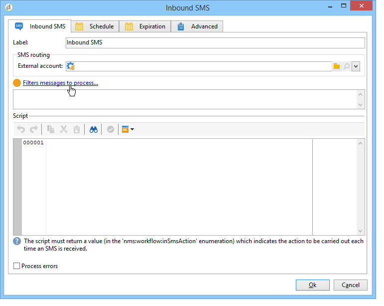

# SMS in entrata{#inbound-sms}

Il **SMS in entrata** attività ti consente di scaricare ed elaborare messaggi di testo da un account esterno.

## Properties {#properties}

La prima scheda della **SMS in entrata** L’attività ti consente di inserire i parametri di indirizzamento per i messaggi SMS e lo script da eseguire alla ricezione di ciascun messaggio. La seconda scheda ti consente di assegnare una pianificazione all’attività e la terza scheda definisce le condizioni di scadenza dell’attività.

1. **[!UICONTROL SMS routing]**: seleziona l’account esterno da utilizzare per il ripristino SMS. Gli account esterni vengono configurati tramite **[!UICONTROL Administration > Platform > External accounts]** dell&#39;albero.
1. **[!UICONTROL Script]**
1. **[!UICONTROL Schedule]**

   

1. **[!UICONTROL Expiration]**

Il **[!UICONTROL Script]**, **[!UICONTROL Schedule]** e **[!UICONTROL Expiry]** Le schede sono descritte in dettaglio in [E-mail in entrata](inbound-emails.md).
