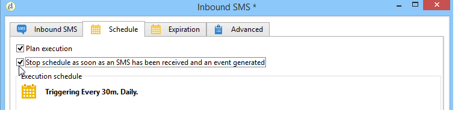

# SMS in entrata{#inbound-sms}

L&#39;attività **Inbound SMS** ti consente di scaricare ed elaborare messaggi di testo da un account esterno.

## Proprietà {#properties}

La prima scheda dell&#39;attività **SMS in entrata** consente di immettere i parametri di routing per i messaggi SMS e di immettere lo script da eseguire alla ricezione di ogni messaggio. La seconda scheda ti consente di assegnare una pianificazione all’attività e la terza scheda definisce le condizioni di scadenza dell’attività.

1. **[!UICONTROL SMS routing]**: selezionare l&#39;account esterno da utilizzare per il ripristino SMS. Gli account esterni sono configurati tramite il nodo **[!UICONTROL Administration > Platform > External accounts]** della struttura. [Ulteriori informazioni](../../v8/config/external-accounts.md)
1. **[!UICONTROL Script]**
1. **[!UICONTROL Schedule]**

   

1. **[!UICONTROL Expiration]**

Le schede **[!UICONTROL Script]**, **[!UICONTROL Schedule]** e **[!UICONTROL Expiry]** sono dettagliate in [E-mail in entrata](inbound-emails.md).
