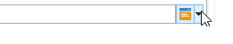

# Script e modelli JavaScript{#javascript-scripts-and-templates}


Gli script consentono di calcolare i valori, scambiare dati tra diverse attività nel processo ed eseguire operazioni specifiche utilizzando chiamate SOAP.

Gli script sono ovunque in un diagramma di flusso di lavoro:

* Tutte le attività dispongono di script di inizializzazione. Viene eseguito uno script di inizializzazione quando l’attività viene attivata e può essere utilizzato per inizializzare le variabili e modificare le proprietà.
* L’attività &quot;Codice JavaScript&quot; viene semplicemente utilizzata per eseguire uno script.
* L’attività &quot;Test&quot; valuta le espressioni JavaScript per attivare la transizione appropriata.
* La maggior parte dei campi di testo sono modelli JavaScript: Le espressioni JavaScript possono essere incluse tra &lt;%= e %>. Questi campi offrono un pulsante che consente di aprire un elenco a discesa per facilitare l’immissione di espressioni.

   

## Oggetti esposti {#objects-exposed}

JavaScript eseguiti nel contesto di un flusso di lavoro accedono a una serie di oggetti globali aggiuntivi.

* **istanza**: Rappresenta il flusso di lavoro in esecuzione. Lo schema dell&#39;oggetto è **xtk:workflow**.
* **compito**: Rappresenta le attività eseguite. Lo schema dell&#39;oggetto è **xtk:workflowTask**.
* **event**: Rappresenta gli eventi che hanno attivato l&#39;attività in esecuzione. Lo schema dell&#39;oggetto è **xtk:workflowEvent**. Questo oggetto non è inizializzato per **AND-join** attività di tipo che sono state attivate da più transizioni.
* **events**: Rappresenta l&#39;elenco degli eventi che hanno attivato l&#39;attività corrente. Lo schema dell&#39;oggetto è **xtk:workflowEvent**. Questa tabella contiene in genere un elemento ma può contenere diversi **AND-join** attività di tipo che sono state attivate in base a diverse transizioni.
* **attività**: Rappresenta il modello dell&#39;attività in esecuzione. Lo schema di questo oggetto dipende dal tipo di attività. Questo oggetto può essere modificato dallo script di inizializzazione, in altri script, le modifiche con effetti indeterminabili.

Le proprietà disponibili per questi oggetti possono essere visualizzate in un elenco a discesa facendo clic sul pulsante a destra della barra degli strumenti script.

>[!CAUTION]
>
>Le proprietà di questi oggetti sono di sola lettura, ad eccezione delle proprietà secondarie della proprietà vars.
>  
>La maggior parte di queste proprietà viene aggiornata solo dopo l&#39;esecuzione di un&#39;attività elementare o quando l&#39;istanza viene passivata. I valori letti non corrispondono necessariamente allo stato corrente, ma allo stato precedente.

**Esempio**

In questo esempio e negli esempi seguenti, crea un flusso di lavoro che include un **Codice JavaScript** attività e **Fine** come illustrato nel diagramma seguente.


Fai doppio clic sul pulsante **Codice JavaScript** e inserire il seguente script:

```
logInfo("Label: " + instance.label)
logInfo("Start date: " + task.creationDate)
```

La **[!UICONTROL logInfo(message)]** inserisce un messaggio nel registro.

Fai clic su **[!UICONTROL OK]** per chiudere la procedura guidata di creazione, avvia il flusso di lavoro utilizzando i pulsanti di azione situati in alto a destra dell’elenco dei flussi di lavoro. Al termine dell&#39;esecuzione, consultare il registro. Dovresti visualizzare due messaggi corrispondenti allo script: una visualizza l’etichetta del flusso di lavoro, l’altra visualizza la data in cui lo script è stato attivato.

## Variabili {#variables}

Le variabili sono le proprietà libere del **[!UICONTROL instance]**, **[!UICONTROL task]** e **[!UICONTROL event]** oggetti. I tipi JavaScript autorizzati per queste variabili sono **[!UICONTROL string]**, **[!UICONTROL number]** e **[!UICONTROL Date]**.

### Variabili di istanza {#instance-variables}

Le variabili di istanza (**[!UICONTROL instance.vars.xxx]**) sono paragonabili alle variabili globali. Sono condivisi da tutte le attività.

### Variabili di attività {#task-variables}

Variabili dell&#39;attività (**[!UICONTROL task.vars.xxx]**) sono paragonabili alle variabili locali. Vengono utilizzati solo dall&#39;attività corrente. Queste variabili vengono utilizzate dalle attività persistenti per conservare i dati e talvolta vengono utilizzate per scambiare dati tra i diversi script di una stessa attività.

### Variabili evento {#event-variables}

Le variabili evento (**[!UICONTROL vars.xxx]**) abilita lo scambio di dati tra le attività elementari di un processo di flusso di lavoro. Queste variabili vengono passate dall’attività che ha attivato l’attività in corso. È possibile modificarli e definirne di nuovi. Vengono quindi passate alle seguenti attività.

>[!CAUTION]
>
>Nel caso di [AND-join](and-join.md) le attività di tipo , le variabili vengono unite ma se una stessa variabile viene definita due volte, si verifica un conflitto e il valore rimane indeterminato.

Gli eventi sono le variabili più utilizzate e devono essere utilizzati in preferenza per le variabili di istanza.

Alcune variabili di evento vengono modificate o lette dalle varie attività. Sono tutte variabili di tipo stringa. Ad esempio, un’esportazione imposta il **[!UICONTROL vars.filename]** con il nome completo del file appena esportato. Tutte queste variabili lette o modificate sono documentate in [Informazioni sulle attività](activities.md)nelle sezioni **Parametri di input** e **Parametri di output** delle attività.

### Casi d’uso {#example}

>[!NOTE]
>
>Sono disponibili ulteriori casi di utilizzo del flusso di lavoro in [questa sezione](workflow-use-cases.md).

**Esempio 1**

In questo esempio, una variabile di istanza viene utilizzata per calcolare dinamicamente la percentuale di suddivisione da applicare a una popolazione.

1. Crea un flusso di lavoro e aggiungi un’attività Inizio .

1. Aggiungi e configura un’attività codice JavaScript per definire una variabile di istanza.

   Ad esempio: `instance.vars.segmentpercent = 10;`

   

1. Aggiungi un’attività Query e target destinatari in base alle tue esigenze.

1. Aggiungi un’attività Split e configurala per eseguire un campionamento casuale della popolazione in arrivo. La percentuale di campionamento può essere qualsiasi cosa di vostra scelta. In questo esempio viene impostato su 50%.

   È questa percentuale che viene aggiornata dinamicamente grazie alla variabile di istanza definita in precedenza.

   

1. All’interno della sezione Script di inizializzazione della scheda Avanzate dell’attività Split, definisci una condizione JS. La condizione JS seleziona la percentuale di campionamento casuale della prima transizione proveniente dall’attività Split e la aggiorna a un valore impostato dalla variabile di istanza creata in precedenza.

   ```
   activity.transitions.extractOutput[0].limiter.percent = instance.vars.segmentpercent;
   ```

   

1. Assicurati che il complemento sia generato in una transizione separata dell’attività Split e aggiungi le attività End dopo ciascuna transizione in uscita.

1. Salva ed esegui il flusso di lavoro. Il campionamento dinamico viene applicato in base alla variabile di istanza.

   

**Esempio 2**

1. Prendi il flusso di lavoro dall’esempio precedente e sostituisci lo script del **Codice JavaScript** attività con il seguente script:

   ```
   instance.vars.foo = "bar1"
   vars.foo = "bar2"
   task.vars.foo = "bar3"
   ```

1. Aggiungi il seguente script allo script di inizializzazione del **Fine** attività:

   ```
   logInfo("instance.vars.foo = " + instance.vars.foo)
   logInfo("vars.foo = " + vars.foo)
   logInfo("task.vars.foo = " + task.vars.foo)
   ```

1. Avvia il flusso di lavoro, quindi osserva il registro.

   ```
   Workflow finished
   task.vars.foo = undefined
   vars.foo = bar2
   instance.vars.foo = bar1
   Starting workflow (operator 'admin')
   ```

Questo esempio mostra che l’attività seguente **Codice JavaScript** accede alle variabili di istanza e di evento, ma le variabili di attività non sono accessibili dall&#39;esterno (&#39;non definito&#39;).

### Chiamata di una variabile di istanza in una query {#calling-an-instance-variable-in-a-query}

Una volta specificata una variabile di istanza in un’attività, puoi riutilizzarla in una query del flusso di lavoro.

Quindi, per chiamare una variabile **instance.vars.xxx = &quot;yyy&quot;** in un filtro, immetti **$(instance/vars/xxx)**.

Ad esempio:

1. Crea una variabile di istanza che definisce il nome interno di una consegna tramite il **[!UICONTROL JavaScript code]**: **instance.vars.deliveryIN = &quot;DM42&quot;**.

   

1. Crea una query le cui dimensioni di targeting e filtro sono i destinatari. Nelle condizioni , specifica che desideri trovare tutti i destinatari a cui è stata inviata la consegna specificata dalla variabile .

   Come promemoria, queste informazioni vengono memorizzate nei registri di consegna.

   Per fare riferimento alla variabile di istanza nel **[!UICONTROL Value]** colonna, immettere **$(instance/vars/@deliveryIN)**.

   Il flusso di lavoro restituirà i destinatari della consegna DM42.

   

## Funzioni avanzate {#advanced-functions}

Oltre alle funzioni JavaScript standard, sono disponibili funzioni speciali per la manipolazione dei file, la lettura o la modifica dei dati nel database o l’aggiunta di messaggi al registro.

### Journal {#journal}

**[!UICONTROL logInfo(message)]** è stato descritto negli esempi precedenti. Questa funzione aggiunge un messaggio informativo al giornale di registrazione.

**[!UICONTROL logError(message)]** aggiunge un messaggio di errore al registro. Lo script interrompe l’esecuzione e il flusso di lavoro cambia in stato di errore (per impostazione predefinita, l’istanza viene sospesa).

## Script di inizializzazione {#initialization-script}

In determinate condizioni, puoi modificare la proprietà di un’attività al momento dell’esecuzione.

La maggior parte delle proprietà delle attività può essere calcolata dinamicamente, utilizzando un modello JavaScript o perché le proprietà del flusso di lavoro consentono esplicitamente di calcolare il valore da uno script.

Per altre proprietà, tuttavia, è necessario utilizzare lo script di inizializzazione. Questo script viene valutato prima dell&#39;esecuzione dell&#39;attività. La **[!UICONTROL activity]** fa riferimento all’attività corrispondente all’attività. Le proprietà di questa attività possono essere modificate e avranno effetto solo su questa attività.

**Argomenti correlati**
[Esempi di codice JavaScript nei flussi di lavoro](javascript-in-workflows.md)
