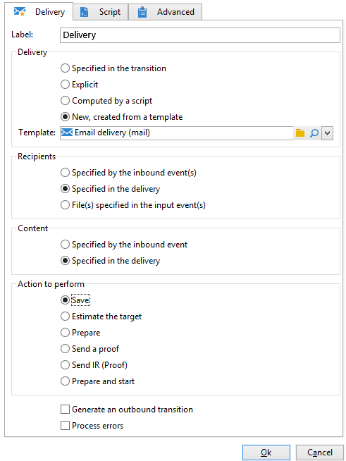

# Caricare i contenuti della consegna{#loading-delivery-content}

Se il contenuto della consegna è disponibile in un file HTML che si trova su server Amazon S3, FTP o SFTP, puoi facilmente caricarlo nelle consegne Adobe Campaign.

Per eseguire questa operazione:

1. Se non hai già definito una connessione tra Adobe Campaign e il server (S)FTP che ospita i file di contenuto, crea un nuovo account esterno S3, FTP o SFTP in **[!UICONTROL Administration]** > **[!UICONTROL Platform]** > **[!UICONTROL External Accounts]**. Specifica in questo account esterno l’indirizzo e le credenziali utilizzati per stabilire la connessione al server S3 o (S)FTP.

   Ecco un esempio di account esterno S3:

   

1. Crea un nuovo flusso di lavoro, ad esempio da **[!UICONTROL Profiles and Targets]** > **[!UICONTROL Jobs]** > **[!UICONTROL Targeting workflows]**.
1. Aggiungi un **[!UICONTROL File transfer]** attività nel flusso di lavoro e configurarla specificando

   * Account esterno da utilizzare per la connessione al server S3 o (S)FTP.
   * Percorso del file sul server S3 o (S)FTP.

   

1. Aggiungi un **[!UICONTROL Delivery]** e collegarla alla transizione in uscita del **[!UICONTROL File transfer]** attività. Configura come segue:

   * Consegna: in base alle tue esigenze, può essere una consegna specifica già creata nel sistema o una nuova consegna basata su un modello esistente.
   * Destinatari: in questo esempio, si considera che il target sia specificato nella consegna stessa.
   * Contenuto: anche se il contenuto viene importato nell’attività precedente, seleziona **[!UICONTROL Specified in the delivery]**. Poiché il contenuto viene importato direttamente da un file che si trova su un server remoto, non ha un identificatore quando viene elaborato dal flusso di lavoro e non può essere identificato come proveniente dall’evento in entrata.
   * Azione da eseguire: Seleziona **[!UICONTROL Save]** per salvare la consegna e potervi accedere da **[!UICONTROL Campaign management]** > **[!UICONTROL Deliveries]** una volta eseguito il flusso di lavoro.

   

1. In **[!UICONTROL Script]** scheda di **[!UICONTROL Delivery]** attività, aggiungi il seguente comando per caricare il contenuto del file importato nella consegna:

   ```
   delivery.content.html.source=loadFile(vars.filename)
   ```

   

1. Salva ed esegui il flusso di lavoro. Viene creata una nuova consegna con il contenuto caricato in **[!UICONTROL Campaign management]** > **[!UICONTROL Deliveries]**.

