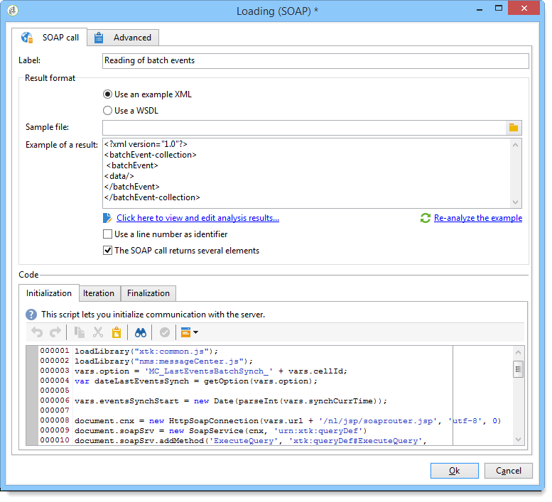

# Caricamento (SOAP){#loading-soap}

>[!CAUTION]
>
>L&#39;attività **Loading (SOAP)** è disponibile solo se è installato il modulo **FDA (Federated Data Access)**. Controlla il contratto di licenza.

L&#39;attività **Loading (SOAP)** viene utilizzata in aggiunta all&#39;attività **data loading (RDBMS)** quando non è possibile raccogliere dati direttamente tramite FDA in un database esterno.

Il funzionamento è il seguente:

1. Scegliere se utilizzare un esempio XML o un file WSDL.

   L&#39;esempio seguente proviene da un flusso di lavoro tecnico del modulo Centro messaggi.

   

1. Per un esempio XML, selezionare un file di esempio. Il file viene analizzato per stabilire un esempio di risultato.

   Per un WSDL, immetti l’URL di accesso corrispondente e genera il codice scheletrico. Il servizio e la chiamata selezionati vengono aggiornati e visualizzati automaticamente.

   

1. Selezionare **[!UICONTROL Click here to view and edit analysis results]** per specificare ogni colonna identificata.

   

   Per aggiornare l&#39;esempio, selezionare **[!UICONTROL Re-analyze the example]**.

1. Puoi utilizzare il numero di riga come identificatore e/o specificare che la chiamata SOAP restituisce diversi elementi.
1. Immetti i seguenti script di tabulazione in base alla loro funzione:

   * **[!UICONTROL Initialization]**: stabilisce una connessione SOAP.
   * **[!UICONTROL Iteration]**: esegue la chiamata al servizio SOAP. Il valore restituito per questa funzione deve essere un oggetto XML compatibile con la descrizione dell&#39;esempio o del file WSDL.

     Il codice di questa scheda verrà richiamato in un ciclo da Adobe Campaign fino alla restituzione di un oggetto XML null.

   * **[!UICONTROL Finalization]**: chiude la connessione e/o libera altre risorse create durante l&#39;elaborazione.
