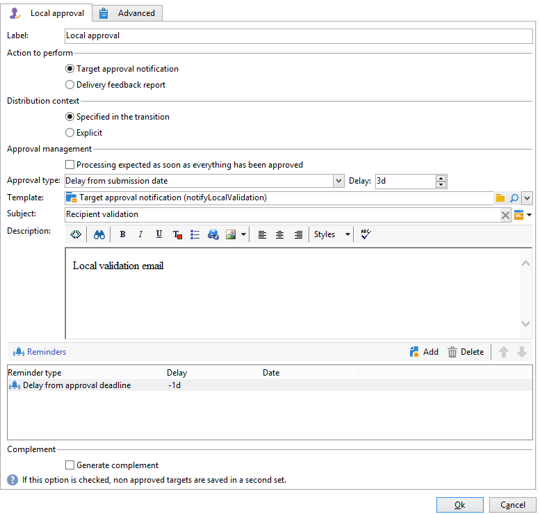
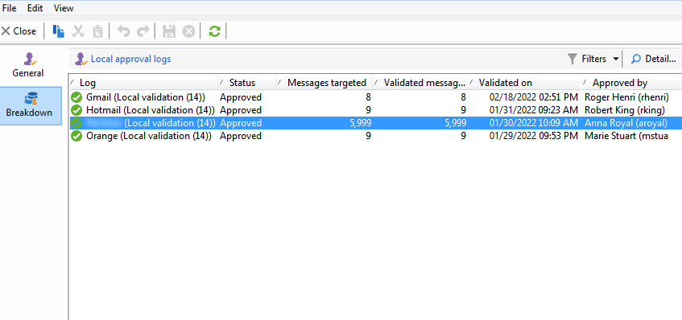

# Utilizzare l’attività di approvazione locale{#using-the-local-approval-activity}

Il **[!UICONTROL Local approval]** l’attività integrata in un flusso di lavoro di targeting ti consente di impostare un processo di approvazione del destinatario prima che venga inviata la consegna.

>[!CAUTION]
>
>Per utilizzare questa funzione, devi acquistare il modulo Marketing distribuito, che è un’opzione di Campaign. Controlla il contratto di licenza.

Per impostare questo caso d’uso, abbiamo creato il seguente flusso di lavoro di targeting:

Le fasi principali del processo di approvazione locale sono:

1. La popolazione risultante dal targeting può essere limitata grazie a **[!UICONTROL Split]** digita l’attività utilizzando un modello di distribuzione dati.

   

1. Il **[!UICONTROL Local approval]** l’attività subentra e invia un’e-mail di notifica a ciascun supervisore locale. L’attività viene sospesa fino a quando ogni supervisore locale non approva i destinatari a loro assegnati.

1. Una volta raggiunta la scadenza dell’approvazione, il flusso di lavoro viene riavviato. In questo esempio, la proprietà **[!UICONTROL Delivery]** l’attività viene avviata e la consegna viene inviata alle destinazioni approvate.

   >[!NOTE]
   >
   >Una volta raggiunta la scadenza, i destinatari che non sono stati approvati vengono esclusi dal targeting.

   

1. Pochi giorni dopo, il secondo **[!UICONTROL Local approval]** tipo di attività invia un’e-mail di notifica a ogni supervisore locale con un riepilogo delle azioni eseguite dai suoi contatti (clic, aperture, ecc.).

## Passaggio 1: creare il modello di distribuzione dei dati {#step-1--creating-the-data-distribution-template-}

Il modello di distribuzione dei dati consente di limitare la popolazione risultante dal targeting in base al raggruppamento di dati, consentendo al contempo di assegnare ogni valore a un supervisore locale. In questo esempio, abbiamo definito il **[!UICONTROL Email address domain]** come campo di distribuzione e assegnato un dominio a ciascun supervisore locale

Per ulteriori informazioni sulla creazione di un modello di distribuzione dati, consulta [Limitazione del numero di record di sottoinsiemi per distribuzione dei dati](split.md#limiting-the-number-of-subset-records-per-data-distribution).

1. Per creare il modello di distribuzione dei dati, passare alla **[!UICONTROL Resources > Campaign management > Data distribution]** e fai clic su **[!UICONTROL New]**.

   

1. Seleziona la scheda **[!UICONTROL General]**.

   

1. Inserisci il **[!UICONTROL Label]** e **[!UICONTROL Distribution context]**. In questo esempio, abbiamo selezionato **[!UICONTROL Recipient]** schema di targeting e **[!UICONTROL Email domain]** come campo di distribuzione. L’elenco dei destinatari verrà suddiviso per dominio.
1. In **[!UICONTROL Distribution type]** , selezionare come verrà espresso il valore di limitazione target nel campo **[!UICONTROL Distribution]** scheda. Qui abbiamo scelto **[!UICONTROL Percentage]**.
1. In **[!UICONTROL Approval storage]** , immetti lo schema di archiviazione delle approvazioni che corrispondono allo schema di targeting in uso. Stiamo per utilizzare lo schema di archiviazione predefinito: **[!UICONTROL Local approval of recipients]**.
1. Quindi fai clic su **[!UICONTROL Advanced parameters]** collegamento.

   

1. Mantieni **[!UICONTROL Approve the targeted messages]** opzione selezionata in modo che tutti i destinatari siano preselezionati dall’elenco dei destinatari da approvare.
1. In **[!UICONTROL Delivery label]** , è stata lasciata l’espressione predefinita (stringa di calcolo della consegna). L’etichetta standard della consegna verrà utilizzata nella notifica di feedback.
1. In **[!UICONTROL Grouping field]** sezione, è stata selezionata la **[!UICONTROL Gender]** campo come campo di raggruppamento per visualizzare i destinatari nelle notifiche di approvazione e feedback.
1. In **[!UICONTROL Edit targeted messages]** sezione, abbiamo selezionato il **[!UICONTROL Edit recipients]** applicazione web e **[!UICONTROL recipientId]** parametro. Nelle notifiche di approvazione e feedback, i destinatari saranno cliccabili e punteranno all’URL dell’applicazione web. Il parametro URL aggiuntivo sarà **[!UICONTROL recipientId]**.
1. Quindi fai clic su **[!UICONTROL Distribution]** scheda. Per ciascun dominio, immetti i campi seguenti:

   

   * **[!UICONTROL Value]**: immetti il valore del nome di dominio.
   * **[!UICONTROL Percentage / Fixed]**: per ogni dominio, immetti il valore massimo. numero di destinatari a cui desideri inviare la consegna. In questo esempio, vogliamo limitare la consegna al 10% per dominio.
   * **[!UICONTROL Label]**: immetti l’etichetta del dominio da visualizzare nelle notifiche di approvazione e feedback.
   * **[!UICONTROL Group or operator]**: seleziona l’operatore o il gruppo di operatori assegnati al dominio.

      >[!CAUTION]
      >
      >Assicurati che agli operatori siano stati assegnati i diritti appropriati.

## Passaggio 2: creare il flusso di lavoro di targeting {#step-2--creating-the-targeting-workflow}

Per impostare questo caso d’uso, abbiamo creato il seguente flusso di lavoro di targeting:

Sono state aggiunte le seguenti attività:

* Due **[!UICONTROL Query]** attività,
* Uno **[!UICONTROL Intersection]** attività,
* Uno **[!UICONTROL Split]** attività,
* Uno **[!UICONTROL Local approval]** attività,
* Uno **[!UICONTROL Delivery]** attività,
* Uno **[!UICONTROL Wait]** attività,
* Un secondo **[!UICONTROL Local approval]** attività,
* Uno **[!UICONTROL End]** attività.

### Query, intersezione e suddivisione {#queries--intersection-and-split}

Il targeting a monte è costituito da due query, una di intersezione e una di divisione. La popolazione risultante dal targeting può essere limitata utilizzando un **[!UICONTROL Split]** mediante un modello di distribuzione dati.

Per ulteriori informazioni sulla configurazione di un’attività divisa, consulta [Dividi](split.md). La creazione di un modello di distribuzione dei dati è descritta in [Limitazione del numero di record di sottoinsiemi per distribuzione dei dati](split.md#limiting-the-number-of-subset-records-per-data-distribution).

Se non desideri limitare il gruppo della query, non è necessario utilizzare **[!UICONTROL Query]**, **[!UICONTROL Intersection]**, e **[!UICONTROL Split]** attività. In questo caso, completa il modello di distribuzione dei dati nel primo **[!UICONTROL Local approval]** attività.

1. In **[!UICONTROL Record count limitation]** , seleziona la sezione **[!UICONTROL Limit the selected records]** e fare clic sul pulsante **[!UICONTROL Edit]** collegamento.

   

1. Seleziona la **[!UICONTROL Keep only the first records after sorting]** e fai clic su **[!UICONTROL Next]**.

   

1. In **[!UICONTROL Sort columns]** , aggiungi il campo a cui viene applicato l’ordinamento. In questo caso, abbiamo scelto il **[!UICONTROL Email]** campo. Fai clic su **[!UICONTROL Next]**.

   

1. Seleziona la **[!UICONTROL By data distribution]** , selezionare il modello di distribuzione creato in precedenza (fare riferimento a [Passaggio 1: creazione del modello di distribuzione dei dati](#step-1--creating-the-data-distribution-template-)) e fai clic su **[!UICONTROL Finish]**.

   

Nel modello di distribuzione, abbiamo scelto di limitare la popolazione al 10% per valore di raggruppamento, che coincide con i valori visualizzati nel flusso di lavoro (340 come input e 34 come output).

### Notifica di approvazione {#approval-notification}

Il **[!UICONTROL Local approval]** attività ti consente di inviare una notifica a ogni supervisore locale.

Per ulteriori informazioni sulla configurazione di **[!UICONTROL Local approval]** attività, fare riferimento a [Approvazione locale](local-approval.md).

È necessario inserire i campi seguenti:

1. Nella sezione **[!UICONTROL Action to execute]**, seleziona l’opzione **[!UICONTROL Target approval notification]**.
1. Nella sezione **[!UICONTROL Distribution context]**, seleziona l’opzione **[!UICONTROL Specified in the transition]**.

   Se non desideri limitare la popolazione target, seleziona la **[!UICONTROL Explicit]** e inserire il modello di distribuzione creato in precedenza nel **[!UICONTROL Data distribution]** campo.

1. In **[!UICONTROL Notification]** , seleziona il modello di consegna e l’oggetto da utilizzare per l’e-mail di notifica. Abbiamo scelto il modello predefinito: **[!UICONTROL Local approval notification]**.
1. In **[!UICONTROL Approval schedule]** sezione, abbiamo mantenuto il termine di approvazione predefinito (3 giorni) e aggiunto un promemoria. La consegna partirà 3 giorni dopo l’inizio dell’approvazione. Una volta raggiunta la scadenza dell’approvazione, i destinatari che non sono stati approvati non vengono presi in considerazione dal targeting.

Un messaggio e-mail di notifica viene inviato da **[!UICONTROL Local approval]** alle autorità di vigilanza locali.

### Attività Wait {#wait}

L’attività Attendi ti consente di posticipare l’inizio della seconda attività di approvazione locale che invierà la notifica di feedback della consegna. In **[!UICONTROL Duration]** , è stato immesso il **[!UICONTROL 5d]** (5 giorni). Le azioni eseguite dai destinatari nei 5 giorni successivi all’invio della consegna verranno incluse nella notifica di feedback.

### Notifica di feedback {#feedback-notification}

Il secondo **[!UICONTROL Local approval]** attività ti consente di inviare una notifica di feedback sulla consegna a ciascun supervisore locale.

È necessario immettere i campi seguenti.

1. In **[!UICONTROL Action to execute]** , scegliere **[!UICONTROL Delivery feedback report]**.
1. In **[!UICONTROL Delivery]** , scegliere **[!UICONTROL Specified in the transition]**.
1. In **[!UICONTROL Notification]** , seleziona il modello di consegna e l’oggetto da utilizzare per l’e-mail di notifica.

Una volta raggiunta la scadenza configurata nell’attività Attendi, il secondo **[!UICONTROL Local approval]** l’attività di tipo invia la seguente e-mail di notifica a ogni supervisore locale:

### Tracciamento dell’approvazione da parte dell’amministratore {#approval-tracking-by-the-administrator}

A ogni avvio dell&#39;attività di approvazione locale viene creata un&#39;attività di approvazione. L&#39;amministratore può controllare ciascuna di queste attività di approvazione.

Vai al flusso di lavoro di targeting della campagna e fai clic su **[!UICONTROL Local approval tasks]** scheda.

È inoltre possibile accedere all’elenco delle attività di approvazione locali tramite **[!UICONTROL Approval tasks]** del modello di distribuzione dei dati.

Selezionare l&#39;attività che si desidera monitorare e fare clic su **[!UICONTROL Detail]** pulsante. Il **[!UICONTROL General]** scheda dell’attività di approvazione locale consente di visualizzare informazioni sull’attività. Se necessario, puoi modificare le date di approvazione e promemoria.

Questa scheda mostra le seguenti informazioni:

* l’etichetta dell’attività e il relativo ID
* il modello di distribuzione utilizzato
* il numero di messaggi target
* il flusso di lavoro e la campagna collegati
* la pianificazione delle attività

Il **[!UICONTROL Distribution]** Questa scheda dell’attività ti consente di visualizzare i registri di approvazione, il loro stato, il numero di messaggi target, la data di approvazione e l’operatore che ha approvato la consegna.

Seleziona un registro di approvazione e fai clic su **[!UICONTROL Detail]** per visualizzare ulteriori informazioni. Il **[!UICONTROL General]** scheda del registro di approvazione locale consente di visualizzare le informazioni generali del registro. Puoi anche modificare lo stato di approvazione.

Questa scheda mostra le seguenti informazioni:

* l&#39;attività di approvazione collegata
* lo stato di approvazione (**[!UICONTROL Approved]** o **[!UICONTROL Pending]**)
* il modello di distribuzione utilizzato
* il supervisore locale che ha approvato e la data di approvazione
* il numero di messaggi target e approvati

Il **[!UICONTROL Targeted]** La scheda del registro di approvazione mostra l’elenco dei destinatari target e il loro stato di approvazione. Se necessario, puoi modificare questo stato.

