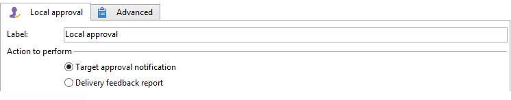

# Approvazione locale{#local-approval}

Quando viene integrato in un flusso di lavoro di targeting, la **[!UICONTROL Local approval]** activity ti consente di impostare un processo di approvazione del destinatario prima che la consegna venga inviata.

>[!CAUTION]
>
>Per utilizzare questa attività, è necessario aver acquistato il modulo Marketing distribuito , che è un’opzione Campaign. Controlla il contratto di licenza.

Per un esempio di **[!UICONTROL Local approval]** attività con un modello di distribuzione, fai riferimento a [Utilizzo dell’attività di approvazione locale](local-approval-activity.md).

Inizia immettendo un’etichetta per l’attività e il **[!UICONTROL Action to execute]** campo:

* Seleziona la **[!UICONTROL Target approval notification]** opzione per inviare un messaggio e-mail di notifica alle autorità di vigilanza locali prima della consegna, chiedendo loro di approvare i destinatari assegnati.

* **Incremental query**: consente di eseguire una query e pianificarne l’esecuzione. Fai riferimento a [Incremental query](incremental-query.md) sezione .

   

## Notifica di approvazione di destinazione {#target-approval-notification}

In questo caso, il **[!UICONTROL Local approval]** l’attività viene inserita tra il targeting a monte e la consegna:

I campi da inserire nel caso di una notifica per l’approvazione del target sono i seguenti:

* **[!UICONTROL Distribution context]**: seleziona la **[!UICONTROL Specified in the transition]** se utilizzi un **[!UICONTROL Split]** digita l’attività per limitare la popolazione target. In questo caso, il modello di distribuzione viene inserito nell’attività divisa. Se non stai limitando la popolazione target, seleziona la **[!UICONTROL Explicit]** qui e immetti il modello di distribuzione nel **[!UICONTROL Data distribution]** campo .

   Per ulteriori informazioni sulla creazione di un modello di distribuzione dati, consulta [Limitazione del numero di record di sottoinsiemi per distribuzione di dati](split.md#limiting-the-number-of-subset-records-per-data-distribution).

* **[!UICONTROL Approval management]**

   * Seleziona il modello di consegna e l’oggetto da utilizzare per la notifica e-mail. È disponibile un modello predefinito: **[!UICONTROL Local approval notification]**. Puoi anche aggiungere una descrizione che verrà visualizzata sopra gli elenchi dei destinatari nelle notifiche di approvazione e feedback.
   * Specifica la **[!UICONTROL Approval type]** che corrisponde al termine di approvazione (data o scadenza dall&#39;inizio dell&#39;approvazione). A questa data, il flusso di lavoro viene riavviato e i destinatari che non sono stati approvati non vengono presi in considerazione nel targeting. Una volta inviate le notifiche, l’attività viene messa in coda in modo che le autorità di vigilanza locali possano approvare i loro contatti.

      >[!NOTE]
      >
      >Per impostazione predefinita, all’avvio del processo di approvazione, l’attività viene sospesa per tre giorni.

      È inoltre possibile aggiungere uno o più promemoria per informare le autorità di vigilanza locali che la scadenza si sta avvicinando. A questo scopo, fai clic sul pulsante **[!UICONTROL Add a reminder]** link.

* **[!UICONTROL Complementary set]**: la **[!UICONTROL Generate complement]** consente di generare un secondo set che include tutti i target non approvati.

   >[!NOTE]
   >
   >Questa opzione è disabilitata per impostazione predefinita.

## Rapporto del feedback sulla consegna {#delivery-feedback-report}

In questo caso, il **[!UICONTROL Local approval]** l’attività viene inserita dopo la consegna:

Nel caso di un rapporto di feedback sulla consegna, devono essere inseriti i campi seguenti:

* Seleziona la **[!UICONTROL Specified in the transition]** se la consegna è stata inserita durante un’attività precedente. Seleziona **[!UICONTROL Explicit]** per specificare la consegna nell’attività di approvazione locale.
* Seleziona il modello di consegna e l’oggetto dell’e-mail di notifica. Esiste un modello predefinito: **[!UICONTROL Local approval notification]**.

## Esempio: Approvazione di una consegna del flusso di lavoro {#example--approving-a-workflow-delivery}

Questo esempio mostra come impostare un processo di approvazione per una consegna di flusso di lavoro. Per ulteriori informazioni sulla creazione di flussi di lavoro di consegna, consulta [Esempio: flusso di lavoro di consegna](delivery.md#example--delivery-workflow) sezione .

Un operatore può approvare una consegna in uno dei due modi seguenti: utilizzare la pagina web collegata nel messaggio e-mail o tramite la console.

* Approvazione web

   L’e-mail inviata agli operatori del gruppo Amministratore consente di approvare la destinazione della consegna. Il messaggio utilizza il testo definito e l’espressione JavaScript viene sostituita dal valore calcolato (in questo caso, &#39;574&#39;)

   Per approvare la consegna, fai clic sul collegamento pertinente e accedi alla console Adobe Campaign.

   

   Fai una scelta e fai clic sul pulsante **[!UICONTROL Submit]** pulsante .

   

* Approvazione tramite la console

   Nella struttura ad albero, il **[!UICONTROL Administration > Production > Objects created automatically > Approvals pending]** il nodo contiene l&#39;elenco delle attività che devono essere approvate dall&#39;operatore attualmente connesso. Nell’elenco deve essere visualizzata una riga. Fai doppio clic su questa riga per rispondere. Viene visualizzata la seguente finestra:

Seleziona **Sì**, quindi fai clic su **[!UICONTROL Approve]**. Un messaggio ti informa che la risposta è stata registrata.

Torna alla schermata del flusso di lavoro: Dopo circa dieci secondi, il diagramma viene visualizzato come segue:

Il flusso di lavoro ha eseguito il **[!UICONTROL Delivery control]** attività , che in questo caso significa avviare la consegna creata in precedenza. Il flusso di lavoro è stato completato senza errori.
