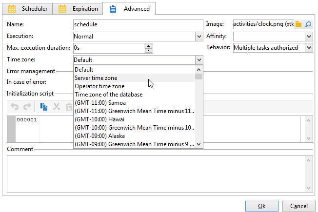

# Gestire i fusi orari{#managing-time-zones}

Adobe Campaign consente di gestire i ritardi tra i vari paesi interessati dalla stessa istanza. La configurazione applicata viene configurata durante la creazione dell’istanza.

In un flusso di lavoro, puoi adattare i programmi di esecuzione dell’attività e collegare un fuso orario specifico a un’attività o all’intero flusso di lavoro. Questa configurazione può essere utile durante l’importazione del file o nel quadro della pianificazione della consegna.

## Pianificazione dell’esecuzione {#execution-scheduling}

È possibile pianificare l&#39;esecuzione delle attività utilizzando la pianificazione (fare riferimento a [Pianificazione](scheduler.md)). Puoi anche utilizzare le opzioni di pianificazione disponibili nelle attività che offrono questa funzionalità. Queste attività offrono una scheda **[!UICONTROL Schedule]**: **[!UICONTROL File collector]**, **[!UICONTROL File transfer]**, **[!UICONTROL Web download]**, **[!UICONTROL Email reception]** e **[!UICONTROL SMS]**, ecc.

Per tutte le attività pianificate, ovvero tutte le attività con opzioni di pianificazione, è possibile selezionare il fuso orario da applicare. Il fuso orario viene selezionato tramite la scheda **[!UICONTROL Advanced]** dell&#39;attività interessata:

I valori possibili sono:

* Fuso orario server

  Utilizza il fuso orario del server applicazioni Adobe Campaign.

* Fuso orario utente

  Utilizza il fuso orario dell’operatore Adobe Campaign che esegue il flusso di lavoro.

* Fuso orario del database

  Utilizza il fuso orario del server di database utilizzato.

* Fusi orari specifici

  Utilizza il fuso orario selezionato.

Se è selezionato il valore **[!UICONTROL By default]**, viene applicato il fuso orario del flusso di lavoro o, in caso contrario, quello del server applicazioni.

## Collegamento di un fuso orario a un’attività {#linking-a-time-zone-to-an-activity}

La scheda **[!UICONTROL Advanced]** delle attività del flusso di lavoro consente di selezionarne il fuso orario. Anche se nella maggior parte dei casi il fuso orario dei flussi di lavoro è sufficiente, può essere necessario sovraccaricarlo ora e ancora per un’attività specifica, ad esempio l’importazione di dati, per collegare le date al fuso orario corretto.
