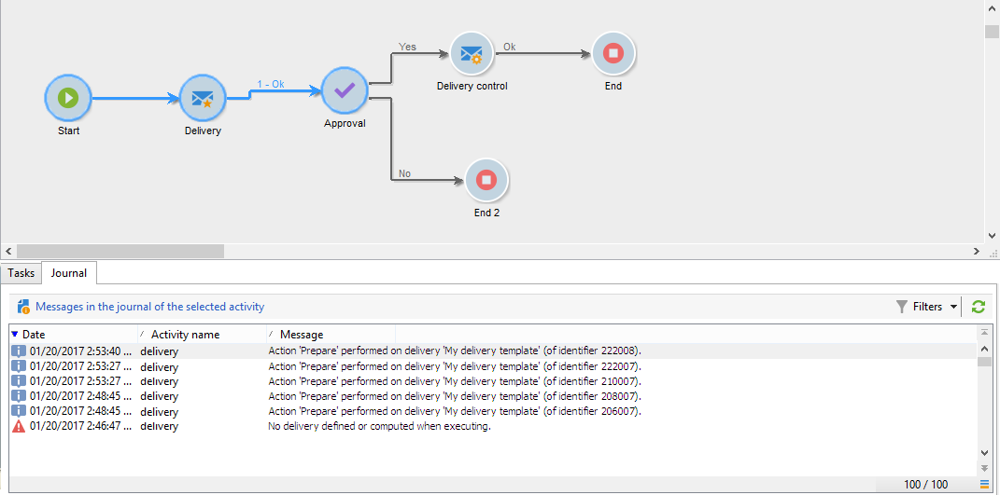

# Monitorare l’esecuzione di un flusso di lavoro {#monitoring-workflow-execution}

Questa sezione contiene informazioni su come monitorare l’esecuzione dei flussi di lavoro.

Un caso d’uso su come creare un flusso di lavoro che consente di monitorare lo stato di un set di flussi di lavoro &quot;in pausa&quot;, &quot;interrotti&quot; o &quot;con errori&quot; è disponibile anche in [questa sezione](workflow-supervision.md#supervising-workflows).

Inoltre, gli amministratori dell’istanza possono utilizzare **Audit trail** per verificare le attività e le ultime modifiche apportate ai flussi di lavoro, lo stato dei flussi di lavoro. Ulteriori informazioni su Audit trail sono disponibili in questo articolo [pagina](../../v8/reporting/audit-trail.md){target="_blank"}.

## Visualizzazione dell&#39;avanzamento {#displaying-progress}

Puoi monitorare l’esecuzione visualizzando l’avanzamento utilizzando l’icona appropriata sulla barra degli strumenti.

Il **[!UICONTROL Display progress information]** L’icona ti consente di visualizzare lo stato e il risultato dell’attività nella schermata di esecuzione.


Quando questa opzione è selezionata, le attività eseguite vengono visualizzate in blu, le attività in sospeso lampeggiano, gli avvisi vengono visualizzati in arancione e gli errori in rosso. Questa opzione visualizza anche il risultato delle attività nella relativa transizione in uscita, seguito dall’etichetta del risultato definita nelle proprietà dell’attività e dalla durata del processo, se superiore a un secondo


## Visualizzazione dei registri {#displaying-logs}

Il registro contiene la cronologia o l’audit trail del flusso di lavoro. Registra tutte le azioni dell’utente, tutte le operazioni eseguite e gli errori riscontrati. Puoi eseguire le seguenti azioni:

* Seleziona la **[!UICONTROL Tracking]** nel dettaglio. Questo elenco contiene tutti i messaggi del flusso di lavoro.

  

* Filtra i messaggi di registro per attività. A questo scopo, fai clic su **[!UICONTROL Display the tasks and the log]** sulla barra degli strumenti sopra il diagramma per visualizzare **[!UICONTROL Log]** e **[!UICONTROL Tasks]** sotto il diagramma. Seleziona un’attività per visualizzare tutti i messaggi correlati. Questo elenco contiene tutti i messaggi quando non è selezionata alcuna attività.

  

  >[!NOTE]
  >
  >Fare clic sullo sfondo del diagramma per deselezionare tutti gli elementi.

* Visualizza solo i messaggi collegati a una determinata attività. A questo scopo, seleziona la **[!UICONTROL Tasks]** e quindi selezionare un&#39;attività nel diagramma per limitare l&#39;elenco. Fare doppio clic su un&#39;attività per visualizzare le informazioni; l&#39;ultima scheda della finestra contiene il registro.

  

  Il **[!UICONTROL Details...]** consente di visualizzare tutte le informazioni aggiuntive sull’esecuzione dell’attività. Ad esempio, puoi visualizzare l’operatore di convalida e, se applicabile, il commento inserito durante l’approvazione.

>[!NOTE]
>
>Il registro non viene eliminato al riavvio di un flusso di lavoro. Tutti i messaggi vengono conservati. Se desideri eliminare i messaggi di un’esecuzione precedente, devi eliminare la cronologia.

Il registro mostra l’elenco cronologico dei messaggi di esecuzione relativi alle attività del flusso di lavoro di targeting.

* Registro di una campagna di targeting

  Dopo aver eseguito una campagna di targeting, fai clic su **[!UICONTROL Tracking]** per visualizzare la traccia dell’esecuzione.

  

  Vengono visualizzati tutti i messaggi della campagna: campagne eseguite, avvisi o errori.

* Registro di un’attività

  Puoi anche visualizzare il registro di esecuzione e i dettagli di ogni attività. Esistono due modi per farlo:

   1. Seleziona l’attività con targeting e fai clic su **[!UICONTROL Display the tasks and the log]** icona.

      

      La sezione inferiore del diagramma mostra due schede: Registro e Attività.

      Le attività selezionate nel diagramma fungono da filtri nell&#39;elenco dei registri e delle attività.

      

   1. Fai clic con il pulsante destro del mouse sull’attività di destinazione e seleziona **[!UICONTROL Display logs]**.

      

      Il registro viene visualizzato in una finestra separata.

## Rimozione dei registri {#purging-the-logs}

La cronologia del flusso di lavoro non viene eliminata automaticamente: tutti i messaggi vengono conservati per impostazione predefinita. La cronologia può essere eliminata tramite **[!UICONTROL File > Actions]** o facendo clic sul pulsante **[!UICONTROL Actions]** nella barra degli strumenti sopra l’elenco. Seleziona **[!UICONTROL Purge history]**. Le opzioni disponibili nel **[!UICONTROL Actions]** il menu è descritto in [Barra delle azioni](start-a-workflow.md) sezione.


## Tabelle di lavoro e schema flusso di lavoro {#worktables-and-workflow-schema}

Il flusso di lavoro trasmette tabelle di lavoro che possono essere manipolate tramite determinate attività. Adobe Campaign consente di modificare, rinominare e arricchire le colonne delle tabelle di lavoro del flusso di lavoro tramite attività di gestione dati, ad esempio per allinearle alla nomenclatura in base alle esigenze del cliente, per raccogliere informazioni aggiuntive sul co-beneficiario di un contratto, ecc.

È inoltre possibile creare collegamenti tra varie dimensioni di lavoro e definire modifiche alle dimensioni. Ad esempio, per ogni contratto registrato nella banca dati, indicare nelle informazioni supplementari il titolare principale e utilizzare i dati dei cotitolari.

Le tabelle di lavoro del flusso di lavoro vengono eliminate automaticamente quando il flusso di lavoro viene passivo. Se si desidera conservare una tabella di lavoro, salvarla in un elenco tramite **[!UICONTROL List update]** attività (fare riferimento a [Aggiornamento elenco](list-update.md)).

## Gestione degli errori {#managing-errors}

Quando si verifica un errore, il flusso di lavoro viene messo in pausa e l’attività in esecuzione quando si verifica l’errore lampeggia in rosso. Nella panoramica del flusso di lavoro, sotto **[!UICONTROL Monitoring]** scheda -  **[!UICONTROL Workflows]** , puoi visualizzare i flussi di lavoro con solo errori, come mostrato di seguito.


In Adobe Campaign Explorer, nell’elenco dei flussi di lavoro viene visualizzata una **[!UICONTROL Failed]** per impostazione predefinita.


Quando un flusso di lavoro è in errore, gli operatori appartenenti al gruppo di supervisione del flusso di lavoro ricevono una notifica via e-mail, purché il loro indirizzo e-mail sia elencato nel profilo. Questo gruppo è selezionato nel **[!UICONTROL Supervisor(s)]** delle proprietà del flusso di lavoro.


Il contenuto della notifica è configurato in **[!UICONTROL Workflow manager notification]** modello predefinito: questo modello è selezionato nel **[!UICONTROL Execution]** delle proprietà del flusso di lavoro. La notifica mostra il nome del flusso di lavoro di errore e dell’attività interessata.

Esempio di notifica:


Il collegamento ti consente di accedere alla console client di Adobe Campaign in modalità Web e di lavorare sul flusso di lavoro degli errori dopo aver effettuato l’accesso.


Puoi configurare il flusso di lavoro in modo che non vada in pausa e continui l’esecuzione in caso di errori. A questo scopo, modifica il flusso di lavoro **[!UICONTROL Properties]** e, nella **[!UICONTROL Error management]** , seleziona la sezione **[!UICONTROL Ignore]** opzione in **[!UICONTROL In case of error]** campo. È quindi possibile specificare il numero di errori consecutivi che possono essere ignorati prima della messa in pausa del processo.

In questo caso, l’attività di errore viene interrotta. Questa modalità è particolarmente adatta per i flussi di lavoro progettati per ritentare la campagna in un secondo momento (azioni periodiche).


>[!NOTE]
>
>Puoi applicare questa configurazione singolarmente per ogni attività. A questo scopo, modifica le proprietà dell’attività e seleziona la modalità di gestione degli errori in **[!UICONTROL Advanced]** scheda.

## Errori di elaborazione {#processing-errors}

Per quanto riguarda le attività, **[!UICONTROL Process errors]** Questa opzione visualizza una transizione specifica che verrà attivata se viene generato un errore. In questo caso, il flusso di lavoro non entra in modalità di errore e l’esecuzione continua.

Gli errori presi in considerazione sono errori del file system (file non spostabile, directory non accessibile, ecc.).

Questa opzione non elabora gli errori relativi alla configurazione dell’attività, ovvero valori non validi. Gli errori relativi a una configurazione errata non abiliteranno questa transizione (la directory non esiste, ecc.).

Se un flusso di lavoro viene sospeso (manualmente o automaticamente dopo un errore), il **[!UICONTROL Start]** riavvia l’esecuzione del flusso di lavoro nel punto in cui è stata interrotta. L’attività errata (o l’attività in pausa) verrà rieseguita. Le attività precedenti non vengono rieseguite.

Per eseguire nuovamente tutte le attività del flusso di lavoro, utilizza **[!UICONTROL Restart]** pulsante.

Se modifichi attività già eseguite, le modifiche non vengono prese in considerazione al riavvio dell’esecuzione del flusso di lavoro.

Se modifichi le attività non eseguite, queste vengono prese in considerazione al riavvio dell’esecuzione del flusso di lavoro.

Se modifichi le attività in pausa, le modifiche non possono essere prese in considerazione correttamente al riavvio del flusso di lavoro.

Se possibile, si consiglia di riavviare completamente il flusso di lavoro dopo aver eseguito le modifiche.

## Supervisione istanza {#instance-supervision}

Il **[!UICONTROL Instance supervision]** Questa pagina consente di visualizzare l’attività del server Adobe Campaign e l’elenco dei flussi di lavoro e delle consegne con errori.

Per accedere a questa pagina, vai al **[!UICONTROL Monitoring]** e fai clic sul pulsante **[!UICONTROL General view]** collegamento.


Per visualizzare tutti i flussi di lavoro, fai clic sul pulsante **[!UICONTROL Workflows]** collegamento. Utilizza l’elenco a discesa per visualizzare i flussi di lavoro nella piattaforma in base al loro stato.


Fai clic sul collegamento con errori in un flusso di lavoro per aprirlo e visualizzarne il registro.


## Impedire esecuzioni simultanee multiple {#preventing-simultaneous-multiple-executions}

Un singolo flusso di lavoro può avere più esecuzioni in esecuzione contemporaneamente. In alcuni casi è necessario evitare che ciò si verifichi.

Ad esempio, puoi fare in modo che una pianificazione attivi l’esecuzione del flusso di lavoro ogni ora, ma a volte l’esecuzione dell’intero flusso di lavoro richiede più di un’ora. Potrebbe essere necessario saltare l’esecuzione se il flusso di lavoro è già in esecuzione.

Se hai un’attività di segnale all’inizio del flusso di lavoro, potresti voler saltare il segnale se il flusso di lavoro è in esecuzione.

Il principio generale è il seguente:


La soluzione consiste nell’utilizzare una variabile di istanza. Le variabili dell’istanza sono condivise da tutte le esecuzioni parallele dei flussi di lavoro.

Di seguito è riportato un semplice flusso di lavoro di test:


Il **[!UICONTROL Scheduler]** sta attivando un evento ogni minuto. I seguenti elementi **[!UICONTROL Test]** l&#39;attività sta per testare **isRunning** variabile di istanza per decidere se continuare o meno l’esecuzione:


>[!NOTE]
>
>**isRunning** è un nome di variabile scelto per questo esempio. Questa non è una variabile incorporata.

L’attività immediatamente successiva alla **[!UICONTROL Test]** nel **sì** branch deve impostare la variabile di istanza nel relativo **Script di inizializzazione**:

```
instance.vars.isRunning = true
```

L’ultima attività in **sì** branch deve ripristinare la variabile su false nei relativi **Script di inizializzazione**:

```
instance.vars.isRunning = false
```

Tieni presente che:

* Puoi controllare il valore corrente della variabile di istanza tramite **Variabili** scheda nel flusso di lavoro **Proprietà**.
* Le variabili dell’istanza vengono reimpostate al riavvio di un flusso di lavoro.
* In JavaScript, un valore non definito è falso in un test, consentendo di testare la variabile di istanza anche prima di averla inizializzata.
* Per monitorare le attività non elaborate a causa di questo meccanismo, aggiungi un’istruzione di registrazione allo script di inizializzazione dell’endpoint &quot;no&quot;.

  ```
  logInfo("Workflow already running, parallel execution not allowed.");
  ```

Un caso d’uso è presentato in questa sezione: [Coordinamento degli aggiornamenti dei dati](coordinate-data-updates.md).

## Manutenzione del database {#database-maintenance}

I flussi di lavoro utilizzano molte tabelle di lavoro che occupano spazio e finiscono per rallentare l’intera piattaforma se non vengono mantenuti.

Il **Database cleanup** accessibile tramite il **Amministrazione > Produzione > Flussi di lavoro tecnici** , consente di eliminare i dati obsoleti per evitare la crescita esponenziale del database. Il flusso di lavoro viene attivato automaticamente senza l’intervento dell’utente.

Puoi anche creare flussi di lavoro tecnici specifici per eliminare i dati non necessari che occupano spazio. Fai riferimento a e [sezione](#purging-the-logs).

## Gestione dei flussi di lavoro in pausa {#handling-of-paused-workflows}

Per impostazione predefinita, se un flusso di lavoro viene sospeso, le relative tabelle di lavoro non vengono mai eliminate. Dalla build 8880, i flussi di lavoro che sono stati in pausa per troppo tempo vengono automaticamente interrotti e le relative tabelle di lavoro vengono eliminate. Questo comportamento viene attivato come segue:

* I flussi di lavoro sospesi da più di 7 giorni vengono visualizzati come un avviso nel dashboard di monitoraggio (e nell’API di monitoraggio) e viene inviata una notifica al gruppo di supervisori.
* Lo stesso accade ogni settimana, quando **[!UICONTROL cleanupPausedWorkflows]** viene attivato il flusso di lavoro tecnico. Per ulteriori dettagli sul flusso di lavoro, consulta [questa sezione](delivery.md).
* Dopo 4 notifiche (ovvero un mese in stato di pausa per impostazione predefinita), il flusso di lavoro viene interrotto incondizionatamente. Dopo l’interruzione, nel flusso di lavoro viene visualizzato un registro. Le tabelle vengono eliminate all’esecuzione successiva **[!UICONTROL cleanup]** workflow

Questi periodi possono essere configurati tramite l’opzione NmsServer_PausedWorkflowPeriod.

I supervisori del flusso di lavoro ricevono una notifica. Vengono avvisati anche il creatore e l’ultimo utente che ha modificato il flusso di lavoro. Gli amministratori non ricevono le notifiche.

## Filtrare i flussi di lavoro in base al loro stato {#filtering-workflows-status}

L’interfaccia Campaign Classic ti consente di monitorare lo stato di esecuzione di tutti i flussi di lavoro sull’istanza utilizzando predefiniti **visualizzazioni**. Per accedere a queste visualizzazioni, apri **[!UICONTROL Administration]** / **[!UICONTROL Audit]** / **[!UICONTROL Workflows Status]** nodo.

Sono disponibili le seguenti viste:

* **[!UICONTROL Running]**: elenca tutti i flussi di lavoro in esecuzione.
* **[!UICONTROL Paused]**: elenca tutti i flussi di lavoro in pausa.
* **[!UICONTROL Failed]**: elenca tutti i flussi di lavoro non riusciti.
* ** ).


Per impostazione predefinita, queste visualizzazioni sono accessibili nel **[!UICONTROL Audit]** cartella. Tuttavia, è possibile ricrearli nella posizione desiderata nella struttura delle cartelle. In questo modo, saranno disponibili per gli utenti standard senza alcun diritto di amministrazione.

Per eseguire questa operazione:

1. Fare clic con il pulsante destro del mouse sulla cartella in cui si desidera aggiungere la visualizzazione.
1. In entrata **[!UICONTROL Add new folder]** / **[!UICONTROL Administration]**, selezionare la visualizzazione da aggiungere.
1. Una volta aggiunta la cartella alla struttura, accertati di configurarla come vista, in modo che vengano visualizzati tutti i flussi di lavoro, indipendentemente dalla cartella di origine. Per ulteriori informazioni su come configurare le visualizzazioni, consulta [questa pagina](../../v8/audiences/folders-and-views.md#turn-a-folder-to-a-view).

Oltre a queste visualizzazioni, puoi impostare cartelle di filtri che ti consentano di filtrare l’elenco dei flussi di lavoro in base al loro stato di esecuzione. Per eseguire questa operazione:

1. Accedi a una cartella di tipo flusso di lavoro, quindi seleziona la **[!UICONTROL Filters]** / **[!UICONTROL Advanced filter]** menu.
1. Configura il filtro in modo che il **[!UICONTROL @status]** è uguale allo stato scelto.
1. Salva e assegna un nome al filtro. Sarà quindi disponibile direttamente dall’elenco dei filtri.


Per ulteriori informazioni, consulta le sezioni seguenti:
