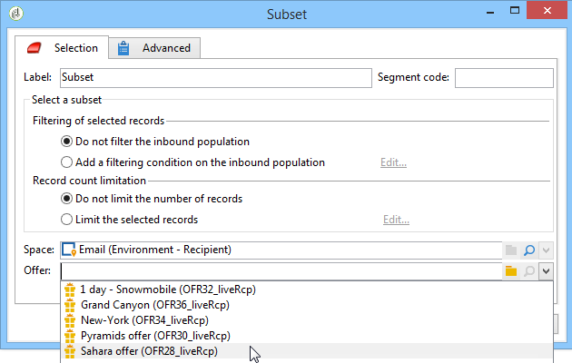

# Offerte per cella{#offers-by-cell}

L&#39;attività **[!UICONTROL Offers by cell]** consente di distribuire il gruppo in entrata (ad esempio da una query) in più segmenti e di specificare un&#39;offerta da presentare per ciascuno di questi segmenti.

Questa attività può essere utilizzata solo con **Interaction**. Ulteriori informazioni sulla gestione delle offerte sono disponibili in [questa sezione](../../v8/interaction/interaction.md).

Per eseguire questa operazione:

1. Aggiungere l&#39;attività **[!UICONTROL Offers by cell]** dopo aver specificato la popolazione target, quindi aprirla.
1. Nella scheda **[!UICONTROL General]**, seleziona lo spazio dell&#39;offerta in cui desideri presentare le offerte.
1. Nella scheda **[!UICONTROL Cells]**, specifica i diversi sottoinsiemi utilizzando il pulsante **[!UICONTROL Add]**:

   * Specifica la popolazione del sottoinsieme utilizzando le regole di filtro e limitazione disponibili.
   * Quindi, seleziona l’offerta da presentare al sottoinsieme. Le offerte disponibili sono quelle idonee per lo spazio dell’offerta selezionato al passaggio precedente.

     

1. Quindi configura un’attività di consegna che corrisponde al canale scelto. Consulta [Consegne cross-channel](cross-channel-deliveries.md).
