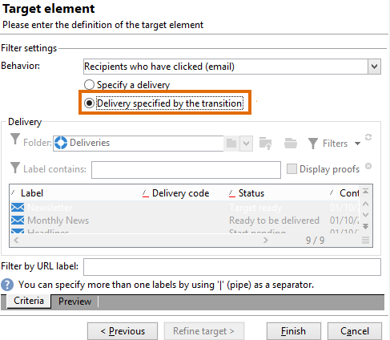

# Eseguire una query sulle informazioni di consegna {#querying-delivery-information}

## Numero di clic per una consegna specifica {#number-of-clicks-for-a-specific-delivery}

In questo esempio, stiamo cercando di recuperare il numero di clic per una consegna specifica. Questi clic vengono registrati grazie ai registri di tracciamento dei destinatari acquisiti in un dato periodo. Il destinatario viene identificato tramite il suo indirizzo e-mail. Questa query utilizza **[!UICONTROL Recipient tracking logs]** tabella.

* Quale tabella deve essere selezionata?

  Tabella di tracciamento del registro dei destinatari (**[!UICONTROL nms:trackingLogRcp]**)

* Campi da selezionare per le colonne di output?

  Chiave primaria (con conteggio) e e-mail

* Su quali criteri verranno filtrate le informazioni?

  Un periodo specifico e un elemento dell’etichetta di consegna

Per eseguire questo esempio, attieniti alla seguente procedura:

1. Apri **[!UICONTROL Generic query editor]** e seleziona la **[!UICONTROL Recipient tracking logs]** schema.

   

1. In **[!UICONTROL Data to extract]** si desidera creare un aggregato per raccogliere informazioni. A questo scopo, aggiungi la chiave primaria (situata sopra la chiave principale) **[!UICONTROL Recipient tracking logs]** : il conteggio dei registri di tracciamento viene eseguito su questo **[!UICONTROL Primary key]** campo. L’espressione modificata sarà **[!UICONTROL x=count(primary key)]**. Collega la somma dei vari registri di tracciamento a un singolo indirizzo e-mail.

   Per eseguire questa operazione:

   * Fai clic su **[!UICONTROL Add]** a destra del **[!UICONTROL Output columns]** campo. In **[!UICONTROL Formula type]** , selezionare la **[!UICONTROL Edit the formula using an expression]** e fai clic su **[!UICONTROL Next]**. In **[!UICONTROL Field to select]** finestra, fai clic su **[!UICONTROL Advanced selection]**.

     

   * In **[!UICONTROL Formula type]** eseguire un processo sulla funzione di aggregazione. Questo processo sarà un conteggio di chiavi primarie.

     Seleziona **[!UICONTROL Process on an aggregate function]** nel **[!UICONTROL Aggregate]** e fai clic su **[!UICONTROL Count]**.

     

     Fai clic su **[!UICONTROL Next]**.

   * Seleziona la **[!UICONTROL Primary key (@id)]** campo. Il **[!UICONTROL count (primary key)]** colonna di output configurata.

     

1. Selezionare l&#39;altro campo da visualizzare nella colonna di output. In **[!UICONTROL Available fields]** , aprire la **[!UICONTROL Recipient]** e scegli **[!UICONTROL Email]**. Controlla la **[!UICONTROL Group]** casella a **[!UICONTROL Yes]** per raggruppare i registri di tracciamento per indirizzo e-mail: questo gruppo collega ciascun registro al relativo destinatario.

   

1. Configura l’ordinamento delle colonne in modo che vengano visualizzati per primi i destinatari più attivi (con il maggior numero di registri di tracciamento). Verifica **[!UICONTROL Yes]** nel **[!UICONTROL Descending sort]** colonna.

   

1. Devi quindi filtrare i registri che ti interessano, ovvero quelli che hanno meno di 2 settimane e che riguardano le consegne relative alle vendite.

   Per eseguire questa operazione:

   * Configura il filtro dei dati. A questo scopo, seleziona **[!UICONTROL Filter conditions]** quindi fai clic su **[!UICONTROL Next]**.

     

   * Recupera i registri di tracciamento in un determinato periodo per una consegna specifica. Sono necessarie tre condizioni di filtro: due condizioni di data per impostare il periodo di ricerca tra 2 settimane prima della data corrente e il giorno prima della data corrente; e un’altra condizione per limitare la ricerca a una consegna specifica.

     In **[!UICONTROL Target element]** , configura la data a partire dalla quale i registri di tracciamento verranno presi in considerazione. Fai clic su **[!UICONTROL Add]**. Viene visualizzata una riga di condizione. Modifica il **[!UICONTROL Expression]** facendo clic sul pulsante **[!UICONTROL Edit expression]** funzione. In **[!UICONTROL Field to select]** finestra, scegli **[!UICONTROL Date (@logDate)]**.

     

     Seleziona la **[!UICONTROL greater than]** operatore. In **[!UICONTROL Value]** , fare clic su **[!UICONTROL Edit expression]**, e nella **[!UICONTROL Formula type]** finestra, seleziona **[!UICONTROL Process on dates]**. Infine, in **[!UICONTROL Current date minus n days]**, immettere &quot;15&quot;.

     Fai clic su **[!UICONTROL Finish]**.

     

   * Per selezionare la data di fine della ricerca nel registro di tracciamento, crea una seconda condizione facendo clic su **[!UICONTROL Add]**. In **[!UICONTROL Expression]** , scegli **[!UICONTROL Date (@logDate)]** di nuovo.

     Seleziona la **[!UICONTROL less than]** operatore. In **[!UICONTROL Value]** , fare clic su **[!UICONTROL Edit expression]**. Per l’elaborazione della data, vai a **[!UICONTROL Formula type]** finestra, immettere &quot;1&quot; in **[!UICONTROL Current date minus n days]**.

     Fai clic su **[!UICONTROL Finish]**.

     

     Ora vogliamo configurare la terza condizione di filtro, ovvero l’etichetta di consegna interessata dalla query.

   * Fai clic su **[!UICONTROL Add]** per creare un&#39;altra condizione di filtro. In **[!UICONTROL Expression]** , fare clic su **[!UICONTROL Edit expression]**. In **[!UICONTROL Field to select]** finestra, scegli **[!UICONTROL Label]** nel **[!UICONTROL Delivery]** nodo.

     Fai clic su **[!UICONTROL Finish]**.

     

     Cerca una consegna contenente la parola &quot;vendite&quot;. Poiché non si ricorda l&#39;etichetta esatta, è possibile scegliere **[!UICONTROL contains]** e inserire &quot;sales&quot; in **[!UICONTROL Value]** colonna.

     

1. Clic **[!UICONTROL Next]** fino a quando non raggiungi il **[!UICONTROL Data preview]** window: non è necessaria alcuna formattazione qui.
1. In **[!UICONTROL Data preview]** finestra, fai clic su **[!UICONTROL Start the preview of the data]** per visualizzare il numero di registri di tracciamento per ogni destinatario della consegna.

   Il risultato viene visualizzato in ordine decrescente.

   

   Il numero più alto di registri per un utente è 6 per questa consegna. 5 utenti diversi hanno aperto l’e-mail di consegna o fatto clic su uno dei collegamenti presenti nell’e-mail.

## Destinatari che non hanno aperto alcuna consegna {#recipients-who-did-not-open-any-delivery}

In questo esempio, vogliamo filtrare i destinatari che non hanno aperto un’e-mail negli ultimi 7 giorni.

Per creare questo esempio, attieniti alla seguente procedura:

1. Trascina una **[!UICONTROL Query]** in un flusso di lavoro e aprire l’attività.
1. Clic **[!UICONTROL Edit query]** e impostare le dimensioni di destinazione e filtro su **[!UICONTROL Recipients]**.

   

1. Seleziona **[!UICONTROL Filtering conditions]** quindi fai clic su **[!UICONTROL Next]**.
1. Fai clic su **[!UICONTROL Add]** e seleziona **[!UICONTROL Tracking logs]**.
1. Imposta il **[!UICONTROL Operator]** del **[!UICONTROL Tracking logs]** espressione a **[!UICONTROL Do not exist such as]**.

   

1. Aggiungi un’altra espressione. Seleziona **[!UICONTROL Type]** nel **[!UICONTROL URL]** categoria.
1. Quindi, imposta i **[!UICONTROL Operator]** a **[!UICONTROL equal to]** e i relativi **[!UICONTROL Value]** a **[!UICONTROL Open]**.

   

1. Aggiungi un’altra espressione e seleziona **[!UICONTROL Date]**. **[!UICONTROL Operator]** deve essere impostato su **[!UICONTROL on or after]**.

   

1. Per impostare il valore negli ultimi 7 giorni, fare clic sul pulsante **[!UICONTROL Edit expression]** pulsante in **[!UICONTROL Value]** campo.
1. In **[!UICONTROL Function]** categoria, seleziona **[!UICONTROL Current date minus n days]** e aggiungi il numero di giorni di cui desideri eseguire il targeting. In questo caso, vogliamo puntare agli ultimi 7 giorni.

   

La transizione in uscita conterrà destinatari che non hanno aperto un’e-mail negli ultimi 7 giorni.

Se, al contrario, desideri filtrare i destinatari che hanno aperto almeno un’e-mail, la query deve essere la seguente. Si prega di notare che, in questo caso, **[!UICONTROL Filtering dimension]** deve essere impostato su **[!UICONTROL Tracking logs (Recipients)]**.

## Destinatari che hanno aperto una consegna {#recipients-who-have-opened-a-delivery}

L’esempio seguente mostra come eseguire il targeting dei profili che hanno aperto una consegna nelle ultime 2 settimane:

1. Per eseguire il targeting dei profili che hanno aperto una consegna, devi utilizzare i registri di tracciamento. sono memorizzate in una tabella collegata: inizia selezionando questa tabella nell’elenco a discesa della **[!UICONTROL Filtering dimension]** come mostrato di seguito:

   

1. Per quanto riguarda le condizioni di filtro, fai clic su **[!UICONTROL Edit expression]** icona dei criteri mostrati nella struttura ad albero secondaria dei registri di tracciamento. Seleziona la **[!UICONTROL Date]** campo.

   

   Clic **[!UICONTROL Finish]** per confermare la selezione.

   Per ripristinare solo i registri di tracciamento di meno di due settimane, seleziona la **[!UICONTROL Greater than]** operatore.

   

   Quindi fai clic su **[!UICONTROL Edit expression]** icona in **[!UICONTROL Value]** per definire la formula di calcolo da applicare. Seleziona la **[!UICONTROL Current date minus n days]** e immettere 15 nel campo correlato.

   

   Fai clic su **[!UICONTROL Finish]** della finestra della formula. Nella finestra di filtraggio, fai clic su **[!UICONTROL Preview]** per verificare i criteri di targeting.

   

## Filtrare il comportamento dei destinatari dopo una consegna {#filtering-recipients--behavior-folllowing-a-delivery}

In un flusso di lavoro, il **[!UICONTROL Query]** e **[!UICONTROL Split]** Le caselle consentono di selezionare un comportamento dopo una consegna precedente. Questa selezione viene eseguita tramite **[!UICONTROL Delivery recipient]** filtro.

* Scopo dell’esempio

  In un flusso di lavoro di consegna sono disponibili diversi modi per dare seguito a una prima comunicazione e-mail. Questo tipo di operazione comporta l&#39;utilizzo di **[!UICONTROL Split]** casella.

* Contesto

  Viene inviata una consegna per un’“offerta di sport estivi”. Quattro giorni dopo la consegna, vengono inviate altre due consegne. Uno di questi è &quot;offerta di sport acquatici&quot;, l&#39;altro è un follow-up della prima consegna &quot;Offerta di sport estivi&quot;.

  La consegna “Offerta sport acquatici” viene inviata ai destinatari che hanno fatto clic sul collegamento “sport acquatici” nella prima consegna. Questi clic mostrano che il destinatario è interessato all’argomento. Ha senso indirizzarli verso offerte simili. Tuttavia, i destinatari che non hanno fatto clic sull’“offerta sport estivi” riceveranno nuovamente lo stesso contenuto.

I passaggi seguenti mostrano come configurare **[!UICONTROL Split]** integrando due comportamenti diversi:

1. Inserisci il **[!UICONTROL Split]** nel flusso di lavoro. In questa casella i destinatari della prima consegna vengono suddivisi nelle due consegne successive. Il raggruppamento si verifica in base alle condizioni di filtro collegate al comportamento del destinatario durante la prima consegna.

   

1. Apri **[!UICONTROL Split]** casella. In **[!UICONTROL General]** , immetti un’etichetta: **Dividi in base al comportamento** ad esempio.

   

1. In **[!UICONTROL Subsets]** , definisci il primo ramo suddiviso. Ad esempio, inserisci il **Clic effettuato** etichetta per questo ramo.
1. Seleziona la **[!UICONTROL Add a filtering condition on the incoming population]** opzione. Fai clic su **[!UICONTROL Edit]**.
1. In **[!UICONTROL Targeting and filtering dimension]** fare doppio clic sulla **[!UICONTROL Recipients of a delivery]** filtro.

   

1. In **[!UICONTROL Target element]** selezionare il comportamento che si desidera applicare al ramo: **[!UICONTROL Recipients having clicked (email)]**.

   Di seguito, seleziona la **[!UICONTROL Delivery specified by the transition]** opzione. Questa funzionalità ripristina automaticamente le persone target durante la prima consegna.

   Questa è la consegna &quot;Offerta sport acquatici&quot;.

   

1. Definite il secondo ramo. Questo ramo includerà l’e-mail di follow-up con lo stesso contenuto della prima consegna. Vai a **[!UICONTROL Subsets]** e fai clic su **[!UICONTROL Add]** per crearlo.

   

1. Viene visualizzata un’altra scheda secondaria. Denomina &quot;**Non ha fatto clic su**&quot;.
1. Fai clic su **[!UICONTROL Add a filtering condition for the incoming population]**. Quindi fai clic su **[!UICONTROL Edit...]**.

   

1. Clic **[!UICONTROL Delivery recipients]** nel **[!UICONTROL Targeting and filtering dimension]** finestra.
1. In **[!UICONTROL Target element]** , selezionare la **[!UICONTROL Recipients who did not click (email)]** comportamento. Seleziona la **[!UICONTROL Delivery specified by the transition]** come nell&#39;ultimo ramo.

   Il **[!UICONTROL Split]** La casella è ora completamente configurata.

   

Di seguito è riportato l’elenco dei vari componenti configurati per impostazione predefinita:

* **[!UICONTROL All recipients]**
* **[!UICONTROL Recipients of successfully sent messages,]**
* **[!UICONTROL Recipients who opened or clicked (email),]**
* **[!UICONTROL Recipients who clicked (email),]**
* **[!UICONTROL Recipients of a failed message,]**
* **[!UICONTROL Recipients who didn't open or click (email),]**
* **[!UICONTROL Recipients who didn't click (email).]**

  
