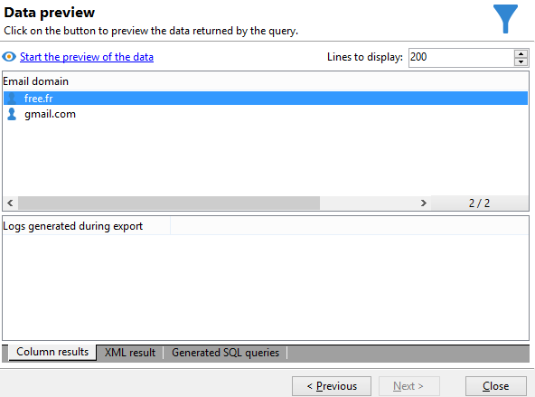

# Eseguire query tramite gestione dei raggruppamenti {#querying-using-grouping-management}

In questo esempio, desideri eseguire una query per trovare tutti i domini e-mail target oltre 30 volte durante le consegne precedenti.

* Quale tabella deve essere selezionata?

  Tabella dei destinatari (nms:recipient)

* Campi da selezionare nelle colonne di output?

  Dominio e-mail e chiave primaria (con conteggio)

* Raggruppamento dati?

  In base al dominio e-mail con un numero di chiavi primarie superiore a 30. Questa operazione viene eseguita con il **[!UICONTROL Group by + Having]** opzione. **[!UICONTROL Group by + Having]** consente di raggruppare i dati (&quot;raggruppa per&quot;) e di effettuare una selezione di ciò che è stato raggruppato (&quot;avere&quot;).

Per creare questo esempio, attieniti alla seguente procedura:

1. Apri **[!UICONTROL Generic query editor]** e scegliere la tabella Destinatario (**nms:destinatario**).

   

1. In **[!UICONTROL Data to extract]** , selezionare la **[!UICONTROL Email domain]** e **[!UICONTROL Primary key]** campi. Esegui un conteggio su **[!UICONTROL Primary key]** campo.

1. Controlla la **[!UICONTROL Handle groupings (GROUP BY + HAVING)]** casella.

   

1. In **[!UICONTROL Sorting]** finestra, ordina i domini e-mail in ordine decrescente. Per eseguire questa operazione, selezionare **[!UICONTROL Yes]** nel **[!UICONTROL Descending sort]** colonna. Fai clic su **[!UICONTROL Next]**.

   

1. In **[!UICONTROL Data filtering]**, seleziona **[!UICONTROL Filtering conditions]**. Vai a **[!UICONTROL Target elements]** e fai clic su **[!UICONTROL Next]**.
1. In **[!UICONTROL Data grouping]** , selezionare la **[!UICONTROL Email domain]** facendo clic su **[!UICONTROL Add]**.

   Questa finestra di raggruppamento dati viene visualizzata solo se **[!UICONTROL Handle groupings (GROUP BY + HAVING]**) è stata selezionata.

   

1. In **[!UICONTROL Grouping condition]** finestra, indica un conteggio di chiavi primarie maggiore di 30 poiché si desidera che vengano restituiti come risultati solo i domini e-mail con destinazione superiore a 30 volte.

   Questa finestra viene visualizzata quando **[!UICONTROL Manage groupings (GROUP BY + HAVING)]** La casella è stata selezionata: è qui che il risultato del raggruppamento viene filtrato (HAVING).

   

1. In **[!UICONTROL Data formatting]** finestra, fai clic su **[!UICONTROL Next]**: qui non è necessaria alcuna formattazione.
1. Nella finestra di anteprima dati, fai clic su **[!UICONTROL Launch data preview]**: qui vengono restituiti tre diversi domini e-mail target più di 30 volte.

   
