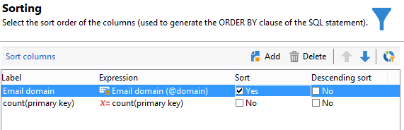

# Eseguire query tramite gestione dei raggruppamenti {#querying-using-grouping-management}

In questo esempio, desideri eseguire una query per trovare tutti i domini e-mail target oltre 30 volte durante le consegne precedenti.

* Quale tabella deve essere selezionata?

  Tabella dei destinatari (nms:recipient)

* Campi da selezionare nelle colonne di output?

  Dominio e-mail e chiave primaria (con conteggio)

* Raggruppamento dati?

  In base al dominio e-mail con un numero di chiavi primarie superiore a 30. Questa operazione viene eseguita con l&#39;opzione **[!UICONTROL Group by + Having]**. **[!UICONTROL Group by + Having]** consente di raggruppare i dati (&quot;raggruppare per&quot;) e di selezionare ciò che è stato raggruppato (&quot;avere&quot;).

Per creare questo esempio, attieniti alla seguente procedura:

1. Apri **[!UICONTROL Generic query editor]** e scegli la tabella Destinatario (**nms:recipient**).

   

1. Nella finestra **[!UICONTROL Data to extract]**, selezionare i campi **[!UICONTROL Email domain]** e **[!UICONTROL Primary key]**. Eseguire un conteggio nel campo **[!UICONTROL Primary key]**.

1. Selezionare la casella **[!UICONTROL Handle groupings (GROUP BY + HAVING)]**.

   

1. Nella finestra **[!UICONTROL Sorting]**, ordina i domini e-mail in ordine decrescente. Per eseguire questa operazione, selezionare **[!UICONTROL Yes]** nella colonna **[!UICONTROL Descending sort]**. Fai clic su **[!UICONTROL Next]**.

   

1. In **[!UICONTROL Data filtering]**, selezionare **[!UICONTROL Filtering conditions]**. Passare alla finestra **[!UICONTROL Target elements]** e fare clic su **[!UICONTROL Next]**.
1. Nella finestra **[!UICONTROL Data grouping]**, selezionare **[!UICONTROL Email domain]** facendo clic su **[!UICONTROL Add]**.

   Questa finestra di raggruppamento dati viene visualizzata solo se è stata selezionata la casella **[!UICONTROL Handle groupings (GROUP BY + HAVING]**).

   

1. Nella finestra **[!UICONTROL Grouping condition]**, indica un conteggio di chiavi primarie maggiore di 30 poiché si desidera che vengano restituiti come risultati solo i domini e-mail con destinazione superiore a 30 volte.

   Questa finestra viene visualizzata quando è stata selezionata la casella **[!UICONTROL Manage groupings (GROUP BY + HAVING)]**: è qui che il risultato del raggruppamento viene filtrato (HAVING).

   

1. Nella finestra **[!UICONTROL Data formatting]**, fare clic su **[!UICONTROL Next]**: non è necessaria alcuna formattazione.
1. Nella finestra di anteprima dei dati, fai clic su **[!UICONTROL Launch data preview]**: qui vengono restituiti tre diversi domini e-mail con destinazione superiore a 30 volte.

   
