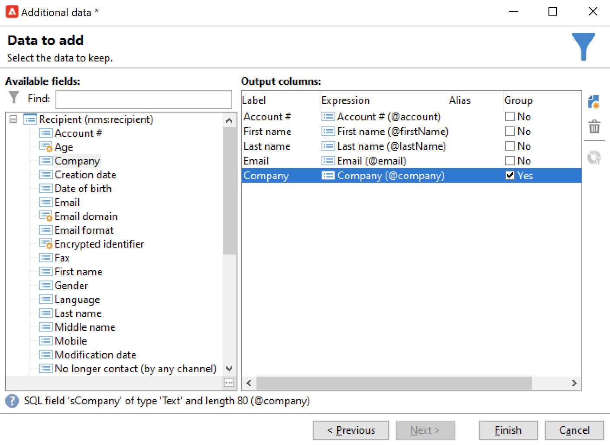

# Query{#query}

## Creare una query {#creating-a-query}

Una query consente di selezionare una destinazione in base ai criteri. È possibile associare un codice di segmento al risultato della query e inserirvi dati aggiuntivi.
Per ulteriori informazioni sugli esempi di query, consulta questa [questa sezione](querying-recipient-table.md).

{width="70%" align="center" zoomable="yes"}

Per ulteriori informazioni sull’utilizzo e la gestione di dati aggiuntivi, consulta [Aggiungi dati](#adding-data).

Il **[!UICONTROL Edit query...]** Il collegamento ti consente di definire il tipo di targeting, le restrizioni e i criteri di selezione per la popolazione nel modo seguente:

1. Seleziona la dimensione di targeting e filtro. Per impostazione predefinita, il target viene selezionato dai destinatari. L’elenco dei filtri di restrizione è lo stesso di quelli utilizzati per il targeting della consegna.

   La dimensione di targeting coincide con il tipo di elemento su cui lavoreremo, ad esempio la popolazione target dell’operazione.

   La dimensione di filtro consente di raccogliere questi elementi, ad esempio informazioni relative alla persona target (contratti, liquidazioni complete e finali, ecc.).

   Per ulteriori informazioni, consulta [Dimensioni di targeting e filtro](targeting-workflows.md#targeting-and-filtering-dimensions).

   {width="70%" align="center" zoomable="yes"}

   Una query può essere basata sui dati della transizione in entrata, se necessario, selezionando **[!UICONTROL Temporary schema]** durante la scelta delle dimensioni di targeting e filtro.

   {width="70%" align="center" zoomable="yes"}

1. Definisci le popolazioni utilizzando la procedura guidata. I campi da immettere possono variare a seconda del tipo di destinazione. Puoi visualizzare in anteprima la popolazione target con i criteri correnti utilizzando **[!UICONTROL Preview]** scheda.

   {width="70%" align="center" zoomable="yes"}

1. Se hai selezionato **[!UICONTROL Filtering conditions]** al passaggio 1 o utilizzando **[!UICONTROL Filters]** > **[!UICONTROL Advanced filter...]** , sarà necessario aggiungere manualmente i criteri di filtro in un secondo momento.

   È inoltre possibile aggiungere condizioni di raggruppamento dei dati selezionando la casella corrispondente. A questo scopo, la dimensione di filtro deve essere diversa dalla dimensione di targeting della query. Per ulteriori informazioni sul raggruppamento, consulta questa [sezione](query-grouping-management.md).

   È inoltre possibile aggiungere altri criteri utilizzando il generatore di espressioni e combinarlo con le opzioni logiche AND, OR e EXCEPT.

   Salva il filtro se desideri riutilizzarlo in un secondo momento.

## Aggiungi dati {#adding-data}

Le colonne aggiuntive consentono di raccogliere informazioni aggiuntive sulla popolazione target, ad esempio numeri di contratto, abbonamenti a newsletter o origini. Questi dati possono essere memorizzati nel database di Adobe Campaign o in un database esterno.

Il **[!UICONTROL Add data...]** consente di selezionare i dati aggiuntivi da raccogliere.

{width="70%" align="center" zoomable="yes"}

Per iniziare, seleziona il tipo di dati da aggiungere:

{width="70%" align="center" zoomable="yes"}

* Seleziona **[!UICONTROL Data linked to the filtering dimension]** per selezionare i dati nel database di Adobe Campaign.
* Seleziona **[!UICONTROL External data]** per aggiungere dati da un database esterno. Questa opzione è disponibile solo se hai acquistato **Federated Data Access** opzione. Per ulteriori informazioni, consulta [Accedere a un database esterno (FDA)](accessing-an-external-database-fda.md).
* Seleziona la **[!UICONTROL An offer proposition]** opzione per aggiungere un set di colonne che ti consente di memorizzare la proposta migliore generata dal motore di offerta. Questa opzione è disponibile solo se hai acquistato **Interazione** modulo.

Se sulla piattaforma non è installato alcun modulo opzionale, questa fase non viene visualizzata. Si passerà direttamente alla fase successiva.

Per aggiungere dati dal database di Adobe Campaign:

1. Seleziona il tipo di dati da aggiungere. Possono essere dati appartenenti alla dimensione di filtro o dati memorizzati in tabelle collegate.

   {width="70%" align="center" zoomable="yes"}

1. Se i dati appartengono alla dimensione di filtro della query, selezionali semplicemente nell’elenco dei campi disponibili per visualizzarli nelle colonne di output.

   {width="70%" align="center" zoomable="yes"}

   Puoi aggiungere:

   * Un campo calcolato in base ai dati ottenuti dalla popolazione target o a un aggregato (numero di acquisti in sospeso nell’ultimo mese, importo medio di una ricevuta, ecc.). Ad esempio, vai a [Seleziona dati](targeting-workflows.md#selecting-data).
   * Un nuovo campo, creato utilizzando **[!UICONTROL Add]** a destra dell&#39;elenco delle colonne di output.

     Puoi anche aggiungere una raccolta di informazioni, ad esempio un elenco di contratti, le ultime 5 consegne e così via. Le raccolte coincidono con campi che possono avere più valori per lo stesso profilo (relazione 1-N). Per ulteriori informazioni, consulta [Modifica dati aggiuntivi](targeting-workflows.md#editing-additional-data).

Per aggiungere una raccolta di informazioni collegate a una popolazione target:

1. Al primo passaggio della procedura guidata, seleziona **[!UICONTROL Data linked to the filtering dimension]** opzione:
1. Seleziona la tabella contenente le informazioni da raccogliere e fai clic su **[!UICONTROL Next]**.

   {width="70%" align="center" zoomable="yes"}

1. Se necessario, specifica il numero di elementi della raccolta che desideri mantenere selezionando uno dei valori in **[!UICONTROL Data collected]** campo. Per impostazione predefinita, tutte le righe della raccolta vengono recuperate e quindi filtrate in base alle condizioni specificate al passaggio successivo.

   * Se un singolo elemento della raccolta coincide con le condizioni di filtro per questa raccolta, seleziona **[!UICONTROL Single row]** nel **[!UICONTROL Data collected]** campo.

     >[!IMPORTANT]
     >
     >Questa modalità ottimizza la query SQL generata grazie a una giunzione diretta sugli elementi di raccolta.
     >
     >Se la condizione iniziale non viene rispettata, il risultato potrebbe essere difettoso (linee mancanti o sovrapposte).

   * Se si sceglie di recuperare più righe (**[!UICONTROL Limit the line count]**) puoi specificare il numero di righe da raccogliere.
   * Se le colonne raccolte contengono aggregati, ad esempio il numero di errori dichiarati, la spesa media in un sito e così via. è possibile utilizzare **[!UICONTROL Aggregates]** valore.

   {width="70%" align="center" zoomable="yes"}

1. Specifica la sottoselezione della raccolta.

   {width="70%" align="center" zoomable="yes"}

1. Se hai selezionato **[!UICONTROL Limit the line count]** , definisci l’ordine in cui devono essere filtrati i dati raccolti. Quando il numero di righe raccolte è superiore al numero di righe che si è specificato di mantenere, l&#39;ordine di filtraggio consente di specificare quali righe mantenere.

## Esempio: targeting su attributi di destinatari semplici {#example--targeting-on-simple-recipient-attributes}

Nell’esempio che segue, l’interrogazione mira a individuare gli uomini di età compresa tra i 18 e i 30 anni che vivono in Francia. Questa query verrà utilizzata in un flusso di lavoro che, ad esempio, mira a renderle un’offerta esclusiva.

>[!NOTE]
>
>Ulteriori esempi di query sono presentati in [questa sezione](querying-recipient-table.md).

1. Assegna un nome alla query, quindi seleziona la **[!UICONTROL Edit query...]** collegamento.
1. Seleziona **[!UICONTROL Filtering conditions]** nell’elenco dei tipi di filtro disponibili.
1. Inserire i diversi criteri per il target proposto. I criteri di seguito vengono combinati utilizzando l’opzione E. Per essere inclusi nella selezione, i destinatari dovranno soddisfare le quattro condizioni seguenti:

   * I destinatari il cui titolo è &quot;Mr&quot; (possono essere trovati anche utilizzando il **Genere** campo e selezione **Maschio** come valore).
   * Destinatari di età inferiore a 30 anni.
   * Destinatari di età superiore a 18 anni.
   * Destinatari che vivono in Francia.

   {width="70%" align="center" zoomable="yes"}

   È possibile visualizzare il codice SQL corrispondente alla combinazione di criteri:

   {width="70%" align="center" zoomable="yes"}

1. Per verificare che il criterio sia corretto, visualizza in anteprima i destinatari che corrispondono alla query nella scheda pertinente:

   {width="70%" align="center" zoomable="yes"}

1. Salva i filtri in modo da poterli riutilizzare in un secondo momento facendo clic su **[!UICONTROL Finish]** > **[!UICONTROL OK]**.
1. Continua a modificare il flusso di lavoro aggiungendovi altre attività. Una volta avviato e completato il passaggio di query precedente, verrà visualizzato il numero di destinatari trovati. Potete visualizzare ulteriori dettagli utilizzando il menu a comparsa del mouse (fate clic con il pulsante destro del mouse sulla transizione > **[!UICONTROL Display the target...]**).

   {width="70%" align="center" zoomable="yes"}

## Parametri di output {#output-parameters}

* tableName
* schema
* recCount

Questo set di tre valori identifica la popolazione target della query. **[!UICONTROL tableName]** è il nome della tabella che registra gli identificativi target, **[!UICONTROL schema]** è lo schema della popolazione (in genere nms:recipient) e **[!UICONTROL recCount]** è il numero di elementi nella tabella.

Questo valore è lo schema della tabella di lavoro. Questo parametro è valido per tutte le transizioni con **[!UICONTROL tableName]** e **[!UICONTROL schema]**.

## Ottimizzazione delle query {#optimizing-queries}

La sezione seguente fornisce le best practice per ottimizzare le query in esecuzione su Adobe Campaign al fine di limitare il carico di lavoro sul database e migliorare l’esperienza utente.

### Join e indici {#joins-and-indexes}

* Le query efficienti si basano sugli indici.
* Utilizzare un indice per tutti i join.
* La definizione dei collegamenti nello schema determinerà le condizioni di join. La tabella collegata deve avere un indice univoco sulla chiave primaria e il join deve trovarsi su questo campo.
* Eseguire join definendo chiavi in campi numerici anziché campi stringa.
* Evitare di eseguire outer join. Se possibile, utilizza il record ID zero per ottenere la funzionalità outer join.
* Utilizza il tipo di dati corretto per i join.

  Assicurati che `where` è dello stesso tipo del campo.

  Un errore comune è: `iBlacklist='3'` dove `iBlacklist` è un campo numerico e `3` indica un valore di testo.

  Assicurati di sapere quale sarà il piano di esecuzione della query. Evita scansioni complete delle tabelle, in particolare per query in tempo reale o quasi query in tempo reale in esecuzione ogni minuto.

### Funzioni {#functions}

* Attenzione a funzioni come `Lower(...)`. Quando si utilizza la funzione Lower, non viene utilizzato Index.
* Controlla attentamente le query utilizzando l’istruzione &quot;like&quot; o le istruzioni &quot;upper&quot; o &quot;lower&quot;. Applica &quot;Upper&quot; all&#39;input dell&#39;utente, non al campo del database.

### Filtrare le dimensioni {#filtering-dimensions}

Utilizza la dimensione di filtro della query invece di utilizzare l’operatore &quot;esiste come&quot;.

{width="70%" align="center" zoomable="yes"}

Nelle query, le condizioni &quot;esiste come&quot; nei filtri non sono efficienti. Equivale a una sottoquery in SQL:

`select iRecipientId from nmsRecipient where iRecipientId IN (select iRecipientId from nmsBroadLog where (...))`

La best practice prevede invece di utilizzare la dimensione di filtro della query:

{width="70%" align="center" zoomable="yes"}

L&#39;equivalente della dimensione di filtro in SQL è l&#39;inner join:

`select iRecipientId from nmsRecipient INNER JOIN nmsBroadLog ON (...)`

Per ulteriori informazioni sul filtraggio delle dimensioni, consulta [questa sezione](build-a-workflow.md#targeting-and-filtering-dimensions).

### Architettura {#architecture}

* Crea una piattaforma di sviluppo con volumi, parametri e architettura simili a quelli della piattaforma di produzione.
* Utilizza gli stessi valori per gli ambienti di sviluppo e produzione. Per quanto possibile, utilizza lo stesso:

   * Sistema operativo,
   * Versione,
   * Dati,
   * Applicazione,
   * Volumi.

  >[!NOTE]
  >
  >Una funzione che funziona in un ambiente di sviluppo potrebbe non funzionare in un ambiente di produzione in cui i dati potrebbero essere diversi. Cercare di individuare le principali differenze per anticipare i rischi e preparare soluzioni.

* Creare configurazioni corrispondenti ai volumi di destinazione. Volumi di grandi dimensioni richiedono configurazioni specifiche. Una configurazione che ha funzionato per 100.000 destinatari potrebbe non funzionare per 10.000.000 di destinatari.

  Considera come il sistema si ridimensionerà quando andrà in diretta. Solo perché qualcosa funziona su piccola scala non significa che sarà adatto con volumi maggiori. Le prove devono essere eseguite con volumi simili al volume in produzione. È inoltre necessario valutare l’effetto delle modifiche nei volumi (numero di chiamate, dimensioni del database) nelle ore di picco, nei giorni di picco e per tutta la durata del progetto.
