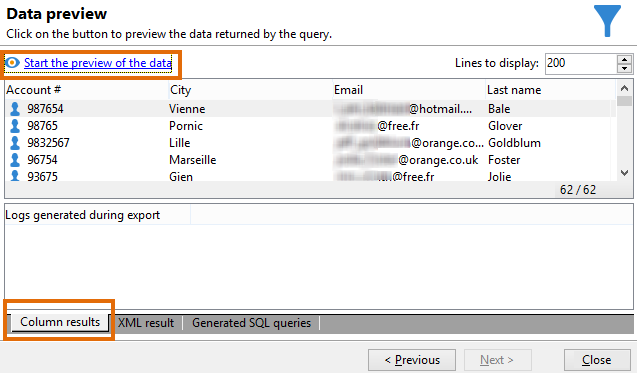

# Eseguire una query sulla tabella dei destinatari {#querying-recipient-table}

In questo esempio, vogliamo recuperare i nomi e le e-mail dei destinatari il cui dominio e-mail è &quot;orange.co.uk&quot; e che non vivono a Londra.

* Quale tabella selezionare?

  Tabella dei destinatari (nms:recipient)

* Campi da selezionare come colonne di output

  E-mail, nome, città e numero account

* Quali sono le condizioni di filtro dei destinatari?

  città e dominio e-mail

* È configurato un ordinamento?

  Sì, in base a **[!UICONTROL Account number]** e **[!UICONTROL Last name]**

Per creare questo esempio, attieniti alla seguente procedura:

1. Fare clic su **[!UICONTROL Tools > Generic query editor...]** e scegliere la tabella **Destinatari** (**nms:recipient**). Quindi fai clic su **[!UICONTROL Next]**.
1. Scegliere: **[!UICONTROL Last name]**, **[!UICONTROL First name]**, **[!UICONTROL Email]**, **[!UICONTROL City]** e **[!UICONTROL Account number]**. Questi campi vengono aggiunti a **[!UICONTROL Output columns]**. Quindi fai clic su **[!UICONTROL Next]**.

   

1. Ordinare le colonne per visualizzarle nell&#39;ordine corretto. In questo caso si desidera ordinare i numeri di conto in ordine decrescente e i nomi in ordine alfabetico. Quindi fai clic su **[!UICONTROL Next]**.

   

1. Nella finestra **[!UICONTROL Data filtering]**, perfeziona la ricerca: scegli **[!UICONTROL Filtering conditions]** e fai clic su **[!UICONTROL Next]**.
1. La finestra **[!UICONTROL Target element]** consente di immettere le impostazioni del filtro.

   Definisci la seguente condizione di filtro: destinatari con un dominio e-mail uguale a &quot;orange.co.uk&quot;. A tale scopo, scegliere **Dominio e-mail (@email)** nella colonna **[!UICONTROL Expression]**, scegliere **uguale a** nella colonna **[!UICONTROL Operator]** e immettere &quot;orange.co.uk&quot; nella colonna **[!UICONTROL Value]**.

   

1. Se necessario, fare clic sul pulsante **[!UICONTROL Distribution of values]** per visualizzare una distribuzione basata sul dominio e-mail dei potenziali clienti. È disponibile una percentuale per ogni dominio e-mail nel database. I domini diversi da &quot;orange.co.uk&quot; vengono visualizzati finché non viene applicato il filtro.

   Nella parte inferiore della finestra viene visualizzato un riepilogo della query: **Dominio e-mail uguale a &#39;orange.co.uk&#39;**.

1. Fare clic su **[!UICONTROL Preview]** per avere un&#39;idea del risultato della query: vengono visualizzati solo i domini e-mail &quot;orange.co.uk&quot;.

   

1. Ora modificheremo la query per trovare i contatti che non vivono a Londra.

   Selezionare **[!UICONTROL City (location/@city)]** nella colonna **[!UICONTROL Expression]**, **[!UICONTROL different from]** come operatore e immettere **[!UICONTROL London]** nella colonna **[!UICONTROL Value]**.

   

1. Verrà visualizzata la finestra **[!UICONTROL Data formatting]**. Controlla l’ordine delle colonne. Sposta la colonna &quot;Città&quot; verso l’alto sotto la colonna &quot;Numero account&quot;.

   Deselezionare la colonna &quot;Nome&quot; per rimuoverla dall&#39;elenco.

   

1. Nella finestra **[!UICONTROL Data preview]**, fare clic su **[!UICONTROL Start the preview of the data]**. Questa funzione calcola il risultato della query.

   La scheda **[!UICONTROL Column results]** mostra il risultato della query in colonne.

   Il risultato mostra tutti i destinatari con un dominio e-mail &quot;orange.co.uk&quot; che non vivono a Londra. La colonna &quot;Nome&quot; non viene visualizzata perché è stata deselezionata durante la fase precedente. I numeri di conto sono ordinati in ordine decrescente.

   

   La scheda **[!UICONTROL XML result]** mostra il risultato in formato XML.

   

   La scheda **[!UICONTROL Generated SQL queries]** mostra il risultato della query in formato SQL.

   
