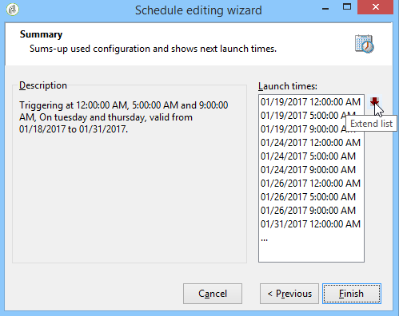

# Modulo di pianificazione {#scheduler}

L&#39;**Utilità di pianificazione** è un&#39;attività persistente che attiva la relativa transizione nei momenti specificati dalla pianificazione.

Dovresti considerare l’attività **[!UICONTROL Scheduler]** come un inizio pianificato. Le regole di posizionamento dell’attività all’interno del grafico sono le stesse dell’attività **[!UICONTROL Start]**. Questa attività non deve avere una transizione in entrata.

## Best practice {#best-practices}

**Riavvia il flusso di lavoro dopo aver modificato la tempistica del modulo di pianificazione**. Quando si modifica l&#39;ora pianificata dell&#39;attività **[!UICONTROL Scheduler]**, è importante riavviare il flusso di lavoro. In questo modo il flusso di lavoro viene eseguito agli orari aggiornati. Senza il riavvio, il flusso di lavoro continuerà a essere eseguito in base alla pianificazione precedente.

**Limita la frequenza dell&#39;utilità di pianificazione** - Evitare di pianificare l&#39;esecuzione dei flussi di lavoro con una frequenza maggiore di ogni 15 minuti. Eseguirli più spesso può compromettere le prestazioni del sistema e causare una congestione del database.

**Utilizza un modulo di pianificazione per ramo** - Ogni ramo del flusso di lavoro deve avere una sola attività **[!UICONTROL Scheduler]**. Per ulteriori informazioni sulle best practice per l&#39;utilizzo delle attività nei flussi di lavoro, fare riferimento alla [pagina sulle best practice per i flussi di lavoro](workflow-best-practices.md#using-activities).

**Impedisci esecuzioni simultanee del flusso di lavoro** - Se un flusso di lavoro viene attivato da un modulo di pianificazione, tenere presente che è possibile eseguire più istanze del flusso di lavoro contemporaneamente. Ad esempio, se una pianificazione attiva il flusso di lavoro ogni ora, ma l’esecuzione del flusso di lavoro richiede più di un’ora, si potrebbero verificare esecuzioni sovrapposte.Per evitare questo problema, è consigliabile impostare dei controlli per evitare più esecuzioni simultanee. [Scopri come impedire l&#39;esecuzione simultanea di più flussi di lavoro](monitor-workflow-execution.md#preventing-simultaneous-multiple-executions).

**Account per transizioni ritardate** - Le transizioni attivate dal modulo di pianificazione potrebbero essere ritardate se il flusso di lavoro esegue attività con tempi di esecuzione lunghi (come le importazioni) o se il modulo wfserver è stato temporaneamente interrotto. Per ovviare a questo problema, limitare i tempi di attivazione del modulo di pianificazione in modo che i task vengano eseguiti entro un intervallo di tempo definito.

## Configurazione dell’attività Scheduler {#configuring-scheduler-activity}

Il modulo di pianificazione definisce la pianificazione di attivazione della transizione. Per configurarlo, fare doppio clic sull&#39;oggetto grafico, quindi fare clic su **[!UICONTROL Change...]**

Una procedura guidata consente di definire la frequenza e il periodo di validità dell’attività. I passaggi di configurazione sono i seguenti:

1. Selezionare la frequenza di attivazione e fare clic su **[!UICONTROL Next]**.

   

1. Assegna ore e giorni di attivazione. I parametri per questo passaggio dipendono dalla frequenza selezionata nel passaggio precedente. Se scegli di avviare l’attività più volte al giorno, le opzioni di configurazione saranno le seguenti:

   

1. Definisci il periodo di validità della pianificazione o specifica quante volte verrà eseguita.

   

1. Controllare la configurazione e fare clic su **[!UICONTROL Finish]** per salvare.

   
