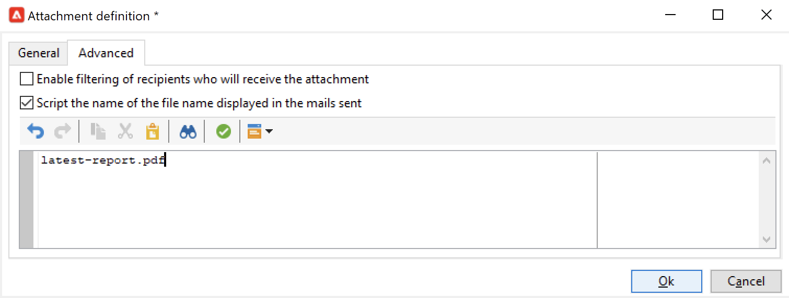

# Inviare un rapporto a un elenco{#send-a-report-to-a-list}

Questo caso d’uso descrive come generare un **[!UICONTROL Tracking indicators]** rapporti in formato PDF e modalità di invio a un elenco di destinatari.


I passaggi principali per l’implementazione di questo caso d’uso sono:

* Crea un elenco di destinatari per il rapporto. [Ulteriori informazioni](#step-1--create-the-recipient-list).
* Crea un modello di consegna che crea una nuova consegna ogni volta che il flusso di lavoro viene eseguito. [Ulteriori informazioni](#step-2--create-the-delivery-template).
* Crea un flusso di lavoro che genera il rapporto in formato PDF e lo invia all’elenco dei destinatari. [Ulteriori informazioni](#step-3--create-the-workflow)).

## Passaggio 1: Creare l’elenco dei destinatari {#step-1--create-the-recipient-list}

Per creare l’elenco dei destinatari desiderati, segui i passaggi seguenti:

1. Sfoglia il **[!UICONTROL Profiles and targets]** fai clic sulla scheda **[!UICONTROL Lists]** link.
1. Fai clic sul pulsante **[!UICONTROL Create]**.
1. Seleziona **[!UICONTROL New list]** e crea un nuovo elenco di destinatari per il rapporto a cui inviare.

Per ulteriori informazioni sulla creazione di elenchi, consulta [questa sezione](../../v8/audiences/create-audiences.md).

## Passaggio 2: Creare il modello di consegna {#step-2--create-the-delivery-template}

Per creare il modello di consegna, segui i passaggi seguenti:

1. Sfoglia il **[!UICONTROL Resources > Templates > Delivery templates]** nodo di Adobe Campaign explorer e duplica il **[!UICONTROL Email delivery]** modello incorporato.

   Per ulteriori informazioni sulla creazione di un modello di consegna, consulta [questa sezione](../../v8/send/create-templates.md).

1. Immetti i parametri del modello: etichetta, target (l’elenco dei destinatari creati in precedenza), oggetto e contenuto.

   Ogni volta che il flusso di lavoro viene eseguito, il **[!UICONTROL Tracking indicators]** viene aggiornato come spiegato in [Passaggio 3: Creare il flusso di lavoro](#step-3--creating-the-workflow)).

1. Per includere nella consegna la versione più recente del rapporto, devi aggiungere un **[!UICONTROL Calculated attachment]**:

   * Fai clic sul pulsante **[!UICONTROL Attachments]** e fai clic sulla freccia accanto alla **[!UICONTROL Add]** pulsante . Seleziona **[!UICONTROL Calculated attachment...]**.

      

   * In **[!UICONTROL Type]** dall’elenco a discesa, seleziona l’opzione più recente: **[!UICONTROL File name is computed during delivery of each message (it may then depend on the recipient profile)]**.

      

      Il valore immesso nel **[!UICONTROL Label]** il campo non verrà visualizzato nella consegna finale.

   * Nella zona di testo, immettere il percorso di accesso e il nome del file.

      

      >[!CAUTION]
      >
      >Il percorso e il nome devono essere identici a quelli immessi nel **[!UICONTROL JavaScript code]** tipo di attività del flusso di lavoro, come spiegato in [Passaggio 3: Creare il flusso di lavoro](#step-3--creating-the-workflow).

   * Seleziona la **[!UICONTROL Advanced]** scheda e controllo **[!UICONTROL Script the name of the file name displayed in the mails sent]**. Nella zona di testo, immettere il nome dell&#39;allegato nella consegna finale.

      

## Passaggio 3: Creare il flusso di lavoro {#step-3--creating-the-workflow}

Crea il seguente flusso di lavoro per questo caso d’uso.


Utilizza tre attività:

* A **[!UICONTROL Scheduler]** attività che esegue il flusso di lavoro una volta al mese,
* A **[!UICONTROL JavaScript code]** attività che genera il rapporto in formato PDF,
* A **[!UICONTROL Delivery]** attività che fa riferimento al modello di consegna creato in precedenza.

Per creare questo flusso di lavoro, segui i passaggi seguenti:

1. Sfoglia il **[!UICONTROL Administration > Production > Technical workflows]** esplode il nodo di Campaign e crea una nuova cartella per memorizzare i flussi di lavoro.
1. Crea un nuovo flusso di lavoro.

   

1. Inizia aggiungendo un **[!UICONTROL Scheduler]** digita l’attività e configurala in modo che il flusso di lavoro venga eseguito il primo lunedì del mese.

   

   Per ulteriori informazioni sulla configurazione della pianificazione, consulta [Scheduler](scheduler.md).

1. Quindi aggiungi una **[!UICONTROL JavaScript code]** digitare activity.

   

   Immetti il seguente codice nella zona di modifica:

   ```sql
   var reportName = "indicators";
   var path = "/tmp/indicators.pdf";
   var exportFormat = "PDF";
   var reportURL = "<PUT THE URL OF THE REPORT HERE>";
   var _ctx = <ctx _context="global" _reportContext="deliveryFeedback" />
   var isAdhoc = 0;
   
   xtk.report.export(reportName, _ctx, exportFormat, path, isAdhoc);
   ```


   con le seguenti variabili:

   * **var reportName**: inserire il nome interno del rapporto tra virgolette doppie. In questo caso, il nome interno del **Indicatore di tracciamento** il rapporto è &quot;deliveryFeedback&quot;.
   * **percorso var**: inserisci il percorso di salvataggio del file (&quot;tmp&quot;), il nome che desideri assegnare al file (&quot;deliveryFeedback&quot;) e l’estensione del file (&quot;.pdf&quot;). In questo caso, abbiamo utilizzato il nome interno come nome del file. I valori devono essere tra virgolette doppie e separati dal carattere &quot;+&quot;.

      >[!CAUTION]
      >
      >Il file deve essere salvato sul server. È necessario immettere lo stesso percorso e lo stesso nome di nel **[!UICONTROL General]** scheda della finestra di modifica per l&#39;allegato calcolato, come dettagliato [qui](#step-2--create-the-delivery-template)).

   * **var exportFormat**: immettere il formato di esportazione del file (&quot;PDF&quot;).
   * **var_ctx** (contesto): in questo caso, utilizziamo il **[!UICONTROL Tracking indicators]** nel suo contesto globale.

1. Completare aggiungendo un **[!UICONTROL Delivery]** attività con le seguenti opzioni:

   

   * **[!UICONTROL Delivery]**: select **[!UICONTROL New, created from a template]**, quindi seleziona il modello di consegna creato in precedenza.
   * Per **[!UICONTROL Recipients]** e **[!UICONTROL Content]** campi, seleziona **[!UICONTROL Specified in the delivery]**.
   * **[!UICONTROL Action to perform]**: select **[!UICONTROL Prepare and start]**.
   * Deseleziona il **[!UICONTROL Generate an outbound transition]** e **[!UICONTROL Process errors]** opzioni.

1. Salva le modifiche e avvia il flusso di lavoro. Il messaggio viene inviato all’elenco dei destinatari ogni primo lunedì del mese, con il relativo rapporto.