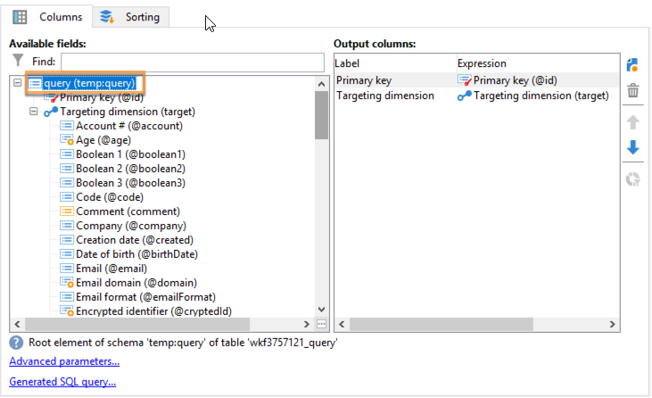

# Inviare avvisi personalizzati agli operatori{#sending-personalized-alerts-to-operators}


In questo esempio, vogliamo inviare un avviso a un operatore che conterrà il nome dei profili che hanno aperto una newsletter ma non hanno fatto clic sul collegamento in essa contenuto.

I campi di nome e cognome dei profili sono collegati alla dimensione di targeting **[!UICONTROL Recipients]**, mentre l&#39;attività **[!UICONTROL Alert]** è collegata alla dimensione di targeting **[!UICONTROL Operator]**. Di conseguenza, non è disponibile alcun campo tra le due dimensioni di targeting per eseguire una riconciliazione, recuperare i campi nome e cognome e visualizzarli nell’attività Avviso.

Il processo consiste nel creare un flusso di lavoro come indicato di seguito:

1. Utilizza un&#39;attività **[!UICONTROL Query]** per eseguire il targeting dei dati.
1. Aggiungi un&#39;attività **[!UICONTROL JavaScript code]** nel flusso di lavoro per salvare il gruppo dalla query alla variabile dell&#39;istanza.
1. Utilizzare un&#39;attività **[!UICONTROL Test]** per verificare il conteggio della popolazione.
1. Utilizzare un&#39;attività **[!UICONTROL Alert]** per inviare un avviso a un operatore, a seconda del risultato dell&#39;attività **[!UICONTROL Test]**.


## Salvataggio del gruppo nella variabile di istanza {#saving-the-population-to-the-instance-variable}

Aggiungi il codice seguente all&#39;attività **[!UICONTROL JavaScript code]**.

```
var query = xtk.queryDef.create(  
    <queryDef schema="temp:query" operation="select">  
      <select>  
       <node expr="[target/recipient.@firstName]"/>  
       <node expr="[target/recipient.@lastName]"/>  
      </select>  
     </queryDef>  
  );  
  var items = query.ExecuteQuery();
```

Assicurati che il codice JavaScript corrisponda alle informazioni del flusso di lavoro:

* Il tag **[!UICONTROL queryDef schema]** deve corrispondere al nome della dimensione di targeting utilizzata nell&#39;attività di query.
* Il tag **[!UICONTROL node expr]** deve corrispondere al nome dei campi che si desidera recuperare.


Per recuperare queste informazioni, effettua le seguenti operazioni:

1. Fare clic con il pulsante destro del mouse sulla transizione in uscita dall&#39;attività **[!UICONTROL Query]**, quindi selezionare **[!UICONTROL Display the target]**.

   

1. Fare clic con il pulsante destro del mouse sull&#39;elenco, quindi selezionare **[!UICONTROL Configure list]**.

   

1. Nell’elenco vengono visualizzati la dimensione di targeting della query e i nomi dei campi.

   

## Verifica del conteggio della popolazione {#testing-the-population-count}

Aggiungi il codice seguente all&#39;attività **[!UICONTROL Test]** per verificare se la popolazione di destinazione contiene almeno 1 profilo.

```
var.recCount>0
```


## Configurazione dell’avviso {#setting-up-the-alert}

Ora che il gruppo è stato aggiunto alla variabile dell&#39;istanza con i campi desiderati, è possibile aggiungere queste informazioni nell&#39;attività **[!UICONTROL Alert]**.

A tale scopo, aggiungere nella scheda **[!UICONTROL Source]** il codice seguente:

```
<ul>
<%
var items = new XML(instance.vars.items)
for each (var item in items){
%>
<li><%= item.target.@firstName %> <%= item.target.@lastName %></li>
<%
} %></ul>
```

>[!NOTE]
>
>Il comando **[!UICONTROL <%= item.target.recipient.@fieldName %>]** consente di aggiungere uno dei campi salvati nella variabile di istanza tramite l&#39;attività **[!UICONTROL JavaScript code]**.\
>Puoi aggiungere tutti i campi desiderati, purché siano stati inseriti nel codice JavaScript.


