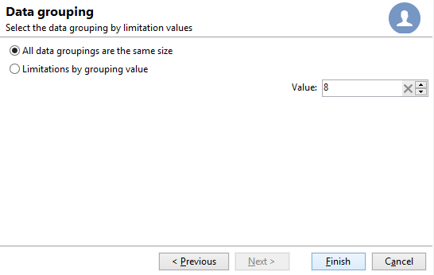
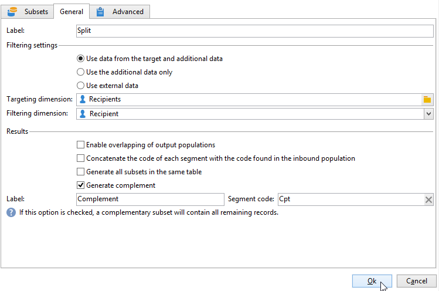

# Dividi{#split}

Un&#39;attività di tipo **Split** consente di suddividere una destinazione in diversi sottoinsiemi. Il target viene costruito con tutti i risultati ricevuti: affinché questa attività possa essere eseguita, tutte le attività precedenti devono essere state completate.

Questa attività non attiva un’unione di popolazioni in entrata. Se più transizioni arrivano a un&#39;attività divisa, è consigliabile inserirvi davanti un&#39;attività **[!UICONTROL Union]**.

>[!NOTE]
>
>Non è possibile eseguire operazioni di suddivisione per tabelle con origini diverse. A questo scopo, devi aggiungere un&#39;attività **Enrichment** prima dell&#39;attività **Split**.

* Per un esempio dell&#39;attività divisa in uso, fare riferimento a [questa sezione](targeting-workflows.md#create-subsets-using-the-split-activity).
* Un esempio che illustra come utilizzare l&#39;attività Split per segmentare la destinazione in popolazioni diverse utilizzando condizioni di filtro è descritto in [questa sezione](cross-channel-delivery-workflow.md).
* Un esempio che mostra come utilizzare una variabile di istanza in un&#39;attività Split è disponibile in [questa sezione](javascript-scripts-and-templates.md).

Per configurare questa attività, definire il contenuto e l&#39;etichetta del sottoinsieme nella scheda **[!UICONTROL Subsets]**, quindi scegliere la dimensione di destinazione nella scheda **[!UICONTROL General]**.

## Creare sottoinsiemi {#create-subsets}

Per creare un sottoinsieme:

1. Fai clic sull’etichetta nel campo corrispondente e seleziona il filtro da applicare.
1. Per filtrare il gruppo in entrata, selezionare l&#39;opzione **[!UICONTROL Add a filtering condition]** e fare clic sul collegamento **[!UICONTROL Edit...]**.

   Selezionare il tipo di filtro da applicare ai dati da includere nel set.

   Il processo è lo stesso di un&#39;attività di tipo **Query**.

   >[!NOTE]
   >
   >Puoi filtrare i dati in un massimo di due database esterni (FDA).

1. È possibile specificare il numero massimo di record da estrarre dalla destinazione per creare il sottoinsieme. A tale scopo, selezionare l&#39;opzione **[!UICONTROL Limit the selected records]** e fare clic sul collegamento **[!UICONTROL Edit...]**.

   Una procedura guidata consente di scegliere la modalità di selezione per i record di questo sottoinsieme. [Ulteriori informazioni](#limit-the-number-of-subset-records).

   

1. Puoi **aggiungere altri sottoinsiemi** utilizzando il pulsante **[!UICONTROL Add]**.

   

   >[!NOTE]
   >
   >Se l&#39;opzione **[!UICONTROL Enable overlapping of output populations]** non è selezionata, i sottoinsiemi vengono creati nell&#39;ordine delle schede. Utilizzare le frecce nella parte superiore destra della finestra per spostarle. Se, ad esempio, il primo sottoinsieme recupera il 70% della popolazione iniziale, il sottoinsieme successivo applicherà i propri criteri di selezione solo al restante 30% e così via.

   Per ogni sottoinsieme creato, all’attività divisa verrà aggiunta una transizione in uscita.

   

   Puoi scegliere di generare una singola transizione in uscita (e identificare i set utilizzando, ad esempio, il codice di segmento): a questo scopo, seleziona l&#39;opzione **[!UICONTROL Generate subsets in the same table]** nella scheda **[!UICONTROL General]**.

   Se è completato, il codice del segmento di ciascun sottoinsieme viene memorizzato automaticamente in una colonna aggiuntiva. Questa colonna sarà accessibile nei campi di personalizzazione a livello di consegna.

## Limita il numero di record del sottoinsieme {#limit-the-number-of-subset-records}

Se non si desidera utilizzare l&#39;intera popolazione contenuta in un sottoinsieme, è possibile limitare il numero di record in esso contenuti.

1. Nella finestra di modifica del sottoinsieme, selezionare l&#39;opzione **[!UICONTROL Limit the selected records]** e fare clic sul collegamento **[!UICONTROL Edit...]**.
1. Selezionare il tipo di limite desiderato:

   * **[!UICONTROL Activate random sampling]**: questa opzione richiede un campione casuale dei record. Il tipo di campionamento casuale applicato dipende dal motore del database.
   * **[!UICONTROL Keep only the first records after sorting]**: questa opzione consente di definire un limite basato su uno o più ordini di ordinamento. Se si seleziona il campo **[!UICONTROL Age]** come criterio di ordinamento e si imposta il limite su 100, verranno mantenuti solo i 100 destinatari più giovani.
   * **[!UICONTROL Keep the first ones after sorting (criteria, random)]**: questa opzione combina le due opzioni precedenti. Consente di definire un limite basato su uno o più criteri di ordinamento e quindi di applicare una selezione casuale ai primi record se alcuni di essi hanno gli stessi valori dei criteri definiti.

     Ad esempio, se si seleziona il campo **[!UICONTROL Age]** come criterio di ordinamento e si definisce un limite di 100, ma i 2000 destinatari più giovani nel database sono tutti 18, verranno selezionati in modo casuale 100 di questi 2000.

   

1. Se si desidera definire i criteri di ordinamento, è possibile definire le colonne e l&#39;ordine di ordinamento in un passaggio aggiuntivo.

   

1. Quindi scegli il metodo di limitazione dei dati.

   

   Esistono diversi modi per farlo:

   * **[!UICONTROL Size (in %)]**: una percentuale di record. Ad esempio, la configurazione seguente estrae il 10% della popolazione totale.

     La percentuale si applica alla popolazione iniziale, non al risultato dell’attività.

   * **[!UICONTROL Size (as a % of the segment)]**: una percentuale di record relativi solo ai sottoinsiemi e non alla popolazione iniziale.
   * **[!UICONTROL Maximum size]**: numero massimo di record.
   * **[!UICONTROL By data grouping]**: è possibile impostare un limite al numero di record in base ai valori in un campo specificato del gruppo in entrata. [Ulteriori informazioni](#limit-the-number-of-subset-records-by-data-grouping).
   * **[!UICONTROL By data grouping (in %)]**: è possibile impostare un limite al numero di record in base ai valori in un campo specificato del gruppo in entrata utilizzando una percentuale. [Ulteriori informazioni](#limit-the-number-of-subset-records-by-data-grouping).
   * **[!UICONTROL By data distribution]**: se i campi di raggruppamento hanno troppi valori o se desideri evitare di immetterli nuovamente per ogni nuova attività di suddivisione, Adobe Campaign ti consente di configurare un limite di **[!UICONTROL By data distribution]** (modulo facoltativo di Marketing distribuito). [Ulteriori informazioni](#limit-the-number-of-subset-records-per-data-distribution).

1. Fare clic su **[!UICONTROL Finish]** per approvare i criteri di selezione dei record. La configurazione definita viene quindi visualizzata nella finestra centrale dell’editor.

## Limita il numero di record di sottoinsiemi per raggruppamento di dati {#limit-the-number-of-subset-records-by-data-grouping}

È possibile limitare il numero di record per raggruppamento di dati. Questo limite può essere applicato utilizzando un valore fisso o una percentuale.

Ad esempio, se si seleziona il campo **[!UICONTROL Language]** come campo di gruppo, è possibile definire un elenco di record per ogni lingua.

1. Dopo aver selezionato i valori di limitazione dei dati, selezionare **[!UICONTROL By data grouping]** o **[!UICONTROL By data grouping (as a %)]** e fare clic su **[!UICONTROL Next]**.

   

1. Selezionare quindi i campi di raggruppamento (il campo **[!UICONTROL Language]** per l&#39;istanza) e fare clic su **[!UICONTROL Next]**.

   

1. Infine, specifica le soglie di raggruppamento dei dati (utilizzando valori fissi o percentuali a seconda del metodo di raggruppamento selezionato in precedenza). Per impostare la stessa soglia per ogni valore, ad esempio per impostare su 10 il numero di record per ogni lingua, selezionare l&#39;opzione **[!UICONTROL All data groupings are the same size]**. Per impostare un limite diverso per ogni valore, selezionare l&#39;opzione **[!UICONTROL Limitations by grouping value]**. Questo ti consentirà di scegliere un limite diverso per inglese, francese, ecc.

   

1. Fai clic su **[!UICONTROL Finish]** per approvare la limitazione e tornare alla modifica dell&#39;attività di suddivisione.

## Limita il numero di record di sottoinsiemi per distribuzione dei dati {#limit-the-number-of-subset-records-per-data-distribution}

Se i campi di raggruppamento contengono un numero eccessivo di valori o se desideri evitare di reimpostare i valori per ogni nuova attività di suddivisione, Adobe Campaign ti consente di creare un limite per la distribuzione dei dati. Quando selezioni [valori limite dati](#create-subsets) sezione), seleziona l&#39;opzione **[!UICONTROL By data distribution]** e seleziona un modello dal menu a discesa. La creazione di un modello di distribuzione dei dati è illustrata di seguito.

Per un esempio dell&#39;attività **[!UICONTROL Local approval]** con un modello di distribuzione, vedere [questa pagina](local-approval-activity.md).

>[!CAUTION]
>
>Questa funzione è disponibile solo con il componente aggiuntivo [Marketing distribuito](../distributed-marketing/about-distributed-marketing.md). Controlla il contratto di licenza.

Il modello di distribuzione dati consente di limitare il numero di record utilizzando un elenco di valori di raggruppamento. Per creare un modello di distribuzione dati, attieniti alla seguente procedura:

1. Per creare il modello di distribuzione dei dati, passare al nodo **[!UICONTROL Resources > Campaign management > Data distribution]** e fare clic su **[!UICONTROL New]**.

   

1. La scheda **[!UICONTROL General]** consente di immettere l&#39;etichetta e il contesto di esecuzione della distribuzione (dimensione di targeting, campo di distribuzione).

   

   È necessario inserire i campi seguenti:

   * **[!UICONTROL Label]**: etichetta per il modello di distribuzione.
   * **[!UICONTROL Targeting dimension]**: immettere la dimensione di targeting a cui verrà applicata la distribuzione dei dati, **[!UICONTROL Recipient]** ad esempio. Questo schema deve sempre essere compatibile con i dati utilizzati nel flusso di lavoro di targeting.
   * **[!UICONTROL Distribution field]**: selezionare un campo tramite la dimensione di targeting. Ad esempio, se selezioni il campo **[!UICONTROL Email domain]**, l&#39;elenco dei destinatari verrà suddiviso per dominio.
   * **[!UICONTROL Distribution type]**: selezionare la modalità di suddivisione del valore di limitazione della destinazione nella scheda **[!UICONTROL Distribution]**: **[!UICONTROL Percentage]** o **[!UICONTROL Set]**.
   * **[!UICONTROL Approval storage]**: se utilizzi un&#39;attività [Local approval](local-approval.md) nel flusso di lavoro di targeting, immetti lo schema in cui verranno memorizzati i risultati dell&#39;approvazione. È necessario specificare uno schema di archiviazione per ogni schema di destinazione. Se si utilizza lo schema di targeting **[!UICONTROL Recipients]**, immettere lo schema di archiviazione predefinito **[!UICONTROL Local approval of recipients]**.

     In caso di una semplice limitazione per raggruppamento di dati senza approvazione locale, non è necessario immettere il campo **[!UICONTROL Approvals storage]**.

1. Se si utilizza un&#39;attività [Approvazione locale](local-approval.md), immettere **[!UICONTROL Advanced settings]** per il modello di distribuzione:

   

   È necessario inserire i campi seguenti:

   * **[!UICONTROL Approve targeted messages]**: selezionare questa opzione se si desidera che tutti i destinatari siano preselezionati dall&#39;elenco di destinatari da approvare. Se questa opzione è deselezionata, nessun destinatario sarà preselezionato.

     >[!NOTE]
     >
     >Questa opzione è selezionata per impostazione predefinita.

     

   * **[!UICONTROL Delivery label]**: consente di definire un&#39;espressione per visualizzare l&#39;etichetta di consegna nella notifica di ritorno. L’espressione predefinita fornisce informazioni sull’etichetta standard della consegna (stringa di calcolo). È possibile modificare questa espressione.

     

   * **[!UICONTROL Grouping field]**: questo campo consente di definire il raggruppamento utilizzato per visualizzare i destinatari nelle notifiche di approvazione e di ritorno.

     

   * **[!UICONTROL Web Interface]**: consente di collegare un&#39;applicazione Web all&#39;elenco dei destinatari. Nella notifica di approvazione e di ritorno, ogni destinatario sarà cliccabile e si collegherà all’applicazione web selezionata. Il campo **[!UICONTROL Parameters]** (ad esempio **[!UICONTROL recipientId]**) consente di configurare il parametro aggiuntivo da utilizzare nell&#39;URL e nell&#39;applicazione Web.

1. La scheda **[!UICONTROL Breakdown]** consente di definire l&#39;elenco dei valori di distribuzione.

   

   * **[!UICONTROL Value]**: immettere i valori di distribuzione.
   * **[!UICONTROL Percentage / Set]**: immettere il limite di record (fisso o percentuale) collegato a ciascun valore.

     Questa colonna è definita dal campo **[!UICONTROL Distribution type]** nella scheda **[!UICONTROL General]**.

   * **[!UICONTROL Label]**: immettere l&#39;etichetta collegata a ciascun valore.
   * **[!UICONTROL Group or operator]**: se si utilizza un&#39;attività [Local approval](local-approval.md), selezionare l&#39;operatore o il gruppo di operatori assegnati a ogni valore di distribuzione.

     In caso di una semplice limitazione per raggruppamento di dati senza approvazione locale, non è necessario immettere il campo **[!UICONTROL Group or operator]**.

     >[!CAUTION]
     >
     >Assicurati che agli operatori siano state assegnate le autorizzazioni appropriate.

## Parametri di filtro {#filtering-parameters}

Fare clic sulla scheda **[!UICONTROL General]** per immettere l&#39;etichetta dell&#39;attività. Selezionare le dimensioni di destinazione e filtro per la suddivisione. Se necessario, potete modificare queste dimensioni per un determinato sottoinsieme.

Selezionare l&#39;opzione **[!UICONTROL Generate complement]** se si desidera sfruttare il gruppo rimanente. Il complemento è il target in entrata meno l’unione dei sottoinsiemi. Verrà quindi aggiunta all’attività un’ulteriore transizione in uscita, come segue:

Affinché questa opzione funzioni correttamente, i dati in entrata devono avere una chiave primaria.

Se ad esempio i dati vengono letti direttamente da un database esterno come Netezza (che non supporta la nozione di indice) tramite un&#39;attività **[!UICONTROL Data loading (RDBMS)]**, il complemento generato dall&#39;attività **[!UICONTROL Split]** non sarà corretto.

Per evitare questo problema, è possibile trascinare un&#39;attività **[!UICONTROL Enrichment]** immediatamente prima dell&#39;attività **[!UICONTROL Split]**. Nell&#39;attività **[!UICONTROL Enrichment]**, controllare **[!UICONTROL Keep all additional data from the main set]** e specificare nei dati aggiuntivi le colonne che si desidera utilizzare per configurare i filtri dell&#39;attività **[!UICONTROL Split]**. I dati della transizione in entrata dell&#39;attività **[!UICONTROL Split]** vengono quindi memorizzati localmente in una tabella temporanea sul server Adobe Campaign e il complemento può essere generato correttamente.

L&#39;opzione **[!UICONTROL Enable overlapping of output populations]** consente di gestire le popolazioni appartenenti a diversi sottoinsiemi:

* Quando questa opzione non è selezionata, l’attività Dividi si assicura che un destinatario non possa essere presente in diverse transizioni di output, anche se soddisfa i criteri di diversi sottoinsiemi. Saranno nel target della prima scheda con criteri corrispondenti.
* Quando questa opzione è selezionata, i destinatari possono essere in più sottoinsiemi se soddisfano i rispettivi criteri di filtro. Adobe Campaign consiglia di usare criteri esclusivi.

## Parametri di input {#input-parameters}

* tableName
* schema

Ogni evento in entrata deve specificare una destinazione definita da questi parametri.

## Parametri di output {#output-parameters}

* tableName
* schema
* recCount

Questo insieme di tre valori identifica il target risultante dall’esclusione. **[!UICONTROL tableName]** è il nome della tabella che registra gli identificatori di destinazione, **[!UICONTROL schema]** è lo schema della popolazione (in genere nms:recipient) e **[!UICONTROL recCount]** è il numero di elementi nella tabella.

La transizione associata al complemento ha gli stessi parametri.
