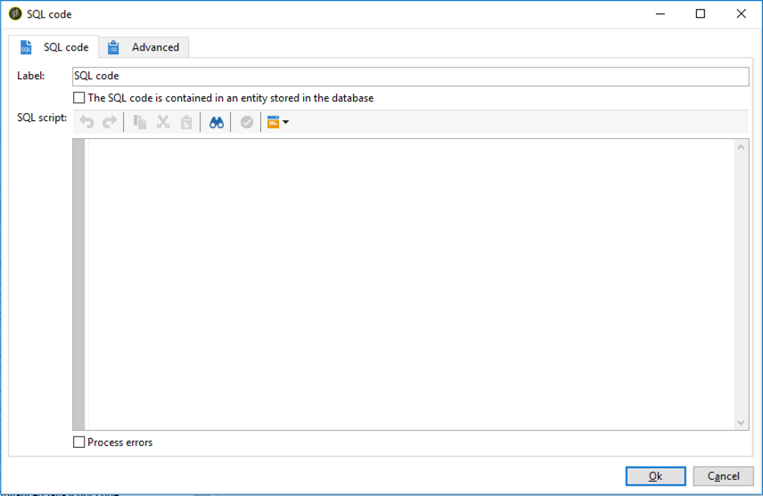

# Codice SQL e codice JavaScript{#sql-code-and-javascript-code}


## Codice SQL {#sql-code}

Un **[!UICONTROL SQL code]** L&#39;attività esegue uno script SQL. Lo script è un modello JST.



* **[!UICONTROL Script]**

   L’area centrale dell’editor contiene lo script da eseguire. Questo script è un modello JST e può quindi essere configurato in base al contesto del flusso di lavoro.

* **[!UICONTROL Processing errors]**

   Fai riferimento a [Errori di elaborazione](monitor-workflow-execution.md#processing-errors).

## Codice JavaScript e codice JavaScript avanzato {#javascript-code}

**[!UICONTROL JavaScript code]** e **[!UICONTROL Advanced JavaScript code]** Le attività eseguono uno script JavaScript nel contesto di un flusso di lavoro. Per ulteriori informazioni sugli script, consulta le sezioni seguenti:

* [Script e modelli JavaScript](javascript-scripts-and-templates.md)
* [Esempi di codice JavaScript nei flussi di lavoro](javascript-in-workflows.md)

### Ritardo di esecuzione {#exec-delay}

A partire dalla versione 20.2, un ritardo di esecuzione è stato aggiunto al **[!UICONTROL JavaScript code]** e **[!UICONTROL Advanced JavaScript code]** attività. Per impostazione predefinita, la fase di esecuzione non può superare 1 ora. Dopo questo ritardo, il processo verrà interrotto con un messaggio di errore e l’esecuzione dell’attività avrà esito negativo.

È possibile modificare questo ritardo in **[!UICONTROL Stop execution after]** disponibile in queste attività.

Per ignorare questo limite, devi impostare il valore su **0**.

### Codice JavaScript {#js-code-desc}


* **[!UICONTROL Script]**: l’area centrale dell’editor contiene lo script da eseguire.

* **[!UICONTROL Process errors]**: fai riferimento a [Errori di elaborazione](monitor-workflow-execution.md#processing-errors).

### Codice JavaScript avanzato {#adv-js-code-desc}


* **[!UICONTROL First call]**: la prima zona dell’editor contiene lo script da eseguire durante la prima chiamata.
* **[!UICONTROL Next calls]**: la seconda zona dell’editor contiene lo script da eseguire durante le chiamate successive.
* **[!UICONTROL Transitions]**: puoi definire diverse transizioni di output dell’attività.
* **[!UICONTROL Schedule]**: Il **[!UICONTROL Schedule]** Questa scheda ti consente di pianificare quando attivare l’attività.

JavaScript avanzato è un&#39;attività persistente e viene periodicamente richiamato se non è stato contrassegnato come completato. Per terminare l&#39;attività ed evitare richiami futuri, è necessario utilizzare **task.setCompleted()** metodo in **[!UICONTROL Next calls]** sezione:

```
task.postEvent(task.transitionByName("ok")); // to transition to Ok branch
task.setCompleted();

return 0;
```
