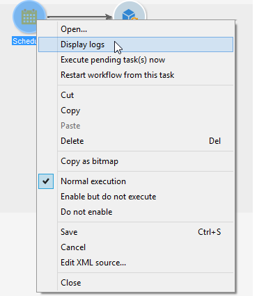

# Avviare, sospendere e interrompere un flusso di lavoro {#starting-a-workflow}

Un workflow viene sempre avviato manualmente. Quando viene avviato, può tuttavia rimanere inattivo a seconda delle informazioni specificate tramite una pianificazione (vedi [Pianificazione](scheduler.md)) o la pianificazione delle attività.

Azioni relative all’esecuzione del flusso di lavoro di targeting (avvio, arresto, pausa, ecc.) sono **processi asincroni**: l&#39;ordine è registrato e diventerà effettivo non appena il server sarà disponibile per applicarlo.

La barra degli strumenti consente di avviare e tenere traccia dell’esecuzione del flusso di lavoro.

L&#39;elenco delle opzioni disponibili nel menu di **[!UICONTROL Actions]** e nel menu di scelta rapida è descritto di seguito.

>[!IMPORTANT]
>
>Tieni presente che, quando un operatore esegue un’azione su un flusso di lavoro (avvio, arresto, pausa, ecc.), l’azione non viene eseguita immediatamente, ma viene inserita in una coda per essere elaborata dal modulo del flusso di lavoro.

## Barra delle azioni {#actions-toolbar}

Il pulsante **[!UICONTROL Actions]** della barra degli strumenti consente di accedere a opzioni di esecuzione aggiuntive nei flussi di lavoro selezionati. È inoltre possibile utilizzare il menu **[!UICONTROL File > Actions]** oppure fare clic con il pulsante destro del mouse su un flusso di lavoro e selezionare **[!UICONTROL Actions]**.


* **[!UICONTROL Start]**

  Questa azione ti consente di avviare l&#39;esecuzione di un flusso di lavoro: un flusso di lavoro **Completato**, **In corso di modifica** o **In pausa** cambia lo stato in **Avviato**. Il motore del flusso di lavoro gestisce quindi l’esecuzione di questo flusso di lavoro. Se il flusso di lavoro è stato sospeso, viene ripreso; in caso contrario, il flusso di lavoro viene avviato dall’inizio e le attività iniziali vengono attivate.

  L’avvio è asincrono: la richiesta viene salvata ed elaborata il prima possibile da un server del flusso di lavoro.

* **[!UICONTROL Pause]**

  Questa azione imposta lo stato del flusso di lavoro su **In pausa**. Nessuna attività viene attivata finché il flusso di lavoro non viene ripreso; tuttavia, le operazioni in corso non vengono sospese.

* **[!UICONTROL Stop]**

  Questa azione interrompe un flusso di lavoro attualmente in esecuzione. Lo stato dell&#39;istanza è impostato su **Completato**. Se possibile, le operazioni in corso vengono interrotte. Le importazioni e le query SQL vengono annullate immediatamente.

  >[!IMPORTANT]
  >
  >L’arresto di un flusso di lavoro è un processo asincrono: la richiesta viene registrata, quindi il server o i server del flusso di lavoro annullano le operazioni in corso. L&#39;arresto di un&#39;istanza del flusso di lavoro può quindi richiedere tempo, soprattutto se il flusso di lavoro è in esecuzione su più server, ognuno dei quali deve assumere il controllo per annullare le attività in corso. Per evitare problemi, attendi il completamento dell’operazione di arresto e non eseguire più richieste di arresto sullo stesso flusso di lavoro.

* **[!UICONTROL Unconditional stop]**

  Questa opzione cambia lo stato del flusso di lavoro in **[!UICONTROL Finished]**. Questa azione deve essere utilizzata solo come ultima risorsa se il normale processo di arresto non riesce dopo alcuni minuti. Utilizzare l&#39;interruzione incondizionata solo se si è certi che non vi siano processi di flusso di lavoro effettivi in corso.

  >[!CAUTION]
  >
  >L’arresto incondizionato è limitato agli utenti amministratori.

* **[!UICONTROL Restart]**

  Questa azione si interrompe e riavvia il flusso di lavoro. Nella maggior parte dei casi, consente un riavvio più rapido. È inoltre utile automatizzare il riavvio quando l’arresto richiede un certo periodo di tempo, perché il comando &quot;Interrompi&quot; non è disponibile quando il flusso di lavoro viene arrestato.

  Si noti che l&#39;azione **Riavvia** non cancella le variabili dell&#39;istanza del flusso di lavoro rispetto alle azioni **Esecuzione**, **Arresta** e **Avvia** (la cancellazione delle variabili dell&#39;istanza avviene al momento dell&#39;azione Avvia). Durante il riavvio di un flusso di lavoro, le variabili dell’istanza sono ancora disponibili per l’utilizzo con valori conservati. Per cancellarli, puoi effettuare le seguenti operazioni:
   * Eseguire **Interrompi** e **Inizia** azioni.
   * Aggiungi di seguito il codice JavaScript alla fine dell’esecuzione del flusso di lavoro:

     ```
     var wkf = xtk.workflow.load(instance.id)
     wkf.variables='<variables/>'
     wkf.save()
     ```

* **[!UICONTROL Purge history]**

  Questa azione ti consente di eliminare la cronologia del flusso di lavoro. Per ulteriori informazioni, consulta [Rimozione dei registri](monitor-workflow-execution.md#purging-the-logs).

* **[!UICONTROL Start in simulation mode]**

  Questa opzione consente di avviare il flusso di lavoro in modalità simulazione anziché in modalità reale. Ciò significa che quando si attiva questa modalità, vengono eseguite solo le attività che non influiscono sul database o sul file system (ad esempio **[!UICONTROL Query]**, **[!UICONTROL Union]**, **[!UICONTROL Intersection]**, ecc.). Attività che hanno un impatto (ad esempio **[!UICONTROL Export]**, **[!UICONTROL Import]**, ecc.) così come quelli successivi (nello stesso ramo) non vengono eseguiti.

* **[!UICONTROL Execute pending tasks now]**

  Questa azione ti consente di avviare tutte le attività in sospeso il prima possibile. Per avviare un&#39;attività specifica, fare clic con il pulsante destro del mouse sulla relativa attività e selezionare **[!UICONTROL Execute pending task(s) now]**.


* **[!UICONTROL Save as template]**

  Questa azione consente di creare un nuovo modello di workflow basato sul workflow selezionato. Specificare la cartella in cui verrà salvata (nel campo **[!UICONTROL Folder]**).


## Best practice per l’esecuzione dei flussi di lavoro {#workflow-execution-best-practices}

Migliora la stabilità dell’istanza implementando le seguenti best practice:

* **Non pianificare l&#39;esecuzione di un flusso di lavoro per più di 15 minuti** perché potrebbe impedire le prestazioni complessive del sistema e creare blocchi nel database.

* **Evita di lasciare i flussi di lavoro in pausa**. Se crei un flusso di lavoro temporaneo, assicurati che possa terminare correttamente e non rimanere nello stato **[!UICONTROL paused]**. Se viene messo in pausa, implicherebbe la necessità di mantenere le tabelle temporanee e quindi aumentare le dimensioni del database. Assegna supervisori flusso di lavoro in Proprietà flusso di lavoro per inviare un avviso quando un flusso di lavoro non riesce o viene messo in pausa dal sistema.

  Per evitare che i flussi di lavoro si trovino in stato di pausa:

   * Controlla i flussi di lavoro regolarmente per assicurarti che non si verifichino errori imprevisti.
   * Mantieni i flussi di lavoro il più semplici possibile, ad esempio suddividendo flussi di lavoro di grandi dimensioni in diversi flussi di lavoro. È possibile utilizzare le attività **[!UICONTROL External signal]** per attivarne l&#39;esecuzione in base all&#39;esecuzione di altri flussi di lavoro.
   * Evita di disabilitare le attività con i flussi nei flussi di lavoro, lasciando aperti i thread e portando a molte tabelle temporanee che possono occupare molto spazio. Non mantenere le attività negli stati **[!UICONTROL Do not enable]** o **[!UICONTROL Enable but do not execute]** nei flussi di lavoro.

* **Interrompere i flussi di lavoro inutilizzati**. I flussi di lavoro in esecuzione gestiscono le connessioni al database.

* **Utilizzare l&#39;interruzione incondizionata solo nei casi più rari**. Questa opzione è riservata agli utenti amministratori. Non utilizzi questa azione regolarmente. La mancata esecuzione di una chiusura pulita delle connessioni generate dai flussi di lavoro al database influisce sulle prestazioni.

* **Non eseguire più richieste di arresto nello stesso flusso di lavoro**. L’arresto di un flusso di lavoro è un processo asincrono: la richiesta viene registrata, quindi il server o i server del flusso di lavoro annullano le operazioni in corso. L&#39;arresto di un&#39;istanza del flusso di lavoro può quindi richiedere tempo, soprattutto se il flusso di lavoro è in esecuzione su più server, ognuno dei quali deve assumere il controllo per annullare le attività in corso. Per evitare problemi, attendi il completamento dell’operazione di arresto ed evita di arrestare più volte un flusso di lavoro.

## Menu di scelta rapida {#right-click-menu}

Quando sono selezionate una o più attività del flusso di lavoro, puoi fare clic con il pulsante destro del mouse per intervenire sulla selezione.



Nel menu di scelta rapida sono disponibili le seguenti opzioni:

**[!UICONTROL Open]**: questa opzione consente di accedere alle proprietà dell&#39;attività.

**[!UICONTROL Display logs:]** questa opzione consente di visualizzare il registro di esecuzione dell&#39;attività per l&#39;attività selezionata. Consulta [Visualizzazione dei registri](monitor-workflow-execution.md#displaying-logs).

**[!UICONTROL Execute pending task(s) now:]** questa azione ti consente di avviare le attività in sospeso il prima possibile.

**[!UICONTROL Workflow restart from a task:]** questa opzione consente di riavviare il flusso di lavoro utilizzando i risultati precedentemente archiviati per questa attività.

**[!UICONTROL Cut/Copy/Paste/Delete:]** queste opzioni consentono di tagliare, copiare, incollare ed eliminare attività.

**[!UICONTROL Copy as bitmap:]** questa opzione ti consente di acquisire una schermata di tutte le attività.

**[!UICONTROL Normal execution / Enable but do not execute / Do not enable:]** queste opzioni sono disponibili anche nella scheda **[!UICONTROL Advanced]** delle proprietà dell&#39;attività. Sono descritte in dettaglio in [Esecuzione](advanced-parameters.md#execution).

**[!UICONTROL Save / Cancel:]** consente di salvare o annullare le modifiche apportate a un flusso di lavoro.

>[!NOTE]
>
>Puoi selezionare un gruppo di attività e applicare uno di questi comandi.

