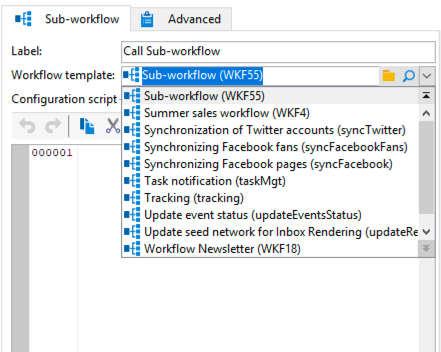

# Flusso di lavoro secondario{#sub-workflow}

La **[!UICONTROL Sub-workflow]** attività ti consente di attivare l’esecuzione di un altro flusso di lavoro e recuperare il risultato. Questa attività ti consente di utilizzare flussi di lavoro complessi utilizzando un’interfaccia semplificata.

Puoi chiamare più flussi di lavoro secondari in un unico flusso di lavoro. I flussi di lavoro secondari vengono eseguiti in modo sincrono.

Nell’esempio seguente, un flusso di lavoro primario chiama un flusso di lavoro secondario utilizzando i salti. Per ulteriori informazioni sugli oggetti grafici di tipo Jump, consulta [questa sezione](jump--start-point-and-end-point-.md).

1. Crea un flusso di lavoro da utilizzare come flusso di lavoro secondario in un altro flusso di lavoro.
1. Inserisci un **[!UICONTROL Jump (end point)]** attività con priorità pari a 1 all’inizio del flusso di lavoro. Se hai più salti di tipo &quot;end point&quot;, Adobe Campaign utilizza il salto &quot;end point&quot; con il numero più basso.
1. Inserisci un **[!UICONTROL Jump (start point)]** attività con priorità 2 alla fine del flusso di lavoro. Se hai più salti di tipo &quot;punto iniziale&quot;, Adobe Campaign utilizzerà il salto &quot;punto iniziale&quot; con il numero più alto.

   

   >[!NOTE]
   >
   >Se l’attività del flusso di lavoro secondario fa riferimento a un flusso di lavoro con diversi **[!UICONTROL Jump]** attività, il flusso di lavoro secondario viene eseguito tra il salto del tipo &quot;punto finale&quot; con il numero più basso e il salto del tipo &quot;punto iniziale&quot; con il numero più alto.
   >
   >Affinché il flusso di lavoro secondario sia eseguito correttamente, è necessario che sia presente un solo salto di tipo &quot;end point&quot; con il numero più basso e un solo salto di tipo &quot;start point&quot; con il numero più alto.

1. Completa e salva questo &quot;flusso di lavoro secondario&quot;.
1. Crea un flusso di lavoro primario.
1. Inserisci un **[!UICONTROL Sub-workflow]** e aprilo.
1. Seleziona il flusso di lavoro che desideri utilizzare dal **[!UICONTROL Workflow template]** elenco a discesa.

   

1. È inoltre possibile aggiungere uno script di configurazione per modificare il flusso di lavoro a cui si fa riferimento.
1. Fai clic su **[!UICONTROL Ok]**. Crea automaticamente una transizione in uscita con l’etichetta del **[!UICONTROL Jump (start point)]** dal flusso di lavoro selezionato.

   

1. Esegui il flusso di lavoro.

Una volta eseguito, il flusso di lavoro chiamato come flusso di lavoro secondario rimane in **[!UICONTROL Being edited]** status, che significa:

* Non puoi fare clic con il pulsante destro del mouse sulle transizioni per visualizzare il target.
* Impossibile visualizzare il conteggio delle popolazioni intermedie.
* I registri dei flussi di lavoro secondari vengono visualizzati nel flusso di lavoro principale.

   

>[!NOTE]
>
>Se si verifica un errore nel flusso di lavoro secondario, il flusso di lavoro principale viene messo in pausa e viene creata una copia del flusso di lavoro secondario.

## Parametri di ingresso (facoltativo) {#input-parameters--optional-}

* tableName
* schema

Ogni evento in entrata deve specificare un target definito da questi parametri.

## Parametri di output {#output-parameters}

* tableName
* schema
* recCount

Questo insieme di tre valori identifica la popolazione oggetto della query. **[!UICONTROL tableName]** è il nome della tabella che registra gli identificatori target, **[!UICONTROL schema]** è lo schema della popolazione (in genere nms:recipient) e **[!UICONTROL recCount]** è il numero di elementi nella tabella.

* targetSchema: Questo valore è lo schema della tabella di lavoro. Questo parametro è valido per tutte le transizioni con **[!UICONTROL tableName]** e **[!UICONTROL schema]**.
