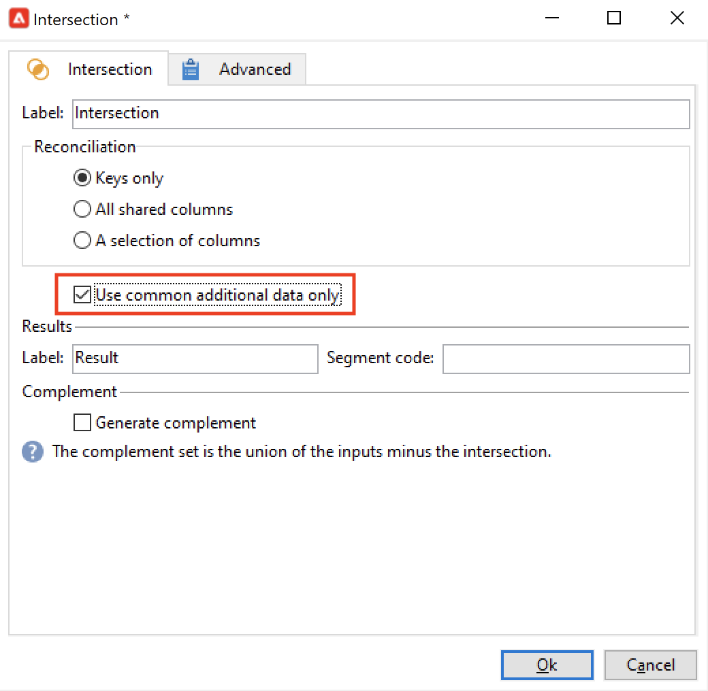

# Creare un flusso di lavoro di targeting{#target-data}

Il flusso di lavoro può essere utilizzato per eseguire query sul database e segmentare i dati. Il modulo del flusso di lavoro di Campaign è uno strumento potente per eseguire attività di gestione dei dati, estrarre, arricchire e trasformare i dati, gestire i tipi di pubblico e perfezionare le popolazioni.

I flussi di lavoro di targeting consentono di creare diversi target di consegna. Grazie alle attività del flusso di lavoro, puoi creare query, definire unioni o esclusioni in base a criteri specifici, aggiungere pianificazioni. Il risultato di questo targeting può essere trasferito automaticamente a un elenco che può fungere da target delle azioni di consegna

Oltre a queste attività, le opzioni di Gestione dati consentono di manipolare i dati e di accedere a funzioni avanzate per soddisfare problemi di targeting complessi. Per ulteriori informazioni, consulta [Gestione dati](targeting-workflows.md#data-management).

Tutte queste attività si trovano nella prima scheda del flusso di lavoro.

>[!NOTE]
>
>Le attività di targeting sono descritte in [questa sezione](activities.md).

I flussi di lavoro di targeting possono essere creati e modificati tramite il nodo **[!UICONTROL Profiles and Targets > Jobs > Targeting workflows]** della struttura Adobe Campaign o tramite il menu **[!UICONTROL Profiles and Targets > Targeting workflows]** della home page.

I flussi di lavoro di targeting all’interno del framework di una campagna sono memorizzati con tutti i flussi di lavoro della campagna.

## Passaggi chiave per creare un flusso di lavoro di targeting {#implementation-steps-}

I passaggi per creare un flusso di lavoro di targeting sono descritti in queste sezioni:

1. **Identificare** dati nel database - Vedere [Creare query](#create-queries)
1. **Prepara** dati per soddisfare le esigenze di consegna. Vedere [Arricchisci e modifica dati](#enrich-and-modify-data)
1. **Utilizza** dati per eseguire aggiornamenti o all&#39;interno di una consegna - Vedi [Aggiornare il database](use-workflow-data.md#update-the-database)

I risultati di tutti gli arricchimenti e di tutte le operazioni eseguite durante il targeting sono memorizzati e accessibili nei campi di personalizzazione, in particolare per l’utilizzo durante la creazione di messaggi personalizzati. Per ulteriori informazioni, consulta [Dati di destinazione](use-workflow-data.md#target-data).

## Dimensioni di targeting e filtro {#targeting-and-filtering-dimensions}

Durante le operazioni di segmentazione dei dati, la chiave di targeting è mappata su una dimensione filtro. La dimensione targeting consente di definire la popolazione target dell’operazione: destinatari, beneficiari del contratto, operatore, abbonati, ecc. La dimensione filtro consente di selezionare la popolazione in base a determinati criteri: titolari di contratti, abbonati a newsletter, ecc.

Ad esempio, per selezionare i clienti che hanno una polizza di assicurazione sulla vita da più di 5 anni, selezionare la seguente dimensione di targeting: **Clienti** e la seguente dimensione di filtro: **Titolare del contratto**. Puoi quindi definire le condizioni di filtro all’interno dell’attività di query

Durante la fase di selezione delle dimensioni di targeting, nell’interfaccia vengono offerte solo dimensioni di filtro compatibili.

Queste due dimensioni devono essere correlate. Pertanto, il contenuto dell&#39;elenco **[!UICONTROL Filtering dimension]** dipende dalla dimensione di targeting specificata nel primo campo.

Ad esempio, per i destinatari (**destinatario**), saranno disponibili le seguenti dimensioni filtro:

Mentre per **Visitatori**, l&#39;elenco conterrà le seguenti dimensioni filtro:

## Creare le query {#create-queries}

### Utilizzare dati aggiuntivi {#select-data}

Un&#39;attività **[!UICONTROL Query]** consente di selezionare i dati di base per generare la popolazione target. Per ulteriori informazioni al riguardo, consulta [questa sezione](query.md#create-a-query).

È inoltre possibile utilizzare le attività seguenti per eseguire query e perfezionare i dati dal database: [Incremental query](incremental-query.md), [Read list](read-list.md).

È possibile raccogliere dati aggiuntivi da inoltrare ed elaborare durante l’intero ciclo di vita del flusso di lavoro. Per ulteriori informazioni, consulta [Aggiungi dati](query.md#add-data) e [Modifica dati aggiuntivi](#edit-additional-data).

### Modifica dati aggiuntivi {#edit-additional-data}

Una volta aggiunti i dati aggiuntivi, puoi modificarli o utilizzarli per perfezionare il target definito nell’attività di query.

Il collegamento **[!UICONTROL Edit additional data...]** consente di visualizzare i dati aggiunti e di modificarli o aggiungerli.

Per aggiungere dati alle colonne di output definite in precedenza, selezionarli nell&#39;elenco dei campi disponibili. Per creare una nuova colonna di output, fare clic sull&#39;icona **[!UICONTROL Add]**, quindi selezionare il campo e fare clic su **[!UICONTROL Edit expression]**.

Fare clic sul pulsante **Selezione avanzata**.

Definisci una modalità di calcolo per il campo da aggiungere, ad esempio un aggregato.

L&#39;opzione **[!UICONTROL Add a sub-item]** consente di allegare i dati calcolati alla raccolta. Questo consente di selezionare i dati aggiuntivi dalla raccolta o di definire calcoli di aggregazione sugli elementi della raccolta.

I sottoelementi verranno rappresentati nella sottostruttura della raccolta a cui sono mappati.

Le raccolte sono visualizzate nella scheda secondaria **[!UICONTROL Collections]**. È possibile filtrare gli elementi raccolti facendo clic sull&#39;icona **[!UICONTROL Detail]** della raccolta selezionata. La procedura guidata di filtro consente di selezionare i dati raccolti e specificare le condizioni di filtro da applicare ai dati della raccolta.

### Ottimizzare una destinazione utilizzando dati aggiuntivi {#refine-the-target-using-additional-data}

I dati aggiuntivi raccolti possono consentire di perfezionare il filtro dei dati nel database. A questo scopo, fai clic sul collegamento **[!UICONTROL Refine the target using additional data...]**: ti consente di filtrare in modo eccessivo i dati aggiunti.

### Omogeneizzare i dati {#homogenize-data}

Nelle attività di tipo **[!UICONTROL Union]** o **[!UICONTROL Intersection]**, puoi scegliere di mantenere solo i dati aggiuntivi condivisi per mantenere la coerenza dei dati. In questo caso, la tabella di lavoro di output temporanea di questa attività conterrà solo i dati aggiuntivi trovati in tutti i set in entrata.

### Riconciliare con dati aggiuntivi {#reconciliation-with-additional-data}

Durante le fasi di riconciliazione dei dati (**[!UICONTROL Union]**, **[!UICONTROL Intersection]**, ecc.) attività), è possibile selezionare le colonne da utilizzare per la riconciliazione dei dati dalle colonne aggiuntive. A questo scopo, configura una riconciliazione su una selezione di colonne e specifica il set principale. Selezionare quindi le colonne nella colonna inferiore della finestra, come illustrato nell&#39;esempio seguente:

Seleziona un’espressione e conferma.

### Creare sottoinsiemi {#create-subsets}

L&#39;attività **[!UICONTROL Split]** consente di creare sottoinsiemi in base ai criteri definiti tramite query di estrazione. Per ogni sottoinsieme, quando modifichi una condizione di filtro sulla popolazione, accedi all’attività di query standard che consente di definire le condizioni di segmentazione di destinazione.

È possibile suddividere una destinazione in diversi sottoinsiemi utilizzando solo dati aggiuntivi come condizioni di filtro o in aggiunta ai dati di destinazione. Puoi anche utilizzare dati esterni se hai acquistato l&#39;opzione **Federated Data Access**.

Per ulteriori informazioni al riguardo, consulta [questa sezione](#create-subsets-using-the-split-activity).

## Dati del segmento {#segment-data}

### Combinare più target (Unione) {#combine-several-targets--union-}

L’attività di unione ti consente di combinare il risultato di più attività in una sola transizione. Gli insiemi non devono necessariamente essere omogenei.

Sono disponibili le seguenti opzioni di riconciliazione dei dati:

* **[!UICONTROL Keys only]**

  Questa opzione può essere utilizzata se le popolazioni di input sono omogenee.

* **[!UICONTROL All columns in common]**

  Questa opzione consente di riconciliare i dati in base a tutte le colonne comuni alle varie popolazioni del target.

  Adobe Campaign identifica le colonne in base al loro nome. È accettata una soglia di tolleranza: ad esempio, una colonna &quot;E-mail&quot; può essere riconosciuta come identica a una colonna &quot;@email&quot;.

* **[!UICONTROL A selection of columns]**

  Seleziona questa opzione per definire l’elenco di colonne alle quali verrà applicata la riconciliazione dei dati.

  Inizia selezionando il set principale (quello contenente i dati di origine), quindi le colonne da utilizzare per il join.

  

  >[!CAUTION]
  >
  >Durante la riconciliazione dei dati, le popolazioni non vengono deduplicate.

  È possibile limitare la dimensione della popolazione a un determinato numero di record. A questo scopo, fai clic sull’opzione appropriata e specifica il numero di record da conservare.

  Inoltre, specifica la priorità delle popolazioni in entrata: la sezione inferiore della finestra elenca le transizioni in entrata dell’attività unione e ti consente di ordinarle utilizzando le frecce blu a destra della finestra.

  I record verranno ricavati prima dalla popolazione della prima transizione in entrata nell’elenco, quindi, se non è stato raggiunto il massimo, verranno ricavati dalla popolazione della seconda transizione in entrata e così via.

  

### Estrai dati articolari (intersezione) {#extract-joint-data--intersection-}

L’intersezione ti consente di recuperare solo le linee condivise dalle popolazioni delle transizioni in entrata. Questa attività deve essere configurata come l’attività di unione.

Inoltre, è possibile mantenere solo una selezione di colonne o solo le colonne condivise dal gruppo in entrata.

L&#39;attività di intersezione è descritta nella sezione [Intersection](intersection.md).

### Escludere una popolazione (esclusione) {#exclude-a-population--exclusion-}

L’attività di esclusione ti consente di escludere gli elementi di un target da una popolazione target diversa. La dimensione di targeting di output di questa attività sarà quella del set principale.

Se necessario, è possibile manipolare le tabelle in entrata. In effetti, per escludere un target da un’altra dimensione, tale target deve essere restituito nella stessa dimensione targeting del target principale. A tale scopo, fare clic sul pulsante **[!UICONTROL Add]** e specificare le condizioni per la modifica della dimensione.

La riconciliazione dei dati viene eseguita tramite un identificatore, la modifica dell’asse o un join.

### Creare sottoinsiemi utilizzando l’attività Dividi {#create-subsets-using-the-split-activity}

L&#39;attività **[!UICONTROL Split]** è un&#39;attività standard che consente di creare tutti i set necessari tramite una o più dimensioni di filtro e di generare una transizione di output per sottoinsieme o una transizione univoca.

I dati aggiuntivi trasmessi dalla transizione in entrata possono essere utilizzati nei criteri di filtro.

Per configurarlo, devi innanzitutto selezionare i criteri:

1. Nel flusso di lavoro, trascinare e rilasciare un&#39;attività **[!UICONTROL Split]**.
1. Nella scheda **[!UICONTROL General]**, selezionare l&#39;opzione desiderata: **[!UICONTROL Use data from the target and additional data]**, **[!UICONTROL Use the additional data only]** o **[!UICONTROL Use external data]**.
1. Se è selezionata l&#39;opzione **[!UICONTROL Use data from the target and additional data]**, la dimensione di targeting consente di utilizzare tutti i dati trasmessi dalla transizione in entrata.

   

   Quando si creano sottoinsiemi, vengono utilizzati i parametri di filtro sopra indicati.

   Per definire le condizioni di filtro, scegliere l&#39;opzione **[!UICONTROL Add a filtering condition on the inbound population]** e fare clic sul collegamento **[!UICONTROL Edit...]**. Quindi specifica le condizioni di filtro per la creazione di questo sottoinsieme.

   

   Un esempio che mostra come utilizzare le condizioni di filtro nell&#39;attività **[!UICONTROL Split]** per segmentare la destinazione in popolazioni diverse è descritto in [questa sezione](cross-channel-delivery-workflow.md).

   Il campo **[!UICONTROL Label]** consente di assegnare un nome al sottoinsieme appena creato, che corrisponderà alla transizione in uscita.

   Puoi anche assegnare un codice di segmento al sottoinsieme per identificarlo e utilizzarlo per eseguire il targeting della sua popolazione.

   Se necessario, puoi modificare le dimensioni di targeting e filtro singolarmente per ogni sottoinsieme che desideri creare. A tale scopo, modificare la condizione di filtro del sottoinsieme e selezionare l&#39;opzione **[!UICONTROL Use a specific filtering dimension]**.

   

1. Se è selezionata l&#39;opzione **[!UICONTROL Use the additional data only]**, vengono offerti solo dati aggiuntivi per il filtro del sottoinsieme.

1. Se l&#39;opzione **Federated Data Access** è abilitata, **[!UICONTROL Use external data]** consente di elaborare i dati in un database esterno già configurato oppure di creare una nuova connessione a un database.

Quindi, è necessario aggiungere nuovi sottoinsiemi:

1. Fare clic sul pulsante **[!UICONTROL Add]** e definire le condizioni di filtro.

   

1. Definisci la dimensione di filtro nella scheda **[!UICONTROL General]** dell&#39;attività (vedi sopra). Si applica a tutti i sottoinsiemi per impostazione predefinita.

   

1. Se necessario, puoi modificare la dimensione di filtro per ogni sottoinsieme singolarmente. Questo ti consente di creare un set per tutti i titolari di carte Gold, uno per tutti i destinatari che hanno fatto clic nell’ultima newsletter e un terzo per le persone di età compresa tra i 18 e i 25 anni che hanno effettuato un acquisto in-store negli ultimi 30 giorni, tutti utilizzando la stessa attività di suddivisione. A tale scopo, selezionare l&#39;opzione **[!UICONTROL Use a specific filtering dimension]** e il contesto di filtro dei dati.

Una volta creati i sottoinsiemi, per impostazione predefinita l’attività divisa mostra tante transizioni di output quanti sono i sottoinsiemi:

Potete raggruppare tutti questi sottoinsiemi in un&#39;unica transizione di output. In questo caso, ad esempio, il collegamento ai rispettivi sottoinsiemi sarà visibile nel codice del segmento. A tale scopo, selezionare l&#39;opzione **[!UICONTROL Generate all subsets in the same table]**.

Ad esempio, puoi inserire una singola attività di consegna e personalizzare il contenuto della consegna in base al codice del segmento di ciascun set di destinatari.

È inoltre possibile creare sottoinsiemi utilizzando l&#39;attività **[!UICONTROL Cells]**. Per ulteriori informazioni, consulta la sezione [Celle](cells.md).

### Utilizzare dati di destinazione {#using-targeted-data}

Una volta identificati e preparati i dati, è possibile utilizzarli nei seguenti contesti:

* Puoi aggiornare i dati nel database seguendo la manipolazione dei dati nelle varie fasi del flusso di lavoro.

  Per ulteriori informazioni, [Aggiorna dati](update-data.md).

* È inoltre possibile aggiornare il contenuto degli elenchi esistenti.

  Per ulteriori informazioni, consulta [Aggiornamento elenco](list-update.md).

* Puoi preparare o avviare le consegne direttamente nel flusso di lavoro.

  Per ulteriori informazioni, consulta [Consegna](delivery.md), [Controllo della consegna](delivery-control.md) e [Consegna continua](continuous-delivery.md).

## Gestione dati {#data-management}

In Adobe Campaign, Data Management combina una serie di attività per risolvere problemi di targeting complessi offrendo strumenti più efficienti e flessibili. Questo consente di implementare una gestione coerente di tutte le comunicazioni con un contatto utilizzando informazioni relative ai contratti, agli abbonamenti, alla reattività alle consegne, ecc. La gestione dati ti consente di eseguire il tracciamento del ciclo di vita dei dati durante le operazioni di segmentazione, in particolare:

* Semplificazione e ottimizzazione dei processi di targeting, includendo dati non modellati nel data mart (creazione di nuove tabelle: estensione locale per ogni flusso di lavoro di targeting, a seconda della configurazione).
* Mantenimento e trasmissione dei calcoli di buffer, soprattutto durante le fasi di costruzione del target o per l’amministrazione del database.
* Accesso a basi esterne (facoltativo): database eterogenei presi in considerazione durante il processo di targeting.

Per implementare queste operazioni, Adobe Campaign offre:

* Attività di raccolta dati: [Trasferimento file](file-transfer.md), [Caricamento dati (file)](data-loading-file.md), [Caricamento dati (RDBMS)](data-loading-rdbms.md), [Aggiornamento dati](update-data.md). Questo primo passaggio di raccolta dei dati prepara i dati per consentirne l’elaborazione in altre attività. È necessario monitorare diversi parametri per garantire che il flusso di lavoro venga eseguito correttamente e dia i risultati previsti. Ad esempio, quando si importano dati, la chiave primaria (Pkey) per questi dati deve essere univoca per ciascun record.
* Le attività di targeting sono state arricchite con le opzioni di gestione dati: [Query](query.md), [Unione](union.md), [Intersezione](intersection.md), [Dividi](split.md). Questo consente di configurare un’unione o un’intersezione tra dati provenienti da diverse dimensioni di targeting diverse, purché sia possibile la riconciliazione dei dati.
* Attività di trasformazione dati: [Arricchimento](enrichment.md), [Modifica dimensione](change-dimension.md).

>[!CAUTION]
>
>Quando due flussi di lavoro sono collegati, l’eliminazione di un elemento della tabella di origine non comporta l’eliminazione di tutti i dati ad esso collegati.
>  
>Ad esempio, l’eliminazione di un destinatario tramite un flusso di lavoro non determinerà l’eliminazione di tutta la cronologia delle consegne del destinatario. Tuttavia, l’eliminazione diretta di un destinatario nella cartella &quot;Destinatari&quot; determinerà l’eliminazione di tutti i dati collegati a questo destinatario.

### Arricchire e modificare i dati {#enrich-and-modify-data}

Oltre alla dimensione di targeting, la dimensione di filtro consente di specificare la natura dei dati raccolti. Fai riferimento a [questa sezione](targeting-workflows.md#targeting-and-filtering-dimensions).

I dati identificati e raccolti possono essere arricchiti, aggregati e manipolati per ottimizzare la costruzione del target. A questo scopo, oltre alle attività di manipolazione dei dati descritte in [questa sezione](#segmen-data), utilizza quanto segue:

* L&#39;attività **[!UICONTROL Enrichment]** consente di aggiungere momentaneamente colonne a uno schema, nonché informazioni ad alcuni elementi. È descritto nella sezione [Enrichment](enrichment.md) dell&#39;archivio delle attività.
* L&#39;attività **[!UICONTROL Edit schema]** consente di modificare la struttura di uno schema. È descritto nella sezione [Modifica schema](edit-schema.md) dell&#39;archivio delle attività.
* L&#39;attività **[!UICONTROL Change dimension]** consente di modificare la dimensione di targeting durante il ciclo di costruzione di destinazione. È descritto nella sezione [Modifica dimensione](change-dimension.md).
