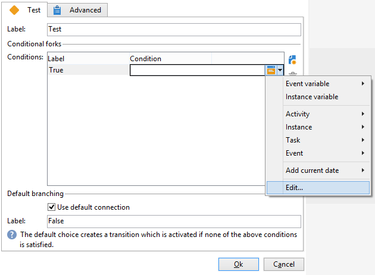

# Test{#test}

Un&#39;attività di tipo **Test** attiva la prima transizione che soddisfa la condizione associata. Se non viene soddisfatta alcuna condizione e se l&#39;opzione **[!UICONTROL Use the default fork]** è attivata, verrà attivata la transizione predefinita.

Una condizione è un’espressione JavaScript che deve essere valutata come &quot;true&quot; o &quot;false&quot;. Per immettere l&#39;espressione, fare clic sull&#39;icona a destra del nome della condizione, quindi selezionare **[!UICONTROL Edit...]**.

Per ulteriori informazioni su tutte le funzioni JavaScript aggiuntive e i metodi SOAP del server applicativo accessibili tramite JavaScript del flusso di lavoro, fare riferimento alla [documentazione JSAPI](https://experienceleague.adobe.com/developer/campaign-api/api/index.html?lang=it){target="_blank"}.

Puoi anche inserire le variabili direttamente da questo editor. Per ulteriori informazioni su come utilizzare le variabili, consulta [questa sezione](javascript-scripts-and-templates.md#variables).

Le condizioni possono essere aggiunte, eliminate o ordinate dalla finestra di modifica delle proprietà dell’attività, ma possono anche essere modificate dalla transizione.

Se il risultato di un calcolo deve essere riutilizzato da condizioni diverse, è possibile calcolarlo nello script di inizializzazione dell’attività. Il risultato deve essere memorizzato in una variabile dell’attività a cui devono accedere gli script di condizione (task.vars.xxx).
