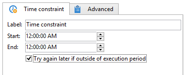

# Attività Time constraint{#time-constraint}

A **Vincolo di tempo** attività consente di posticipare l&#39;esecuzione di un&#39;attività o di abbandonarla.

Immetti l’etichetta per l’attività e specifica l’intervallo di tempo durante il quale l’attività del flusso di lavoro deve essere sospesa.

Quando **[!UICONTROL Try again later if outside of execution period]** selezionata, consente di riavviare l&#39;attività al di fuori dell&#39;intervallo di tempo di esecuzione. se desideri che l’azione del flusso di lavoro venga abbandonata definitivamente dopo la sospensione, deseleziona questa opzione.

