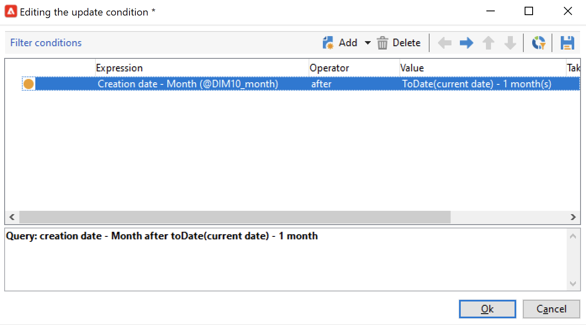

# Aggregato di aggiornamento{#update-aggregate}

Gli aggregati definiti in [cubi](../../v8/reporting/gs-cubes.md) a scopo di reporting possono essere aggiornati con un&#39;attività specifica. È disponibile una scheda **[!UICONTROL Workflow]** durante la configurazione dell&#39;aggregazione.

Ulteriori informazioni su cubi e aggregati sono disponibili in [questa sezione](../../v8/reporting/customize-cubes.md#calculate-and-use-aggregates).

Per aggiornare un aggregato, modificare l&#39;attività **[!UICONTROL Update aggregate]** e selezionare il cubo e l&#39;aggregato da aggiornare.

Puoi configurare un **aggiornamento completo** o un **aggiornamento parziale**.

Per impostazione predefinita, durante ogni calcolo viene eseguito un aggiornamento completo. Per abilitare un aggiornamento parziale, seleziona l’opzione e definisci le condizioni di aggiornamento.

Si consiglia di aggiungere un&#39;attività **[!UICONTROL Scheduler]** per impostare la frequenza degli aggiornamenti del calcolo.
