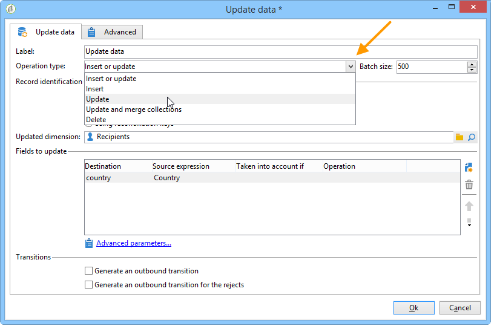
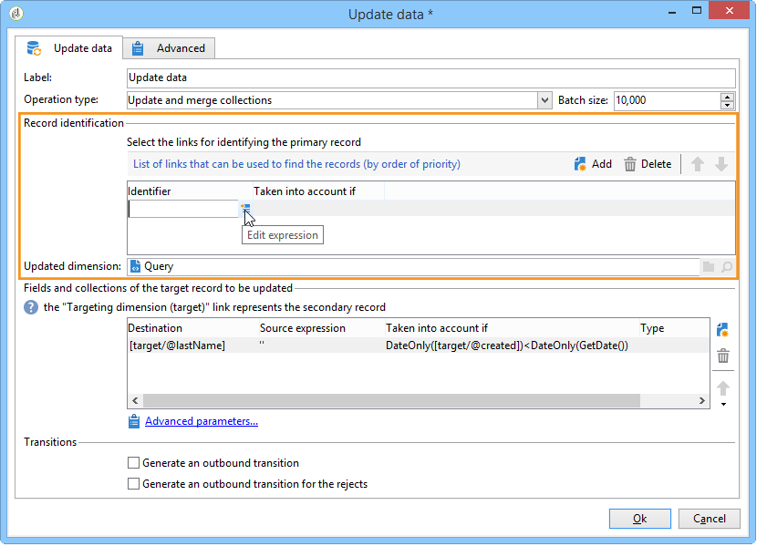

# Attività Update data{#update-data}

Un **Aggiorna dati** L&#39;attività -type esegue un aggiornamento di massa dei campi nel database.

## Tipo di operazione {#operation-type}

Il **[!UICONTROL Operation type]** consente di scegliere il processo da eseguire sui dati del database:

* **[!UICONTROL Insert or update]**: aggiungi i dati o aggiornali, se sono già stati aggiunti.
* **[!UICONTROL Insert]**: aggiungi solo i dati.
* **[!UICONTROL Update]**: aggiorna solo i dati.
* **[!UICONTROL Update and merge collections]**: aggiorna i dati e scegli un record principale, quindi collega gli elementi collegati ai duplicati in questo record principale. I duplicati possono quindi essere eliminati senza creare elementi collegati orfani.
* **[!UICONTROL Delete]**: elimina i dati.

Il **[!UICONTROL Batch size]** Questo campo consente di selezionare il numero di elementi di transizione in entrata da aggiornare. Se ad esempio si specifica 500, verranno aggiornati i primi 500 record trattati.

## Identificazione del record {#record-identification}

Specificare come identificare i record nel database:

* Se le voci di dati si riferiscono a una dimensione di targeting esistente, seleziona la **[!UICONTROL By directly using the targeting dimension]** e selezionarla nella **[!UICONTROL Updated dimension]** campo.

  Puoi visualizzare i campi per la dimensione selezionata utilizzando **[!UICONTROL Edit this link]** pulsante lente di ingrandimento.

* In caso contrario, specifica uno o più collegamenti che consentano l’identificazione dei dati nel database o l’uso diretto delle chiavi di riconciliazione.

## Selezione dei campi da aggiornare {#selecting-the-fields-to-be-updated}

Utilizza il **[!UICONTROL Automatically associate fields with the same name]** affinché Adobe Campaign identifichi automaticamente i campi da aggiornare.

È inoltre possibile utilizzare **[!UICONTROL Insert]** per selezionare manualmente i campi del database da aggiornare.

Seleziona tutti i campi da aggiornare e, se necessario, aggiungi condizioni in base a cui eseguire l’aggiornamento. A questo scopo, utilizza la colonna **[!UICONTROL Taken into account if]**. Le condizioni vengono applicate una dopo l’altra e in conformità all’ordine nell’elenco. Utilizza le frecce a destra per modificare l’ordine degli aggiornamenti.

Puoi utilizzare lo stesso campo di destinazione più volte.

In un **[!UICONTROL Insert or update]** , puoi selezionare la campagna da applicare, singolarmente o per ciascun campo. A questo scopo, seleziona il valore desiderato nella **[!UICONTROL Operation]** colonna.

Il **[!UICONTROL modifiedDate]**, **[!UICONTROL modifiedBy]**, **[!UICONTROL createdDate]** e **[!UICONTROL createdBy]** I campi vengono aggiornati automaticamente durante gli aggiornamenti dei dati, a meno che la relativa modalità di gestione non sia configurata in modo specifico nella tabella di aggiornamento dei campi.

L&#39;aggiornamento del record viene eseguito solo per i record contenenti almeno una differenza. Se i valori sono identici, non viene eseguito alcun aggiornamento.

Il **[!UICONTROL Advanced parameters]** Il collegamento ti consente di specificare opzioni aggiuntive per l’aggiornamento dei dati e la gestione dei duplicati. È inoltre possibile:

* **[!UICONTROL Disable automatic key management]**.
* **[!UICONTROL Disable audit]**.
* **[!UICONTROL Empty the destination value if the source value is empty (NULL)]**. Questa opzione è selezionata automaticamente per impostazione predefinita.
* **[!UICONTROL Update all columns with matching names]**.
* Specificare le condizioni che considerano gli elementi di origine utilizzando un&#39;espressione nella **[!UICONTROL Enabled if]** campo.
* Specifica le condizioni che considerano i duplicati utilizzando un’espressione. Se si controlla **[!UICONTROL Ignore records which concern the same target]** , verrà considerata solo la prima nell’elenco delle espressioni.

**[!UICONTROL Generate an outbound transition]**

Crea una transizione in uscita che verrà attivata alla fine dell’esecuzione. L’aggiornamento in genere segnala la fine di un flusso di lavoro di targeting e l’opzione non viene quindi attivata per impostazione predefinita.

**[!UICONTROL Generate an outbound transition for the rejects]**

Crea una transizione in uscita contenente record che non sono stati elaborati correttamente dopo l’aggiornamento (ad esempio se è presente un duplicato). L’aggiornamento in genere segna la fine di un flusso di lavoro di targeting e pertanto l’opzione non è attivata per impostazione predefinita.

## Aggiornamento e unione di raccolte {#updating-and-merging-collections}

L’aggiornamento dei dati e l’unione delle raccolte ti consentono di aggiornare i dati contenuti in un record utilizzando i dati di uno o più record secondari, allo scopo di conservarne solo uno, se lo desideri. Questi aggiornamenti sono gestiti da un set di regole.

>[!NOTE]
>
>Questa opzione consente inoltre di elaborare i riferimenti ai record secondari dalle tabelle di lavoro del flusso di lavoro (targetWorkflow), dalle consegne (targetDelivery) e dagli elenchi (targetList). Se necessario, questi collegamenti vengono visualizzati nell’elenco in cui si selezionano i campi e le raccolte.

1. Seleziona la **[!UICONTROL Update and merge collections]** operazione.

   

1. Seleziona l’ordine di priorità dei collegamenti. Questo consente di identificare il record principale. I collegamenti disponibili variano a seconda della transizione in entrata.

   

1. Selezionare le raccolte da spostare nel record principale e i campi da aggiornare.

   Immettere le regole applicabili a questi record una volta identificati uno o più record secondari. A questo scopo, puoi utilizzare il Generatore di espressioni. Ad esempio, specificando che si tratta del valore aggiornato più di recente tra tutti i diversi record che devono essere conservati.

   Quindi inserisci le condizioni da considerare per la regola.

   Infine, specifica il tipo di aggiornamento da eseguire. Ad esempio, è possibile scegliere di eliminare i record secondari dopo l&#39;aggiornamento dei dati.

   Ad esempio, puoi configurare l’unione di raccolte contenenti dati eterogenei come l’elenco delle sottoscrizioni di un destinatario. Utilizzando le regole, è inoltre possibile creare nuove cronologie di abbonamenti da abbonamenti a record secondari o persino spostare l’elenco di abbonamenti da un record secondario a un record principale.

1. Specificare l&#39;ordine di elaborazione dei record secondari selezionando **[!UICONTROL Advanced parameters]** > **[!UICONTROL Duplicates]**.

   

I dati per i record secondari sono associati al record principale se sono applicabili le regole definite. A seconda del tipo di aggiornamento selezionato, è possibile eliminare i record secondari.

## Esempio: aggiornare i dati in seguito a un arricchimento {#example--update-data-following-an-enrichment}

Il [Passaggio 2: scrittura di dati arricchiti nella tabella &quot;Acquisti&quot;](create-a-summary-list.md#step-2--writing-enriched-data-to-the--purchases--table) sezione del caso d’uso che descrive come creare un elenco di riepilogo offre un esempio di aggiornamento dei dati dopo un’attività di arricchimento.

## Parametri di input {#input-parameters}

* tableName
* schema

Ogni evento in entrata deve specificare una destinazione definita da questi parametri.
