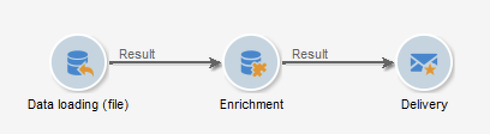

# Utilizzare i dati del flusso di lavoro{#how-to-use-workflow-data}

Puoi utilizzare le attività del flusso di lavoro per eseguire più attività. Di seguito sono riportati alcuni esempi di utilizzo per aggiornare il database creando elenchi, gestendo sottoscrizioni, inviando messaggi tramite un flusso di lavoro o arricchendo le consegne e i relativi tipi di pubblico.

È disponibile una serie di casi di utilizzo del flusso di lavoro in [questa sezione](workflow-use-cases.md).

## Ciclo di vita dei dati {#data-life-cycle}

### Tabella dei lavori temporanei del flusso di lavoro {#work-table}

Nei flussi di lavoro, i dati trasportati da un’attività all’altra vengono memorizzati in una tabella di lavoro temporanea.

Questi dati possono essere visualizzati e analizzati facendo clic con il pulsante destro del mouse sulla transizione appropriata.


A questo scopo, seleziona il menu corrispondente:

* **[!UICONTROL Display the target...]**

   Questo menu visualizza i dati disponibili sulla popolazione target.

   

   È possibile accedere alla struttura della tabella di lavoro nel **[!UICONTROL Schema]** scheda .

   

   Per ulteriori informazioni al riguardo, consulta [questa sezione](monitor-workflow-execution.md#worktables-and-workflow-schema).

* **[!UICONTROL Analyze target...]**

   Questo menu ti consente di accedere alla procedura guidata di analisi descrittiva che ti consente di produrre statistiche e rapporti sui dati della transizione.

   Per ulteriori informazioni, consulta la [documentazione di Campaign Classic v7](https://experienceleague.adobe.com/docs/campaign-classic/using/reporting/analyzing-populations/about-descriptive-analysis.html){target="_blank"}.

I dati di destinazione vengono eliminati durante l’esecuzione del flusso di lavoro. È accessibile solo l’ultima tabella di lavoro. È possibile configurare il flusso di lavoro in modo che tutte le tabelle di lavoro rimangano accessibili: controlla **[!UICONTROL Keep the result of interim populations between two executions]** nelle proprietà del flusso di lavoro.


>[!CAUTION]
>
>Questa opzione deve essere **mai** essere controllati in un **produzione** workflow. Questa opzione viene utilizzata per analizzare i risultati ed è progettata solo a scopo di test e quindi deve essere utilizzata solo negli ambienti di sviluppo o di staging.


### Utilizzo dei dati di destinazione {#target-data}

I dati memorizzati nella tabella di lavoro temporaneo del flusso di lavoro sono disponibili per le attività di personalizzazione. I dati possono essere utilizzati nei campi di personalizzazione.

Ciò ti consente ad esempio di utilizzare i dati raccolti tramite un elenco in una consegna. A questo scopo, utilizza la sintassi seguente:

```
%= targetData.FIELD %
```

**[!UICONTROL Target extension]** Gli elementi di personalizzazione di tipo (targetData) non sono disponibili per i flussi di lavoro di targeting. Il target di consegna deve essere generato nel flusso di lavoro e specificato nella transizione in entrata della consegna.

Nell’esempio seguente, stai raccogliendo un elenco di informazioni sui clienti da utilizzare in un’e-mail personalizzata. Applica i seguenti passaggi:

1. Crea un flusso di lavoro per raccogliere le informazioni, riconcilialo con i dati già presenti nel database, quindi avvia una consegna.

   

1. Nel nostro esempio, il contenuto del file è il seguente:

   ```
   Music,First name,Last name,Account,CD/DVD,Card
   Pop,David,BLAIR,4323,CD,0
   Rock,Daniel,ARCARI,3222,DVD,1
   Disco,Uma,ALTON,0488,DVD,0
   Jazz,Paul,BOLES,6475,CD,1
   Jazz,David,BOUKHARI,0841,DVD,1
   [...]
   ```

   Per caricare il file, configura il **[!UICONTROL Data loading (file)]** attività come segue:

   

1. Configura le **[!UICONTROL Enrichment]** per riconciliare i dati raccolti con quelli già presenti nel database Adobe Campaign. In questo caso, la chiave di riconciliazione è il numero di account:

   

1. Quindi configura la **[!UICONTROL Delivery]**: viene creato in base a un modello e i destinatari sono specificati dalla transizione in entrata.

   

   >[!CAUTION]
   >
   >Per personalizzare la consegna possono essere utilizzati solo i dati contenuti nella transizione. **targetData** i campi di personalizzazione del tipo sono disponibili solo per la popolazione in entrata del **[!UICONTROL Delivery]** attività.

1. Nel modello di consegna, utilizza i campi raccolti nel flusso di lavoro.

   A questo scopo, inserisci **[!UICONTROL Target extension]** digitare campi di personalizzazione.

   

   In questo caso, vogliamo inserire il genere musicale e il tipo di supporto preferiti dal cliente (CD o DVD) come indicato nel file raccolto dal flusso di lavoro.

   In più, aggiungeremo un coupon per i titolari di carte fedeltà, vale a dire i destinatari per i quali il valore &quot;Carta&quot; è uguale a 1.

   

   **[!UICONTROL Target extension]** I dati di tipo (targetData) vengono inseriti nelle consegne utilizzando le stesse caratteristiche di tutti i campi di personalizzazione. Possono anche essere utilizzati nell&#39;oggetto, nelle etichette di collegamento o nei link stessi.


## Aggiornare il database {#update-the-database}

Tutti i dati raccolti possono essere utilizzati per aggiornare il database o nelle consegne. Ad esempio, puoi arricchire le possibilità di personalizzazione del contenuto dei messaggi (include il numero di contratti nel messaggio, specifica il carrello medio nell’ultimo anno, ecc.) o il targeting dettagliato della popolazione (inviare un messaggio ai titolari di contratto, indirizzare i 1.000 migliori abbonati ai servizi online, ecc.). Questi dati possono anche essere esportati o archiviati in un elenco.

### Aggiorna elenchi  {#list-updates}

I dati del database Adobe Campaign e degli elenchi esistenti possono essere aggiornati utilizzando due attività dedicate:

* La **[!UICONTROL List update]** attività ti consente di memorizzare tabelle di lavoro in un datalist.

   È possibile selezionare un elenco esistente o crearlo. In questo caso, vengono calcolati il nome e probabilmente la cartella di record.

   

   Fai riferimento a [Aggiornamento elenco](list-update.md).

* La **[!UICONTROL Update data]** l’attività esegue un aggiornamento di massa dei campi nel database.

   Per ulteriori informazioni, consulta [Update data](update-data.md).

### Gestire le iscrizioni {#subscription-management}

Per informazioni sull’abbonamento e l’annullamento dell’abbonamento dei destinatari a un servizio di informazione tramite un flusso di lavoro, consulta [Servizi sottoscrizione](subscription-services.md).
