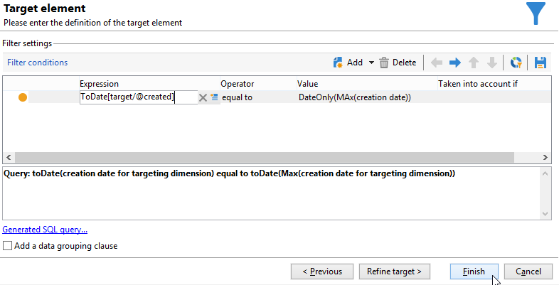

# Utilizzare gli aggregati{#using-aggregates}

Questo caso d’uso descrive come identificare automaticamente gli ultimi destinatari aggiunti al database.

Utilizzando il processo seguente, la data di creazione dei destinatari nel database viene confrontata con l’ultima data nota in cui un destinatario è stato creato utilizzando un aggregato. Verranno selezionati anche tutti i destinatari creati nello stesso giorno.

Per eseguire una **Data creazione = max (Data creazione)** digita filtro per i destinatari, devi eseguire un flusso di lavoro per seguire questi passaggi:

1. Recuperare i destinatari del database utilizzando una query di base. Per ulteriori informazioni su questo passaggio, consulta [Creazione di una query](query.md#creating-a-query).
1. Calcola l’ultima data nota in cui un destinatario è stato creato utilizzando il risultato generato dal **max (Data di creazione)** funzione di aggregazione
1. Il collegamento di ciascun destinatario alla funzione di aggregazione restituisce lo stesso schema.
1. Filtra i destinatari utilizzando l’aggregato tramite lo schema modificato.

## Passaggio 1: calcolo del risultato aggregato {#step-1--calculating-the-aggregate-result}

1. Creare una query. In questo caso, l’obiettivo è calcolare l’ultima data di creazione nota di tutti i destinatari nel database. La query non contiene pertanto un filtro.
1. Seleziona **[!UICONTROL Add data]**.
1. Nelle finestre aperte, seleziona **[!UICONTROL Data linked to the filtering dimension]** allora **[!UICONTROL Filtering dimension data]**.
1. In **[!UICONTROL Data to add]** , aggiungere una colonna che calcola il valore massimo per la **Data di creazione** nell&#39;indice dei destinatari. Puoi utilizzare l’editor espressioni o immettere: **max(@created)** direttamente in un campo nel **[!UICONTROL Expression]** colonna. Quindi fai clic su **[!UICONTROL Finish]** pulsante.

   

1. Fai clic su **[!UICONTROL Edit additional data]**, quindi su **[!UICONTROL Advanced parameters...]**. Seleziona l’opzione **[!UICONTROL Disable automatic adding of the primary keys of the targeting dimension]**.

   Questa opzione garantisce che tutti i destinatari non vengano visualizzati come risultato e che i dati aggiunti esplicitamente non vengano conservati. In questo caso, si riferisce all’ultima data di creazione di un destinatario.

   Lascia selezionata l’opzione **[!UICONTROL Remove duplicate rows (DISTINCT)]**.

## Passaggio 2: collegamento dei destinatari e del risultato della funzione di aggregazione {#step-2--linking-the-recipients-and-the-aggregation-function-result}

Per collegare la query che tratta i destinatari alla query che esegue il calcolo della funzione di aggregazione, è necessario utilizzare un’attività di modifica dello schema.

1. Definisci la query per i destinatari come set principale.
1. In **[!UICONTROL Links]** , aggiungere un nuovo collegamento e inserire le informazioni nella finestra che si apre come segue:

   * Seleziona lo schema temporaneo relativo all’aggregato. I dati per questo schema verranno aggiunti ai membri del set principale.
   * Seleziona **[!UICONTROL Use a simple join]** per collegare il risultato aggregato a ogni destinatario del set principale.
   * Infine, specifica che il collegamento è un **[!UICONTROL Type 11 simple link]**.

   

Il risultato dell&#39;aggregazione è quindi collegato a ciascun destinatario.

## Passaggio 3: filtrare i destinatari utilizzando l’aggregato. {#step-3--filtering-recipients-using-the-aggregate-}

Una volta stabilito il collegamento, il risultato aggregato e i destinatari fanno parte dello stesso schema temporaneo. È quindi possibile creare un filtro sullo schema per confrontare la data di creazione dei destinatari e l’ultima data di creazione nota, rappresentata dalla funzione di aggregazione. Questo filtro viene eseguito utilizzando un’attività divisa.

1. In **[!UICONTROL General]** , seleziona **Destinatari** come dimensione di targeting e **Modifica schema** come dimensione di filtro (per filtrare in base all’attività dello schema di transizione in entrata).
1. In **[!UICONTROL subsets]** , seleziona **[!UICONTROL Add a filtering condition on the inbound population]** quindi fai clic su **[!UICONTROL Edit...]**.
1. Utilizzando l’editor di espressioni, aggiungi un criterio di uguaglianza tra la data di creazione dei destinatari e la data di creazione calcolata dall’aggregato.

   I campi del tipo di data nel database vengono generalmente salvati in millisecondi. Devi quindi estenderli per l’intero giorno per evitare di recuperare i destinatari creati solo nello stesso millisecondo.

   A tale scopo, utilizza **ToDate** funzione, disponibile nell’editor espressioni, che converte date e ore in date semplici.

   Le espressioni da utilizzare per i criteri sono pertanto le seguenti:

   * **[!UICONTROL Expression]**: `toDate([target/@created])`.
   * **[!UICONTROL Value]**: `toDate([datemax/expr####])`, dove expr#### fa riferimento all&#39;aggregato specificato nella query della funzione di aggregazione.

   

Il risultato dell’attività divisa si riferisce quindi ai destinatari creati lo stesso giorno dell’ultima data di creazione nota.

Per arricchire il flusso di lavoro, puoi quindi aggiungere altre attività, ad esempio un aggiornamento dell’elenco o una consegna.
