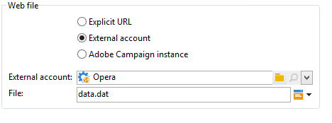

# Download web{#web-download}

Il **Download web** l’attività avvia il download di un file su un URL esplicito, un account esterno o un’istanza di Adobe Campaign. Viene utilizzato il protocollo HTTP. Può trattarsi di un download GET o POST.

## Properties {#properties}

1. **Selezione del file Web**

   Per specificare il file da scaricare, puoi immettere l’URL del file, utilizzare l’account HTTP esterno in cui è memorizzato il file oppure caricare il file tramite un’istanza di Adobe Campaign. I parametri disponibili sono descritti di seguito:

   * Per immettere direttamente l’URL del file da scaricare, seleziona la **[!UICONTROL Explicit URL]** e specifica l’URL nel campo appropriato. Questo URL può essere costruito con dati variabili.

     

   * Per utilizzare un&#39; **[!UICONTROL External account]**, seleziona l’account dall’elenco a discesa e specifica il file da scaricare.

     Gli account esterni sono configurati da **[!UICONTROL Administration > Platform > External accounts]** della struttura Adobe Campaign. I parametri dell’account possono essere modificati tramite **[!UICONTROL Edit link]** icona.

     

   * Per scaricare il file dall’istanza di Adobe Campaign, seleziona la **[!UICONTROL Adobe Campaign Instance]** opzione.

     

1. **Storicizzazione dei file**

   Il **[!UICONTROL File historization settings...]** link consente di specificare la directory di archiviazione dei file e la frequenza di eliminazione della directory.

   

   Sono disponibili le seguenti opzioni:

   * **[!UICONTROL Use a default storage directory]**: il file viene sempre spostato prima di essere elaborato. Se questa opzione è selezionata, il file viene spostato nella directory di archiviazione predefinita (la **variabili** della cartella di installazione di Adobe Campaign). Per specificare una directory di archiviazione, deselezionare la casella e immetterne il percorso in **[!UICONTROL Storage directory]** campo
   * **[!UICONTROL Number of files]**: immetti il numero massimo di file da mantenere nella directory di archiviazione.
   * **[!UICONTROL Maximum size (in Mb)]**: immettere la capacità massima della directory di archiviazione (in megabyte).

   Ogni file viene conservato per 24 ore prima di essere sottoposto alle regole di rimozione definite. L’eliminazione avviene subito prima dell’inizio dell’attività e pertanto non tiene conto del file del flusso di lavoro in corso.

   I file vengono eliminati in funzione della loro età (dal meno recente al più recente). I file meno recenti vengono eliminati finché non vengono verificate entrambe le regole di eliminazione. Pertanto, se è definito un limite di 100 file, significa che la directory di archiviazione conterrà sempre i 100 file più recenti prima dell’inizio del flusso di lavoro, nonché quelli in fase di elaborazione nel flusso di lavoro in corso.

   Se non si desidera più impostare un limite per **[!UICONTROL Number of files]** e **[!UICONTROL Maximum size (in Mb)]** opzioni, immetti 0 come valore.

1. **Parametri avanzati**

   Il **[!UICONTROL Advanced parameters...]** Il collegamento ti consente di specificare le opzioni aggiuntive riportate di seguito:

   * **[!UICONTROL Follow redirections]**: il reindirizzamento dei file consente di utilizzare gli override per indirizzare l’input o l’output di dati a un dispositivo di tipo diverso.
   * **[!UICONTROL Add the HTTP headers to the file]**: in alcuni casi, potrebbe essere utile aggiungere ulteriori intestazioni HTTP a un file. Nella maggior parte dei casi, queste intestazioni vengono utilizzate per fornire informazioni aggiuntive a scopo di risoluzione dei problemi, per [Condivisione delle risorse tra diverse origini (CORS)](https://developer.mozilla.org/docs/Web/HTTP/CORS), o per impostare specifiche direttive di caching.
   * **[!UICONTROL Ignore the HTTP return code]**: i codici di ritorno HTTP, o codici di stato HTTP, indicano il risultato di una richiesta HTTP.

   

   Il **[!UICONTROL Process errors]** è descritta in [Errori di elaborazione](monitor-workflow-execution.md#processing-errors).

## Parametri di output {#output-parameters}

* nome file: nome completo del file scaricato.
