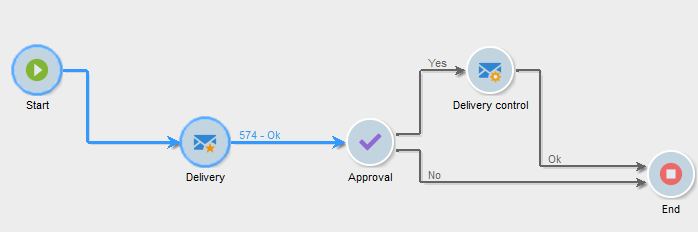

# Ciclo di vita di un flusso di lavoro {#workflow-life-cycle}

Il ciclo del flusso di lavoro prevede tre passaggi principali.

* **In fase di modifica**

  Questa è la fase di progettazione iniziale: quando viene creato il nuovo flusso di lavoro, il suo stato è &quot;In corso di modifica&quot;. Il flusso di lavoro non è ancora gestito dal server e può essere modificato senza rischi.

* **Avviato**

  Una volta completata la fase di progettazione iniziale, è possibile avviare il flusso di lavoro. In questa fase, l’istanza viene gestita dal server e vengono eseguite le singole attività. È comunque possibile modificare il flusso di lavoro con alcune precauzioni.

* **Completato**

  Un flusso di lavoro è &quot;Completato&quot; quando non sono più presenti attività in corso o quando un operatore ha esplicitamente interrotto l’istanza.

Ad esempio, le attività **Inizio** e **Consegna** sono evidenziate mentre l&#39;attività **Approvazione** lampeggia nel flusso di lavoro seguente.

Ciò significa che le prime due attività sono state eseguite correttamente e che l’approvazione è in corso, ovvero è stata creata ma non ancora completata.

I caratteri **574 -Ok** visualizzati sopra la transizione successiva all&#39;attività **Delivery** indicano che la preparazione della consegna ha come destinazione 574 destinatari e che l&#39;operazione è stata completata correttamente. Queste informazioni, che vengono aggiunte alle transizioni quando vengono eseguite, vengono calcolate dalle attività che elaborano i dati.

Il flusso di lavoro è stato avviato ed è in attesa di una decisione da parte di un operatore appartenente al gruppo specificato nell&#39;attività **Approval**. Gli operatori appartenenti al gruppo e che dispongono di un indirizzo e-mail o di un numero di cellulare ricevono una notifica.

Per ulteriori informazioni su come monitorare i flussi di lavoro, consulta [questa sezione](monitor-workflow-execution.md).
