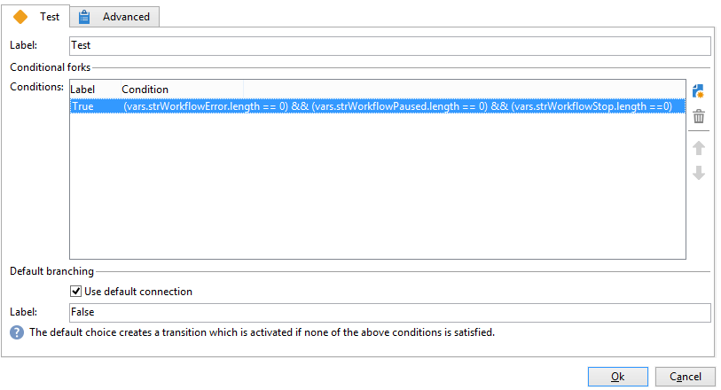
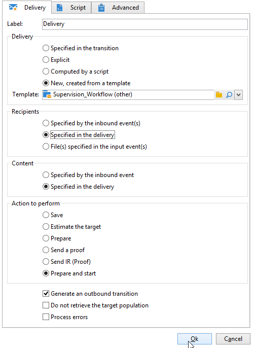

# Caso di utilizzo: supervisione dei flussi di lavoro{#supervising-workflows}

Questo caso d’uso descrive la creazione di un flusso di lavoro che consente di monitorare lo stato di un set di flussi di lavoro &quot;in pausa&quot;, &quot;interrotti&quot; o &quot;con errori&quot;.

Il suo obiettivo è:

* Utilizza un flusso di lavoro per monitorare un gruppo di flussi di lavoro aziendali.
* Invia un messaggio a un supervisore tramite un’attività di &quot;consegna&quot;.

Per monitorare lo stato di un set di flussi di lavoro, è necessario seguire questi passaggi:

1. Crea il flusso di lavoro di monitoraggio.
1. Scrivere il codice JavaScript per determinare se i flussi di lavoro vengono sospesi, interrotti o con errori.
1. Creare **[!UICONTROL Test]** attività.
1. Prepara il modello di consegna.

>[!NOTE]
>
>Oltre al flusso di lavoro, Campaign **Workflow Heatmap** consente di analizzare in dettaglio i flussi di lavoro attualmente in esecuzione. Per ulteriori informazioni, consulta [sezione dedicata](heatmap.md).
>
>Per ulteriori informazioni su come **monitorare l’esecuzione dei flussi di lavoro**, fare riferimento a [questa sezione](monitor-workflow-execution.md).

## Passaggio 1: creazione del flusso di lavoro di monitoraggio {#step-1--creating-the-monitoring-workflow}

La cartella del flusso di lavoro che verrà monitorata è **&quot;CustomWorkflows&quot;** cartella memorizzata in **Amministrazione > Produzione > Flussi di lavoro tecnici** nodo. Questa cartella contiene un set di flussi di lavoro aziendali.

Il **Monitoraggio del flusso di lavoro** viene memorizzato nella directory principale della cartella Flussi di lavoro tecnici. L’etichetta utilizzata è **&quot;Monitoraggio&quot;**.

Lo schema seguente mostra la sequenza di attività:


Questo flusso di lavoro è costituito da:

* a **&quot;Start&quot;** attività.
* a **&quot;Codice JavaScript&quot;** attività responsabile dell’analisi della cartella dei flussi di lavoro aziendali.
* a **&quot;Test&quot;** per inviare una consegna al supervisore o riavviare il flusso di lavoro.
* a **&quot;Delivery&quot;** attività responsabile del layout dei messaggi.
* a **&quot;Wait&quot;** attività che controlla i lead time tra le iterazioni del flusso di lavoro.

## Passaggio 2: scrittura di JavaScript {#step-2--writing-the-javascript}

La prima parte del codice JavaScript coincide con un **query (queryDef)** che consente di identificare i flussi di lavoro con lo stato &quot;pausa&quot; (@state == 13), &quot;errore&quot; (@failed == 1) o &quot;interrotto&quot; (@state == 20).

Il **nome interno** della cartella del flusso di lavoro da monitorare viene fornita nella seguente condizione:

```
<condition boolOperator="AND" expr="[folder/@name] = 'Folder20'" internalId="1"/>
```

```
var strError = "";
var strPaused = "";
var strStop = "";

var queryWkfError = xtk.queryDef.create(
  <queryDef schema="xtk:workflow" operation="select">
    <select>
      <node expr="@internalName"/>
      <node expr="@state"/>
      <node expr="@label"/>
      <node expr="@failed"/>
      <node expr="@state"/>   
    </select>
    <where id="12837805386">
      <condition boolOperator="AND" expr="[folder/@name] = 'Folder20'" internalId="1"/>
        <condition boolOperator="AND" internalId="2">
          <condition boolOperator="OR" expr="@state = 20" internalId="3"/>
          <condition expr="@state = 13" internalId="4"/>
        </condition>  
    </where>
  </queryDef>
);
var ndWkfError = queryWkfError.ExecuteQuery(); 
```

La seconda parte del codice JavaScript consente di: **visualizza un messaggio per ogni flusso di lavoro** in base allo stato recuperato durante la query.

>[!NOTE]
>
>Le stringhe create devono essere caricate nelle variabili evento del flusso di lavoro.

```
for each ( var wkf in ndWkfError.workflow ) 
{
  if ( wkf.@state == 13 )  // Status 13 = paused
  {
    if ( wkf.@failed == 1 )
      strError += "<li>Workflow '" + wkf.@internalName + "' with the label '" + wkf.@label + "'</li>";
    else
      strPaused += "<li>Workflow '" + wkf.@internalName + "' with the label '" + wkf.@label + "'</li>";
  }
  
  if ( wkf.@state == 20 )  // Status 20 = stop
    strStop += "<li>Workflow '" + wkf.@internalName + "' with the label '" + wkf.@label + "'</li>";
}

vars.strWorkflowError = strError;
vars.strWorkflowPaused = strPaused;
vars.strWorkflowStop = strStop;
```

## Passaggio 3: creazione dell’attività &quot;Test&quot; {#step-3--creating-the--test--activity}

L’attività &quot;Test&quot; consente di determinare se una consegna deve essere inviata o se il flusso di lavoro di monitoraggio deve eseguire un altro ciclo in base all’attività &quot;Wait&quot; (Attendi).

Una consegna viene inviata al supervisore **se almeno una delle tre variabili di evento &quot;vars.strWorkflowError&quot;, &quot;vars.strWorkflowPaused&quot; o &quot;vars.strWorkflowStop&quot; non è nulla.**



L’attività &quot;Attendi&quot; può essere configurata per riavviare il flusso di lavoro di monitoraggio a intervalli regolari. Per questo caso d’uso, **il tempo di attesa è impostato su un&#39;ora**.


## Passaggio 4: preparazione della consegna {#step-4--preparing-the-delivery}

L’attività &quot;Delivery&quot; si basa su una **modello di consegna** memorizzato in **Risorse > Modelli > Modelli di consegna** nodo.

Questo modello deve includere:

* **l’indirizzo e-mail del supervisore**.
* **Contenuto HTML** per inserire testo personalizzato.

   

   Le tre variabili dichiarate (WF_Stop, WF_Paused, WF_Error) corrispondono alle tre variabili di evento del flusso di lavoro.

   Queste variabili devono essere dichiarate nella **Variabili** scheda delle proprietà del modello di consegna.

   Da recuperare **il contenuto delle variabili evento del flusso di lavoro**, devi dichiarare le variabili specifiche della consegna che verranno inizializzate con i valori restituiti dal codice JavaScript.

   Il modello di consegna ha il seguente contenuto:

   

Una volta creato e approvato il modello, è necessario configurare **Consegna** attività a:

* collega l’attività &quot;Delivery&quot; al modello di consegna creato in precedenza.
* collega le variabili evento del flusso di lavoro a quelle specifiche del modello di consegna.

Fai doppio clic su **Consegna** e selezionare le opzioni seguenti:

* Consegna: selezionare **Nuovo, creato da un modello** e seleziona il modello di consegna creato in precedenza.
* Per **Destinatari e contenuto** campi, seleziona **Specificato nella consegna**.
* Azione da eseguire: seleziona **Prepara e avvia**.
* Deseleziona la **Errori di processo** opzione.

   

* Vai a **Script** scheda di **Consegna** attività, aggiungi tre **stringa di caratteri** digita le variabili tramite il menu del campo di personalizzazione.

   

   

   Le tre variabili dichiarate sono:

   ```
   delivery.variables._var[0].stringValue = vars.strWorkflowError;
   delivery.variables._var[1].stringValue = vars.strWorkflowPaused;
   delivery.variables._var[2].stringValue = vars.strWorkflowStop; 
   ```

Una volta avviato, il flusso di lavoro di monitoraggio invia un riepilogo ai destinatari.
