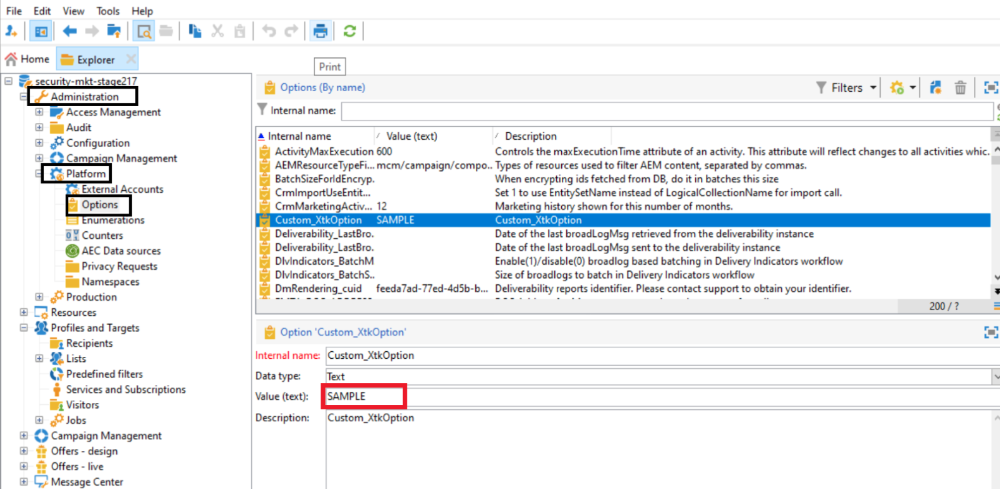

# Nota tecnica: guida alla rotazione delle credenziali {#ac-customer-credentials}

In qualità di cliente, sei tenuto a sostituire periodicamente le tue credenziali con un nuovo set per ridurre il rischio di compromessi.

## Credenziali opzioni Adobe Campaign {#ac-options-credentials}

Da Adobe Campaign Explorer, il nodo **Amministrazione > Piattaforma > Opzioni** consente di apportare modifiche alle opzioni di Adobe Campaign. Se hai memorizzato alcune credenziali, assicurati di ruotarle.

## Credenziali account esterno {#ac-accounts-credentials}

Il nodo **Amministrazione > Platform > Account esterni** consente di apportare modifiche agli account esterni di Adobe Campaign.

Ruota tutte le credenziali salvate negli account esterni.

>[!CAUTION]
>
>**Non** modificare le credenziali gestite dell&#39;Adobe. Tutti gli account esterni con server correlato `adobe` non devono essere modificati.

Per gli operatori `mc*` tecnici specifici (es: mc1, mc2, ecc.) e `Interaction*` (es: interazione1, interazione2, ecc.), può essere seguito uno dei due approcci seguenti:

1. Adobe può modificare le credenziali di tali operatori e condividerle con te. Tieni presente che tutte le integrazioni che utilizzano questi operatori cesseranno di funzionare finché le credenziali per questi operatori non verranno aggiornate dal tuo lato.

1. Adobe può creare **nuovi** operatori corrispondenti a ogni operatore esistente e condividerli con te. Adobe eliminerà tutte le occorrenze dei vecchi operatori dopo il passaggio a questi nuovi operatori.

## Chiave privata/certificato di Mobile Services  {#ac-key-credentials}

Per la rotazione delle chiavi private e del certificato relativi ai servizi mobili, fai riferimento ai collegamenti riportati di seguito.

* Per Android, consulta [questa documentazione](https://experienceleague.adobe.com/it/docs/campaign-classic/using/sending-messages/sending-push-notifications/configure-the-mobile-app/configuring-the-mobile-application-android){target="_blank"}.
Passare alla sezione **Creare l&#39;applicazione mobile Android > Configurare la versione API**.

* Per iOS, consulta [questa documentazione](https://experienceleague.adobe.com/it/docs/campaign-classic/using/sending-messages/sending-push-notifications/configure-the-mobile-app/configuring-the-mobile-application){target="_blank"}.
Passa alla sezione **Crea app mobile iOS->Modalità di autenticazione**.

## Chiavi GPG {#ac-gpg-credentials}

Per la rotazione delle chiavi GPG, è necessario seguire i seguenti passaggi:

1. Decrittare i dati esistenti utilizzando la chiave esistente. [Ulteriori informazioni](https://experienceleague.adobe.com/it/docs/control-panel/using/instances-settings/gpg-keys-management#decrypting-data){target="_blank"}.

1. Crea una nuova coppia di chiavi GPG. Ulteriori informazioni sulla gestione delle chiavi GPG in [questa documentazione](https://experienceleague.adobe.com/it/docs/control-panel/using/instances-settings/gpg-keys-management#decrypting-data){target="_blank"}.

1. Sostituisci l’utilizzo della chiave GPG esistente in tutti i flussi di lavoro con la chiave appena creata.

1. Elimina la chiave GPG esistente.