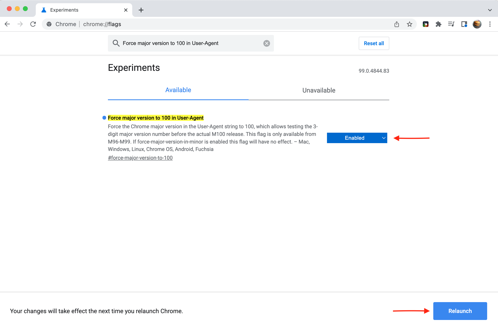

# La versione a 3 cifre del browser influisce sui componenti web di Campaign {#version-100}

Google e Mozilla stanno avvertendo che Chrome e Firefox potrebbero interrompere alcuni siti web a causa delle loro versioni a 3 cifre imminenti.

Chrome v100 è impostato per il rilascio il **29 marzo 2022**, e Firefox v100 su **3 maggio 2022**.

Microsoft ha rilasciato Edge v100 in precedenza a marzo 2022.

La modifica del numero di versione da 2 a 3 cifre può causare alcuni problemi quando si visitano siti Web non preparati per la modifica. Alcune pagine web potrebbero non essere più visualizzate correttamente in queste nuove versioni del browser.

La compatibilità dei principali siti web è stata testata in anticipo. In caso di problemi con i siti che non possono essere risolti prima del rilascio di queste versioni, le aziende dispongono di piani di backup pronti per garantire che i siti non vengano interessati.

I potenziali problemi o la perdita di funzionalità sul sito web derivano dalla stringa dell’agente utente inviata dai browser ai siti web che stai visitando: l’agente utente è una stringa inviata dal browser al sito web per comunicare al sito il browser e la versione in uso, nonché la tecnologia associata. Quando il browser invia una richiesta a un sito web, si identifica con la stringa dell’agente utente prima di recuperare il contenuto richiesto. I dati nella stringa dell’agente utente aiutano il sito web a distribuire il contenuto in un formato adatto al browser. La versione dell’agente utente viene incrementata in modo che corrisponda al numero di versione del browser. Il passaggio da 2 a 3 cifre può causare problemi.

## Sei interessato?{#version-100-impact}

L’Adobe consiglia di testare le applicazioni web di Campaign, inclusi moduli web e sondaggi, per assicurarsi che continuino a funzionare correttamente con queste nuove versioni del browser.

Questo consiglio si applica a tutte le applicazioni web, in particolare se hai incluso il codice JavaScript.

È necessario verificare con tutti i browser, dispositivi mobili e desktop.

## Come si esegue il test?{#version-100-test}

Puoi configurare i browser in modo da segnalare immediatamente la versione 100, quindi segnalare e correggere eventuali problemi riscontrati.

Con queste impostazioni, il browser invia la nuova stringa dell’agente utente ai siti web, indicando che il browser è v100. In caso di problemi con i moduli web, è necessario creare un bug per l’editor del browser. Prendere in considerazione la ricostruzione di questi moduli web prima che gli aggiornamenti siano ampiamente disponibili.

### Test con Firefox 100{#test-firefox-100}

Per testare le pagine web con Mozilla Firefox 100, puoi simulare la prossima modifica dell’agente utente nelle app web modificando manualmente la stringa dell’agente utente.

1. Apri Firefox, immetti `about:config` nella barra degli indirizzi e premere invio.
1. Cerca `general.useragent.override`.
1. Selezionare Stringa e fare clic sul segno più (+).

   

1. Immetti il testo seguente nel campo:

   ```
   Mozilla/5.0 (Windows NT 10.0; rv:100.0) Gecko/20100101 Firefox/100.0
   ```

1. Fai clic sul pulsante con il segno di spunta blu per salvare l’impostazione.
1. Chiudi e riavvia il browser.

Per ripristinare l’impostazione predefinita dell’agente utente, è sufficiente tornare a `about:config` e cerca `general.useragent.override` di nuovo.  Quando viene visualizzato, fai clic sull’icona del cestino per eliminare l’impostazione e riavvia il browser.

### Test con Chrome 100{#test-chrome-100}

Per testare l’agente utente di Google Chrome 100 sulle tue app web, puoi abilitare questo test come segue:

1. Apri Chrome, immetti `chrome://flags` nella barra degli indirizzi e premere invio.
1. Ricerca `Force major version to 100 in User-Agent` nel campo di ricerca e abilitalo come mostrato di seguito.

   

1. Riavvia il browser.
1. Chiudi `chrome://flags` scheda.

Per ripristinare l’agente utente predefinito, segui questa procedura e modifica l’impostazione del flag su `Default` e riavvia il browser.


### Test con Microsoft Edge 100{#test-ms-edge-100}

A partire da v97, i proprietari del sito possono emulare questa versione abilitando il flag di esperimento  `#force-major-version-to-100` in `edge://flags`.

1. Apri Microsoft Edge, immetti `edge://flags` nella barra degli indirizzi e premere invio.
1. Cerca `force-major-version-to-100` e abilitarlo come illustrato di seguito.

   

1. Riavvia il browser.
1. Chiudi `edge://flags` scheda.

Per ripristinare l’agente utente predefinito, segui questa procedura e modifica l’impostazione del flag su `Default` e riavvia il browser.
