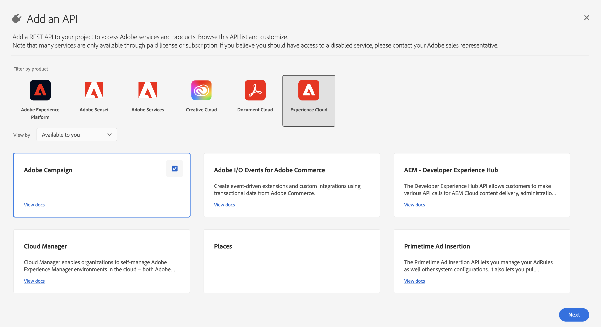

# Migrazione degli operatori tecnici di Campaign a Adobe Developer Console {#migrate-tech-users-to-ims}

Come parte degli sforzi per rafforzare la sicurezza e il processo di autenticazione, a partire da Campaign v8.5, il processo di autenticazione a Campaign v8 viene migliorato. Gli operatori tecnici possono ora utilizzare [Adobe Identity Management System (IMS)](https://helpx.adobe.com/it/enterprise/using/identity.html){target="_blank"} per connettersi a Campaign. Per ulteriori informazioni sul processo di autenticazione da server a server, consulta la [documentazione di Adobe Developer Console](https://developer.adobe.com/developer-console/docs/guides/authentication/ServerToServerAuthentication/){target="_blank"}.

Un operatore tecnico è un profilo utente di Campaign creato esplicitamente per l’integrazione API. Questo articolo descrive i passaggi necessari per migrare un operatore tecnico a un account tecnico tramite la console Adobe Developer.


## Sei interessato?{#ims-impacts}

Se effettui chiamate API da un sistema esterno a Campaign nell’istanza Campaign Marketing o Real-Time Message Center, devi migrare gli operatori tecnici agli account tecnici tramite Adobe Developer Console come descritto di seguito.

Questa modifica è applicabile a partire da Campaign v8.5 e sarà **obbligatoria** a partire da Campaign v8.6.


## Processo di migrazione {#ims-migration-procedure}

Segui i passaggi seguenti per creare account tecnici all’interno di Adobe Developer Console, quindi utilizza gli account appena creati per poter modificare i metodi di autenticazione per tutti i sistemi esterni che effettuano chiamate API in Adobe Campaign.

Ecco una panoramica dei passaggi:

* Creazione di un progetto in Adobe Developer Console
* Assegnazione delle API appropriate al progetto appena creato
* Assegnazione dei profili di prodotto di Campaign necessari al progetto
* Aggiornamento delle API per utilizzare le credenziali dell’account tecnico appena create
* Rimuovere gli operatori tecnici legacy dall’istanza Campaign

### Prerequisiti per la migrazione{#ims-migration-prerequisites}

<!--To be able to create the technical accounts which replace the technical operators, the prerequisite that the proper Campaign Product Profiles exist within the Admin Console for all Campaign instances need to be validated. You can learn more about Product Profiles within the Adobe Console in [Adobe Developer Console documentation](https://developer.adobe.com/developer-console/docs/guides/projects/){target="_blank"}.-->

Per le chiamate API nelle istanze del Centro messaggi, avrebbe dovuto essere creato un profilo di prodotto durante l’aggiornamento a Campaign v8.5 o durante il provisioning dell’istanza. Questo profilo di prodotto è denominato:

`campaign - <your campaign instance> - messagecenter`

Se utilizzi già l’autenticazione basata su IMS per l’accesso utente a Campaign, i profili di prodotto necessari per le chiamate API dovrebbero già esistere in Admin Console. Se utilizzi un gruppo di operatori personalizzato all’interno di Campaign per le chiamate API all’istanza Marketing, devi creare tale profilo di prodotto all’interno di Admin Console.

Per altri casi, devi contattare il tuo Adobe Transition Manager in modo che i team tecnici di Adobe possano migrare i gruppi di operatori e i diritti denominati esistenti ai profili di prodotto in Admin Console.


### Passaggio 1: creare il progetto Campaign in Adobe Developer Console {#ims-migration-step-1}

Le integrazioni vengono create come parte di un **progetto** in Adobe Developer Console. Ulteriori informazioni sui progetti nella [documentazione di Adobe Developer Console](https://developer.adobe.com/developer-console/docs/guides/projects/){target="_blank"}.

Puoi utilizzare qualsiasi progetto creato in precedenza da te oppure creare un nuovo progetto. I passaggi per la creazione di un progetto sono descritti nella [documentazione di Adobe Developer Console](https://developer.adobe.com/developer-console/docs/guides/getting-started/){target="_blank"}. Di seguito sono riportati i passaggi chiave

<!--
For this migration, you must add below APIs in your project: **I/O Management API** and **Adobe Campaign**.

-->

Per creare un nuovo progetto, fare clic su **Crea nuovo progetto** nella schermata principale di Adobe Developer Console.


Puoi usare il pulsante **Modifica progetto** per rinominare questo progetto.


### Passaggio 2: aggiungere API al progetto {#ims-migration-step-2}

Dalla schermata del progetto appena creato, aggiungi nelle API necessarie per poter utilizzare questo progetto come account tecnico per le chiamate API ad Adobe Campaign.

Per aggiungere API al progetto, effettua le seguenti operazioni:

1. Fai clic su **Aggiungi API** per selezionare le API da aggiungere al progetto.
   
1. Seleziona e aggiungi l’API Adobe Campaign al progetto selezionando la casella nell’angolo superiore destro della scheda Adobe Campaign che viene visualizzata quando passi il mouse sulla scheda
   
1. Fai clic su **Avanti** nella parte inferiore della schermata.

### Passaggio 3: selezionare il tipo di autenticazione  {#ims-migration-step-3}

Nella schermata **Configura API**, selezionare il tipo di autenticazione necessario. Per questo progetto è richiesta l&#39;autenticazione da server a server **OAuth**. Assicurati che sia selezionato e fai clic su **Avanti** nella parte inferiore della schermata.


<!--
Once your project is created in the Adobe Developer Console, add an API that uses Server-to-Server authentication. Learn how to set up the OAuth Server-to-Server credential in [Adobe Developer Console documentation](https://developer.adobe.com/developer-console/docs/guides/authentication/ServerToServerAuthentication/implementation/){target="_blank"}.

When the API has been successfully connected, you can access the newly generated credentials including Client ID and Client Secret, as well as generate an access token.-->

### Passaggio 4: selezionare i profili di prodotto {#ims-migration-step-4}

Come descritto nella sezione prerequisiti, è necessario assegnare i profili di prodotto appropriati da utilizzare per il progetto. In questo passaggio, devi selezionare il profilo o i profili di prodotto da utilizzare per l’account tecnico creato.

Se questo account tecnico viene utilizzato per effettuare chiamate API all&#39;istanza del Centro messaggi, assicurarsi di selezionare il profilo di prodotto Adobe create che termina con `messagecenter`.

Per le chiamate API alle istanze Marketing, seleziona il profilo di prodotto corrispondente all’istanza e al gruppo di operatori.

Dopo aver selezionato i profili di prodotto necessari, fai clic su **Salva API configurata** nella parte inferiore della schermata.

<!--
You can now add your Campaign product profile to the project, as detailed below:

1. Open the Adobe Campaign API.
1. Click the **Edit product profiles** button

    

1. Assign all the relevant Product Profiles to the API, for example 'messagecenter', and save your changes.
1. Browse to the **Credential details** tab of your project, and copy the **Technical Account Email** value.-->

### Passaggio 5: aggiungi l’API di gestione I/O al progetto {#ims-migration-step-5}


Dalla schermata del progetto, fai clic su **[!UICONTROL + Add to Project]** e scegli **[!UICONTROL API]** in alto a sinistra per poter aggiungere l&#39;API di gestione I/O a questo progetto.


Nella schermata **Aggiungi API**, scorri verso il basso per trovare la scheda **API di gestione I/O**. Selezionala facendo clic sulla casella di controllo che compare quando passi il cursore del mouse sulla scheda. Quindi fai clic su **Avanti** nella parte inferiore della schermata.


Nella schermata **Configura API**, l&#39;autenticazione server-to-server OAuth esiste già. Fai clic su **Salva API configurata** nella parte inferiore della schermata.


Viene visualizzata di nuovo la schermata Progetto nell’API di gestione I/O del progetto appena creato. Fai clic sul nome del progetto nelle breadcrumb nella parte superiore dello schermo per tornare alla pagina principale dei Dettagli del progetto.


### Passaggio 6: verificare la configurazione del progetto {#ims-migration-step-6}

Controlla il progetto per assicurarti che sia simile al seguente con le **API di gestione I/O** e **API Adobe Campaign** visibili nella sezione Prodotti e servizi e **Server-to-Server OAuth** nella sezione Credenziali.


### Passaggio 7: convalidare la configurazione {#ims-migration-step-7}

Per provare la connessione, seguire i passaggi descritti nella [guida alle credenziali di Adobe Developer Console](https://developer.adobe.com/developer-console/docs/guides/authentication/ServerToServerAuthentication/implementation/#generate-access-tokens){target="_blank"} per generare un token di accesso e copiare il comando cURL di esempio fornito. Puoi creare una chiamata soap utilizzando queste credenziali per verificare di poter autenticare e connettersi correttamente alle istanze di Adobe Campaign. È consigliabile eseguire questa convalida prima di apportare tutte le modifiche alle integrazioni API di terze parti.

### Passaggio 8: aggiornare le integrazioni API di terze parti {#ims-migration-step-8}

Ora devi aggiornare tutte le integrazioni API che effettuano chiamate ad Adobe Campaign per utilizzare l’account tecnico appena creato.

Per ulteriori dettagli sui passaggi di integrazione API, incluso un codice di esempio per un&#39;integrazione fluida, consulta la [documentazione di autenticazione di Adobe Developer Console](https://developer.adobe.com/developer-console/docs/guides/authentication/ServerToServerAuthentication/){target="_blank"}.

Di seguito sono riportati alcuni esempi di chiamate SOAP che mostrano le chiamate di prima e dopo la migrazione per i sistemi di terze parti.

Quando si utilizza l&#39;autenticazione Adobe Identity Management System (IMS) per generare un file WSDL, è necessario aggiungere `Authorization: Bearer <IMS_Technical_Token_Token>` nella chiamata postman:

```
curl --location --request POST 'https://<instance_url>/nl/jsp/schemawsdl.jsp?schema=nms:rtEvent' \--header 'Authorization: Bearer <Technical account access token>'
```

Una volta completato e convalidato il processo di migrazione, le chiamate Soap vengono aggiornate come segue:

* Prima della migrazione: non era disponibile il supporto per il token di accesso dell’account tecnico.

  ```sql
  POST /nl/jsp/soaprouter.jsp HTTP/1.1
  Host: localhost:8080
  Content-Type: application/soap+xml;
  SOAPAction: "nms:rtEvent#PushEvent"
  charset=utf-8
  
  <?xml version="1.0" encoding="utf-8"?>  <soapenv:Envelope xmlns:soapenv="http://schemas.xmlsoap.org/soap/envelope/" xmlns:urn="urn:nms:rtEvent">
  <soapenv:Header/>
  <soapenv:Body>
      <urn:PushEvent>
          <urn:sessiontoken>SESSION_TOKEN</urn:sessiontoken>
          <urn:domEvent>
              <!--You may enter ANY elements at this point-->
              <rtEvent type="type" email="name@domain.com"/>
          </urn:domEvent>
      </urn:PushEvent>
  </soapenv:Body>
  </soapenv:Envelope>
  ```

* Dopo la migrazione: è disponibile il supporto per il token di accesso dell’account tecnico. Il token di accesso deve essere fornito nell&#39;intestazione `Authorization` come token Bearer. L’utilizzo del token di sessione deve essere ignorato qui, come mostrato nell’esempio di chiamata soap seguente.

  ```sql
  POST /nl/jsp/soaprouter.jsp HTTP/1.1
  Host: localhost:8080
  Content-Type: application/soap+xml;
  SOAPAction: "nms:rtEvent#PushEvent"
  charset=utf-8
  Authorization: Bearer <IMS_Technical_Token_Token>
  
  <?xml version="1.0" encoding="utf-8"?>  <soapenv:Envelope xmlns:soapenv="http://schemas.xmlsoap.org/soap/envelope/" xmlns:urn="urn:nms:rtEvent">
  <soapenv:Header/>
  <soapenv:Body>
      <urn:PushEvent>
          <urn:sessiontoken></urn:sessiontoken>
          <urn:domEvent>
              <!--You may enter ANY elements at this point-->
              <rtEvent type="type" email="name@domain.com"/>
          </urn:domEvent>
      </urn:PushEvent>
  </soapenv:Body>
  </soapenv:Envelope>
  ```

### Passaggio 9: (facoltativo) aggiorna l’operatore dell’account tecnico nella console client di Campaign {#ims-migration-step-9}

Questo passaggio è facoltativo e disponibile solo all’interno delle istanze Marketing, non all’interno di alcuna istanza del Centro messaggi. Se sono state definite autorizzazioni di cartelle specifiche o diritti denominati per l’operatore tecnico non tramite i gruppi di operatori assegnati. Ora è necessario aggiornare l’utente dell’account tecnico appena creato in Admin Console per concedere le autorizzazioni della cartella o i diritti denominati richiesti.

L’utente dell’account tecnico NON esisterà in Adobe Campaign finché non verrà effettuata almeno una chiamata API all’istanza di Campaign, momento in cui IMS creerà l’utente all’interno di Campaign. Se non riesci a individuare gli utenti tecnici all’interno di Campaign, assicurati di aver inviato correttamente una chiamata API come descritto [nel passaggio 7](#ims-migration-step-7).

1. Per applicare le modifiche necessarie per il nuovo utente account tecnico, individuale nella console client di Campaign per indirizzo e-mail. Questo indirizzo e-mail è stato creato durante i passaggi di creazione e autenticazione del progetto descritti sopra.

   Puoi individuare questo indirizzo e-mail facendo clic sull&#39;intestazione **OAuth Server-to-Server** nella sezione **Credenziali** del progetto.

   

   Nella schermata Credenziali, scorri verso il basso per individuare il **Indirizzo e-mail account tecnico &#x200B;** e fai clic sul pulsante **Copia**.

   

1. Ora devi aggiornare l’operatore tecnico appena creato nella console client di Adobe Campaign. È necessario applicare al nuovo operatore tecnico le autorizzazioni esistenti per la cartella dell’operatore tecnico.

   Per aggiornare questo operatore, effettua le seguenti operazioni:

   1. Da Esplora console client di Campaign, passa a **Amministrazione > Gestione degli accessi > Operatori**.
   1. Accedi all’operatore tecnico esistente utilizzato per le API.
   1. Individua le autorizzazioni della cartella e controlla i diritti.
   1. Applica le stesse autorizzazioni all’operatore tecnico appena creato. L&#39;e-mail di questo operatore è il valore **E-mail account tecnico** copiato in precedenza.
   1. Salva le modifiche.


>[!CAUTION]
>
>Il nuovo operatore tecnico deve aver effettuato almeno una chiamata API per essere aggiunto alla console client di Campaign.
>

### Passaggio 10 - Rimuovere il vecchio operatore tecnico da Adobe Campaign {#ims-migration-step-10}

Dopo aver migrato tutti i sistemi di terze parti per utilizzare il nuovo account tecnico con autenticazione IMS, puoi eliminare il vecchio operatore tecnico dalla console client di Campaign.

A tale scopo, accedi alla console client di Campaign e vai a **Amministrazione > Gestione degli accessi > Operatori**, individua i vecchi utenti tecnici ed eliminali.
