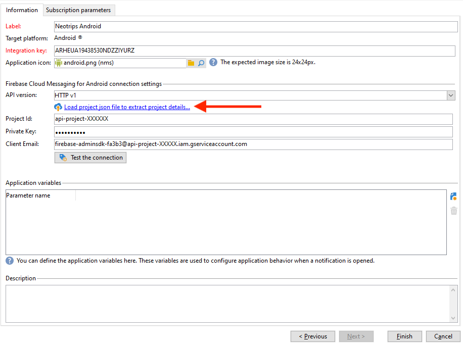
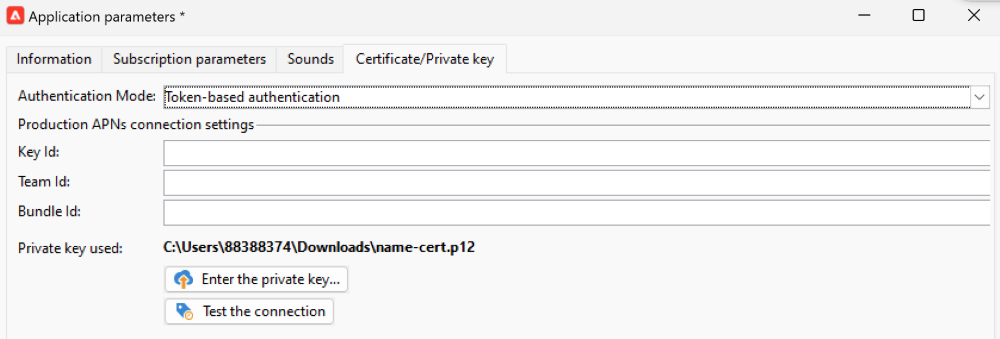

# Modifiche del canale di notifica push {#push-upgrade}

Puoi utilizzare Campaign per inviare notifiche push su dispositivi iOS e Android. Per eseguire questa operazione, Campaign si basa sui servizi di abbonamento alle app mobili.

Alcune modifiche importanti al servizio Android Firebase Cloud Messaging (FCM) sono state rilasciate nel 2024 e potrebbero influire sull’implementazione di Adobe Campaign. Per supportare questa modifica, potrebbe essere necessario aggiornare la configurazione dei servizi di abbonamento per i messaggi push di Android.

Inoltre, Adobe consiglia vivamente di passare alla connessione basata su token agli APN anziché a una connessione basata su certificati, che è più sicura e scalabile.

## Servizio Google Android Firebase Cloud Messaging (FCM) {#fcm-push-upgrade}

### Cosa è cambiato? {#fcm-changes}

Nell&#39;ambito del continuo impegno di Google per migliorare i propri servizi, le API FCM legacy cesseranno il **22 luglio 2024**. Ulteriori informazioni sul protocollo HTTP Firebase Cloud Messaging sono disponibili nella [documentazione di Google Firebase](https://firebase.google.com/docs/cloud-messaging/migrate-v1){target="_blank"}.

Adobe Campaign Classic v7 e Adobe Campaign v8 supportano già le API più recenti per l’invio di messaggi di notifica push. Tuttavia, alcune implementazioni precedenti si basano ancora sulle API legacy. Queste implementazioni devono essere aggiornate.

### Sei interessato? {#fcm-impact}

Se l’implementazione corrente supporta i servizi di abbonamento che si connettono a FCM utilizzando le API legacy, sei interessato. Per evitare distrazioni di servizio, è necessario passare alle API più recenti. In tal caso, i team di Adobe ti contatteranno.

Per verificare se sei interessato, puoi filtrare i **Servizi e abbonamenti** in base al filtro seguente:


* Se uno dei servizi di notifica push attivi utilizza l&#39;API **HTTP (legacy)**, la configurazione sarà direttamente interessata da questa modifica. È necessario rivedere le configurazioni correnti e passare alle API più recenti come descritto di seguito.

* Se la configurazione utilizza esclusivamente l&#39;API **HTTP v1** per le notifiche push di Android, significa che la conformità è già garantita e non sarà necessaria alcuna ulteriore azione da parte tua.

### Come si esegue l’aggiornamento? {#fcm-transition-procedure}

#### Prerequisiti {#fcm-transition-prerequisites}

* Il file JSON dell&#39;account del servizio Android Firebase Admin SDK è necessario per spostare l&#39;app mobile su HTTP v1. Scopri come ottenere questo file nella [documentazione di Google Firebase](https://firebase.google.com/docs/admin/setup#initialize-sdk){target="_blank"}.

* Per Campaign Classic v7, il supporto di HTTP v1 è stato aggiunto nella versione 20.3.1. Se l&#39;ambiente è in esecuzione su una versione precedente, un prerequisito per la transizione a HTTP v1 è aggiornare l&#39;ambiente alla [build Campaign Classic più recente](https://experienceleague.adobe.com/docs/campaign-classic/using/release-notes/latest-release.html){target="_blank"}. Per Campaign v8, HTTP v1 è supportato da tutte le versioni e non è necessario alcun aggiornamento.

* In qualità di utente on-premise di Campaign Classic v7, devi aggiornare sia il server di esecuzione Marketing che il server di esecuzione in tempo reale.

* Per le distribuzioni di servizi cloud ibridi, in hosting e gestiti, oltre alla procedura di transizione descritta di seguito, contatta Adobe per aggiornare il server di esecuzione in tempo reale (RT).

* Informazioni sull’account esterno di indirizzamento di Android:

   * In qualità di utente on-premise o ibrido di Campaign Classic v7, verifica che l&#39;account esterno di indirizzamento di Android sia configurato con `androidPushConnectorV2.js`. Ulteriori informazioni sono disponibili nella [documentazione di Campaign Classic v7](https://experienceleague.adobe.com/en/docs/campaign-classic/using/sending-messages/sending-push-notifications/configure-the-mobile-app/configuring-the-mobile-application-android#configuring-external-account-android){target="_blank"}.

   * Per le distribuzioni di Cloud Services ibridi, in hosting e gestiti, è necessario connettersi anche con il team di Assistenza clienti di Adobe per verificare che il connettore `androidPushConnectorV2.js (nms)` sia selezionato nell&#39;account esterno di indirizzamento di Android del server di mid sourcing.

#### Procedura di transizione {#fcm-transition-steps}

Per spostare l’ambiente in HTTP v1, effettua le seguenti operazioni:

1. Sfoglia l&#39;elenco di **Servizi e abbonamenti**.
1. Elenca tutte le applicazioni mobili che utilizzano la versione API **HTTP (legacy)**.
1. Per ciascuna di queste applicazioni mobili, impostare la **versione API** su **HTTP v1**.
1. Fai clic sul collegamento **[!UICONTROL Load project json file to extract project details...]** per caricare direttamente il file di chiave JSON.

   È inoltre possibile immettere manualmente i seguenti dettagli:

   * **[!UICONTROL Project Id]**
   * **[!UICONTROL Private Key]**
   * **[!UICONTROL Client Email]**

   

1. Fare clic su **[!UICONTROL Test the connection]** per verificare che la configurazione sia corretta e che il server di marketing abbia accesso a FCM. Per le distribuzioni Mid-Sourcing, il pulsante **[!UICONTROL Test connection]** non è in grado di verificare se il server ha accesso al servizio Android Firebase Cloud Messaging (FCM).
1. Se necessario, puoi arricchire il contenuto di un messaggio push con alcuni **[!UICONTROL Application variables]**. Questi sono completamente personalizzabili e fanno parte del payload del messaggio inviato al dispositivo mobile.
1. Fai clic su **[!UICONTROL Finish]**, quindi su **[!UICONTROL Save]**.

   Di seguito sono riportati i nomi del payload FCM per personalizzare ulteriormente la notifica push. Queste opzioni sono dettagliate [qui](#fcm-apps).

   | Tipo di messaggio | Elemento del messaggio configurabile (nome del payload FCM) | Opzioni configurabili (nome payload FCM) |
   |:-:|:-:|:-:|
   | messaggio dati | N/D | validate_only |
   | messaggio di notifica | titolo, corpo, android_channel_id, icona, suono, tag, colore, click_action, immagine, ticker, fisso, visibilità, notification_priority, notification_count <br> | validate_only |


>[!NOTE]
>
>Dopo aver applicato queste modifiche in tutto il server, tutte le **nuove** consegne di notifiche push ai dispositivi Android utilizzano l&#39;API HTTP v1. Le consegne push esistenti in un nuovo tentativo, in corso e in uso utilizzano ancora l’API HTTP (legacy). Scopri come aggiornarli nella sezione seguente.

#### Aggiornare i modelli esistenti {#fcm-transition-update}

Al termine della transizione HTTP v1, devi aggiornare i **modelli di consegna** per le notifiche push di Android per aumentare il numero di messaggi batch. A questo scopo, sfoglia le proprietà del modello di consegna Android e, nella scheda **Consegna**, imposta la [quantità batch messaggi](../../v8/send/configure-and-send.md#delivery-batch-quantity) su **256**. Applica questa modifica a tutti i modelli di consegna utilizzati per le consegne Android e a tutte le consegne Android esistenti.

Puoi anche aggiornare le consegne e i modelli di consegna esistenti creati prima dell’aggiornamento a una versione che supporta HTTP v1. Per eseguire questa operazione:

* In qualità di cliente di Managed Cloud Services o Hosted, contatta Adobe per aggiornare i modelli di consegna esistenti di Android.

* Per gli ambienti locali, scaricare lo script `fcm-httpv1-migration.js` ed eseguirlo come descritto di seguito.

  Scarica [fcm-httpv1-migration.zip](assets/do-not-localize/fcm-httpv1-migration-js.zip).

  >[!CAUTION]
  >
  >Lo script deve essere eseguito nell’istanza Marketing on-premise.


  +++Passaggi per aggiornare consegne e modelli esistenti (solo on-premise)

  Per applicare una patch a tutti i modelli di consegne e consegne creati prima dell’aggiornamento a una versione che supporta HTTP v1, effettua le seguenti operazioni:

   1. Esporta le consegne e i modelli di consegna esistenti in un pacchetto per poterli ripristinare in caso di un problema imprevisto durante l’applicazione della patch.
   1. Esegui il comando seguente in Posgresql:

      ```sql
      pg_dump -Fp -f /sftp/<db_name>-nmsdelivery-before_rd_script.sql -t nmsdelivery -d <db_name>
      ```

   1. Per impostazione predefinita, lo script è in modalità `dryrun`. È possibile avviarlo in tale modalità per verificare se è necessario applicare la patch ad alcune consegne.

      Comando

      ```sql
      nlserver javascript -instance:<instance_name> -file fcm-httpv1-migration.js 
      ```

      Output

      ```sql
      ...
      HH:MM:SS >   Processing delivery (id:123456,  label:'Deliver on Android - New', name:'DM1234')
      HH:MM:SS >   Dry run: Would update androidCheckParams for delivery (id:123456,  label:'Deliver on Android - New', name:'DM1234')
      HH:MM:SS >   Processing delivery (id:567890,  label:'Deliver on Android - New', name:'DM5678')
      HH:MM:SS >   Dry run: Would update androidCheckParams for delivery (id:567890,  label:'Deliver on Android - New', name:'DM5678')
      ...
      HH:MM:SS >   Summary (XYZ processed deliverie(s) or delivery template(s)):
      HH:MM:SS >>  - X had not patchable androidCheckParams formula!
      HH:MM:SS >   - Y had androidCheckParams formula patched.
      HH:MM:SS >   - Z ignored as alreading having androidCheckParams formula patched.
      ```

      >[!NOTE]
      >
      >Le consegne di `not patchable` devono essere aggiornate manualmente. Il loro ID si trova nel registro.

   1. Esegui lo script in modalità di esecuzione nel modo seguente per aggiornare le consegne:

      ```sql
      nlserver javascript -instance:<instance_name> -file fcm-httpv1-migration.js -arg:run
      ```

  +++

### Qual è l’impatto sulle app Android? {#fcm-apps}

Non sono richieste modifiche specifiche al codice delle applicazioni Android Mobile e il comportamento di notifica non deve cambiare.

Tuttavia, con HTTP v1, puoi personalizzare ulteriormente la notifica push con **[!UICONTROL HTTPV1 additional options]**.


Puoi eseguire le seguenti azioni:

* Utilizza il campo **[!UICONTROL Ticker]** per impostare il testo del ticker della notifica.
* Utilizza il campo **[!UICONTROL Image]** per impostare l&#39;URL dell&#39;immagine da visualizzare nella notifica.
* Utilizzare il campo **[!UICONTROL Notification Count]** per impostare il numero di nuove informazioni non lette da visualizzare direttamente sull&#39;icona dell&#39;applicazione.
* Impostare l&#39;opzione **[!UICONTROL Sticky]** su false in modo che la notifica venga automaticamente chiusa quando l&#39;utente fa clic su di essa. Se impostato su true, la notifica viene comunque visualizzata anche quando l’utente fa clic su di essa.
* Imposta il livello **[!UICONTROL Notification Priority]** della notifica su predefinito, minimo, basso o alto.
* Imposta il livello **[!UICONTROL Visibility]** della notifica su public, private o secret.

Per ulteriori informazioni su **[!UICONTROL HTTP v1 additional options]** e su come compilare questi campi, consulta la [documentazione FCM](https://firebase.google.com/docs/reference/fcm/rest/v1/projects.messages#androidnotification){target="_blank"}.


## Servizio Apple iOS Push Notification (APNs) {#apns-push-upgrade}

### Cosa è cambiato? {#ios-changes}

Come consigliato da Apple, è necessario proteggere le comunicazioni con il servizio APN (Apple Push Notification Service) utilizzando token di autenticazione senza stato.

L’autenticazione basata su token offre un modo senza stato di comunicare con i numeri APN. La comunicazione senza stato è più veloce della comunicazione basata su certificato perché non richiede che APN ricerchi il certificato o altre informazioni correlate al server provider. L’utilizzo dell’autenticazione basata su token presenta altri vantaggi:

* È possibile utilizzare lo stesso token da più server provider.

* Puoi utilizzare un token per distribuire le notifiche per tutte le app della tua azienda.

Per ulteriori informazioni sulle connessioni basate su token ai numeri APN, consulta la [documentazione per gli sviluppatori di Apple](https://developer.apple.com/documentation/usernotifications/establishing-a-token-based-connection-to-apns){target="_blank"}.

Adobe Campaign Classic v7 e Adobe Campaign v8 supportano connessioni sia basate su token che basate su certificati. Se l’implementazione si basa su una connessione basata su certificato, Adobe consiglia vivamente di aggiornarla a una connessione basata su token.

### Sei interessato? {#ios-impact}

L’implementazione corrente è interessata se si basa su richieste basate su certificati per la connessione ad APN. Si consiglia di passare a una connessione basata su token.

Per verificare se sei interessato, puoi filtrare i **Servizi e abbonamenti** in base al filtro seguente:


* Se uno dei servizi di notifica push attivi utilizza la modalità di autenticazione **basata su certificato** (.p12), le implementazioni correnti devono essere riviste e spostate in una modalità di autenticazione **basata su token** (.p8) come descritto di seguito.

* Se la configurazione utilizza esclusivamente la modalità di autenticazione **basata su token** per le notifiche push di iOS, l&#39;implementazione è già aggiornata e non sarà necessaria alcuna ulteriore azione da parte tua.

### Come si esegue l’aggiornamento? {#ios-transition-procedure}

#### Prerequisiti {#ios-transition-prerequisites}

* Per Campaign Classic v7, il supporto della modalità di autenticazione **basata su token** è stato aggiunto nella versione 20.2. Se l&#39;ambiente è in esecuzione su una versione precedente, un prerequisito per questa modifica è aggiornare l&#39;ambiente alla [build Campaign Classic più recente](https://experienceleague.adobe.com/docs/campaign-classic/using/release-notes/latest-release.html){target="_blank"}. Per Campaign v8, la modalità **Autenticazione basata su token** è supportata da tutte le versioni e non è necessario alcun aggiornamento.

* Per generare i token utilizzati dal server è necessaria una chiave di firma del token di autenticazione APNs. Richiedi questa chiave al tuo account sviluppatore Apple, come spiegato in [Documentazione per sviluppatori Apple](https://developer.apple.com/documentation/usernotifications/establishing-a-token-based-connection-to-apns){target="_blank"}.

* Per le distribuzioni ibride, in hosting e Managed Services, oltre alla procedura di transizione riportata di seguito, contatta Adobe per aggiornare il server di esecuzione in tempo reale (RT). Il server Mid-Sourcing non è interessato.

* In qualità di utente on-premise di Campaign Classic v7, devi aggiornare sia il server di esecuzione Marketing che il server di esecuzione in tempo reale. Il server Mid-Sourcing non è interessato.

#### Procedura di transizione {#ios-transition-steps}

Per spostare le app mobili iOS nella modalità di autenticazione basata su token, effettua le seguenti operazioni:

1. Sfoglia l&#39;elenco di **Servizi e abbonamenti**.
1. Elenca tutte le applicazioni mobili che utilizzano la modalità **Autenticazione basata su certificato** (.p12).
1. Modifica ciascuna di queste app mobili e passa alla scheda **Certificato/Chiave privata**.
1. Dal menu a discesa **Modalità di autenticazione**, selezionare **Modalità di autenticazione basata su token** (.p8).
1. Compila le impostazioni di connessione APNs **[!UICONTROL Key Id]**, **[!UICONTROL Team Id]** e **[!UICONTROL Bundle Id]**, quindi seleziona il certificato p8 facendo clic su **[!UICONTROL Enter the private key...]**.

   

1. Fare clic su **[!UICONTROL Test the connection]** per verificare che la configurazione sia corretta e che il server abbia accesso ai nomi APN. Si noti che per le distribuzioni Mid-Sourcing, il pulsante **[!UICONTROL Test connection]** non è in grado di verificare se il server ha accesso ad APN.
1. Fare clic su **[!UICONTROL Next]** per avviare la configurazione dell&#39;applicazione di produzione e seguire gli stessi passaggi descritti in precedenza.
1. Fai clic su **[!UICONTROL Finish]**, quindi su **[!UICONTROL Save]**.

L’applicazione iOS viene ora spostata nella modalità di autenticazione basata su token.
