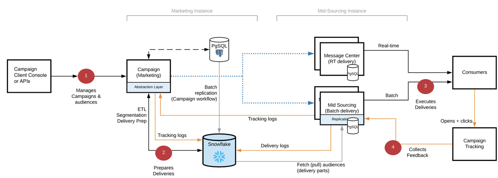

# Distribuzione FFDA [!DNL Campaign] {#gs-ac-ffda}

Sfruttando [[!DNL Snowflake]](https://www.snowflake.com/){target="_blank"}, una tecnologia di database cloud, l&#39;implementazione di Adobe Campaign Enterprise Full Federated Access (FFDA) migliora notevolmente la scalabilità e la velocità, con la possibilità di gestire un numero più significativo di profili cliente e garantendo inoltre tassi di consegna e transazioni all&#39;ora più elevati.

## Vantaggi {#ffda-benefits}

Campaign v8 Enterprise (FFDA) offre una scalabilità end-to-end in qualsiasi fase del processo, dal targeting al reporting finale:

* Scalabilità del volume di dati gestibile (fino a 8 TB)
* Scalabilità delle prestazioni delle query per la segmentazione e il targeting, oltre che per l’acquisizione e l’uscita dei dati
* Scalabilità della preparazione della consegna (da ore a minuti)

Questo è un cambiamento fondamentale nell’architettura del software. Adesso i dati sono remoti e Campaign unisce tutti i dati, inclusi i profili. I processi di [!DNL Campaign] ora vengono scalati in modalità end-to-end, dal targeting all’esecuzione dei messaggi: in genere l’acquisizione dei dati, la segmentazione, il targeting, le query e le consegne vengono eseguite in pochi minuti. Questa nuova versione risolve l’intera sfida della scalabilità mantenendo lo stesso livello di flessibilità ed estensibilità. Il numero di profili è quasi illimitato e la conservazione dei dati può essere estesa.

L’archiviazione cloud viene eseguita in **[!DNL Snowflake]**: un nuovo **account esterno** integrato garantisce la connettività con il database cloud. È configurato da Adobe e non deve essere modificato. [Ulteriori informazioni](../config/external-accounts.md)

Le tabelle o gli schemi integrati che devono essere spostati o replicati nel database cloud hanno un’estensione di schema integrato nello spazio dei nomi **xxl**. Tali estensioni contengono eventuali modifiche necessarie per spostare gli schemi integrati dal database locale di [!DNL Campaign] al database cloud [!DNL Snowflake] e per adattarne di conseguenza la struttura: nuovo UUID, collegamenti aggiornati, ecc.

>[!CAUTION]
>
> I dati dei clienti non vengono memorizzati nel database locale di [!DNL Campaign]. Di conseguenza, eventuali tabelle personalizzate devono essere create nel database cloud.
>

## Architettura Campaign Enterprise (FFDA){#ffda-archi}

In una distribuzione di [Enterprise (FFDA)](../architecture/enterprise-deployment.md), [!DNL Adobe Campaign] v8 funziona con due database: un database [!DNL Campaign] locale per la messaggistica in tempo reale, le query unitarie dell&#39;interfaccia utente e le operazioni di scrittura tramite API e un database [!DNL Snowflake] cloud per l&#39;esecuzione della campagna, le query batch e l&#39;esecuzione del flusso di lavoro.

Campaign v8 Enterprise introduce il concetto di **Full Federated Data Access** (FFDA): adesso tutti i dati sono remoti, nel database cloud.

Sono disponibili API specifiche per la gestione dei dati tra il database locale e quello cloud. Per scoprire come funzionano queste nuove API e come utilizzarle, visita [questa pagina](new-apis.md).

La comunicazione generale tra server e processi viene eseguita in base allo schema seguente:

* I moduli di esecuzione e gestione dei mancati recapiti sono disabilitati nell’istanza.
* L’applicazione è configurata per eseguire l’esecuzione dei messaggi su un server remoto di &quot;mid-sourcing&quot; guidato tramite chiamate SOAP (su HTTP o HTTPS).

Il database [!DNL Snowflake] sul lato marketing viene utilizzato per:

* Memorizza tutti i dati del cliente: profili, dati personalizzati come transazioni, prodotti, posizioni, ecc.
* Memorizza tutti gli eventi e i dati di comportamento generati o raccolti da Campaign, ad esempio i registri di consegna, di tracciamento, di registrazione push e così via.
* Memorizza tutti gli aggregati di dati di cui sopra.
* Memorizza una copia (h+1) delle tabelle di riferimento (come consegne, enumerazioni, paesi, ecc.) utilizzate nei flussi di lavoro, nelle campagne e nei rapporti.
* Eseguire tutti i processi batch e i carichi di lavoro

Il database PostgreSQL nell’istanza di marketing viene utilizzato per:

* Eseguire determinati carichi di lavoro, ad esempio API per volumi ridotti.
* Memorizza tutti i dati di Campaign, incluse le impostazioni di consegna e campagna, le definizioni di flussi di lavoro e servizi.
* Memorizza tutte le tabelle di riferimento incorporate (enumerazioni, paesi, ecc.) replicate in [!DNL Snowflake].

  Tuttavia, non è possibile:
   * creare personalizzazioni per i dati dei clienti, ad esempio non creare una tabella domestica in PostgreSQL, ma solo nel Snowflake
   * archivia eventuali registri di consegna, registri di tracciamento, ecc. sulla dimensione di targeting FFDA.
   * archiviare grandi volumi di dati.

Il database PostgreSQL nell’istanza di mid-sourcing viene utilizzato per:

* Eseguire consegne in batch e in tempo reale (RT).
* Invia registri di consegna e di tracciamento: tieni presente che gli ID dei registri di consegna e di tracciamento sono UUID e non ID a 32 bit.
* Raccogli e archivia i dati di tracciamento.

## Impatti{#ffda-impacts}

### Meccanismo di staging API [!DNL Campaign]{#staging-api}

Con il database cloud [!DNL Campaign], non è consigliabile attivare chiamate unitarie per quanto riguarda le prestazioni (latenza e concorrenza). A meno che non si invii un volume estremamente basso, le operazioni batch devono essere utilizzate per garantire prestazioni API ottimali. Per migliorare le prestazioni, le API di acquisizione vengono reindirizzate al database locale. [Ulteriori informazioni sul meccanismo di staging delle API di Campaign](staging.md)

### Nuove API{#new-apis}

Sono disponibili nuove API per gestire la sincronizzazione dei dati tra il database locale [!DNL Campaign] e il database cloud. È stato inoltre introdotto un nuovo meccanismo per gestire le chiamate API a livello di database locale al fine di evitare la latenza e aumentare le prestazioni complessive.

[Le nuove API sono dettagliate in questa pagina](new-apis.md)

### Replica dei dati{#data-replication}

Un flusso di lavoro tecnico specifico gestisce la replica delle tabelle che devono essere presenti su entrambi i lati (database Cloud e database locale di Campaign). Questo flusso di lavoro viene attivato ogni ora e si basa su una nuova libreria JavaScript integrata.

>[!NOTE]
>
> Sono stati creati diversi criteri di replica in base alle dimensioni della tabella (XS, XL, eccetera).
> Alcune tabelle vengono replicate in tempo reale, altre vengono replicate su base oraria. Alcune tabelle avranno aggiornamenti incrementali, altre avranno un aggiornamento completo.
>

[Ulteriori informazioni sulla replica dei dati](replication.md)

### Gestione ID{#id-mgt-ffda}

Gli oggetti di Campaign v8 utilizzano ora un **ID universalmente univoco (UUID)**, che consente l’identificazione dei dati tramite valori univoci illimitati.

Tieni presente che questo ID è basato su stringhe e non è sequenziale. La chiave primaria non è un valore numerico in Campaign v8 e devi utilizzare gli attributi **autouuid** e **autopk** negli schemi.

In Campaign Classic v7 e versioni precedenti, l’unicità di una chiave all’interno di uno schema (ovvero una tabella) viene gestita a livello di motore del database. Più in generale, i motori di database classici come PostgreSQL, Oracle o SQL Server includono un meccanismo nativo per impedire l’inserimento di righe duplicate basate su una colonna o su un set di colonne attraverso l’uso di chiavi primarie e/o indici univoci. Quando l’indice e le chiavi primarie sono impostati correttamente a livello di database, l’ID duplicato non esiste in queste versioni.

Adobe Campaign v8 viene fornito con Snowflake come database di base. Poiché aumenta notevolmente la scalabilità delle query, l’architettura distribuita del database Snowflake non fornisce i meccanismi che consentono di gestire e dunque applicare l’unicità di una chiave all’interno di una tabella. Di conseguenza, in Adobe Campaign v8, è possibile effettuare l’inserimento di chiavi duplicate all’interno di una tabella. Gli utenti finali sono ora responsabili di garantire la coerenza delle chiavi all’interno del database di Adobe Campaign. [Ulteriori informazioni](keys.md)

### Disponibilità delle funzioni {#feature-availability}

Alcune funzionalità non sono disponibili nel contesto di una distribuzione Enterprise (FFDA) di Campaign, ad esempio:

* Gestione delle risorse marketing
* Coupon
* Tracciamento web
* Indagini

**Argomenti correlati**

* [Best practice per i modelli di dati](../dev/datamodel-best-practices.md)
