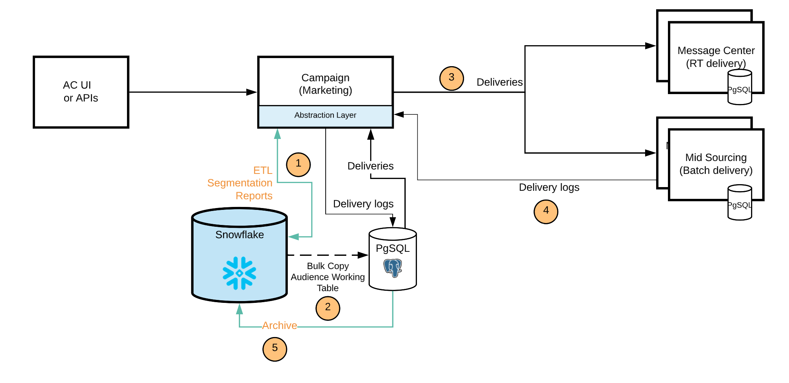

# [!DNL Campaign] FDA [!DNL Snowflake] distribuzione{#gs-fda-snowflake}

In una [!DNL Snowflake] distribuzione FDA (predefinita), [!DNL Adobe Campaign] v8 è collegato a [!DNL Snowflake] accedere ai dati tramite [Federated Data Access](../connect/fda.md) funzionalità: puoi accedere ed elaborare dati e informazioni esterni memorizzati nel tuo [!DNL Snowflake] senza modificare la struttura dei dati di Adobe Campaign.

## Vantaggi{#fda-benefits}

Questo modello di implementazione presenta i seguenti vantaggi:

* **Storage e prestazioni**
È possibile spostare i dati storici in [!DNL Snowflake] e quindi riduci le dipendenze al limite Adobe Campaign ID. Questa architettura riduce anche la dipendenza dall&#39;archiviazione PostgreSQL e i limiti di prestazioni. Poiché nel database di Campaign vengono memorizzati meno dati, le prestazioni sono migliori e le attività di manutenzione vengono eseguite più rapidamente.

* **Estensione e gestione dei dati del modello dati**
È possibile creare tabelle in [!DNL Snowflake] e collegarli ad Adobe Campaign, ad esempio per utilizzare i dati archiviati nei periodi di conservazione o per eseguire processi di segmentazione con prestazioni migliori.

   Questa architettura consente inoltre di utilizzare le funzionalità del flusso di lavoro di gestione dei dati in [!DNL Snowflake]. Solo gli aggregati e le tabelle temporanee vengono spostati in Campaign a scopo di personalizzazione e consegna.

## Architettura{#fda-archi}

Con questo modello di implementazione, gli utenti Adobe Campaign possono estendere i propri dati in [!DNL Snowflake] e sfrutta i vantaggi di una singola piattaforma dati integrata per ottenere informazioni approfondite sui dati delle campagne di marketing in tempo reale. Offre agli utenti la possibilità di sbloccare i dati in modo profondo offrendo una piattaforma unica, unificata e di facile utilizzo per l&#39;analisi dei dati. La piattaforma dati cloud non richiede alcuna gestione in quanto viene ridimensionata all’infinito per supportare qualsiasi volume di dati di marketing provenienti da Adobe Campaign.

La comunicazione generale tra server e processi viene eseguita secondo il seguente schema:

PostgreSQL è il database principale e il Snowflake è il database secondario. Puoi estendere il modello dati e memorizzare i dati sul Snowflake. Successivamente, puoi eseguire ETL, segmentazione e rapporti su un set di dati di grandi dimensioni con prestazioni eccezionali.
