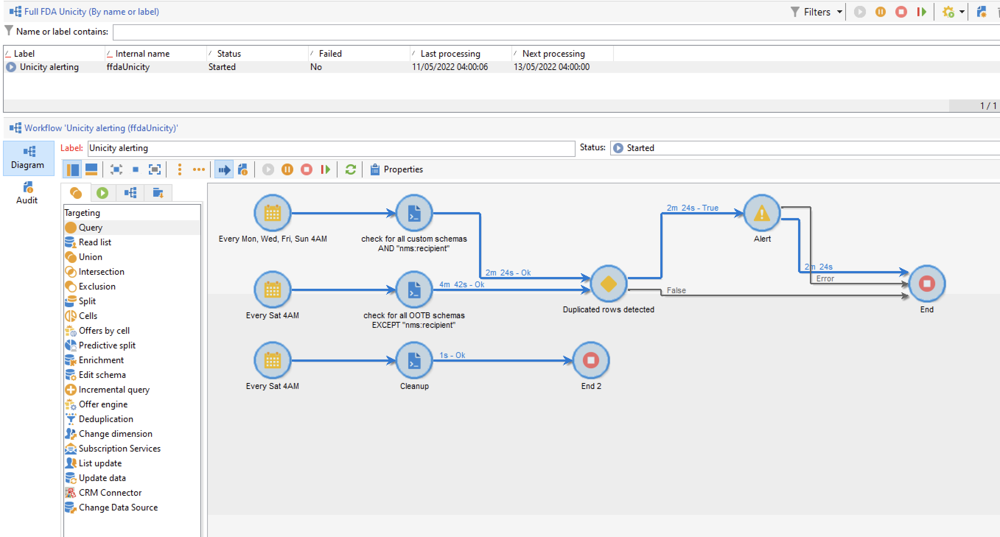
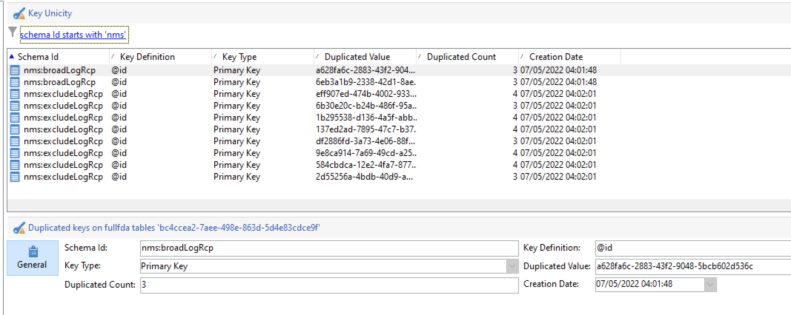

# Gestione delle chiavi e unicità {#key-management}

Nel contesto di una distribuzione di [Enterprise (FFDA)](enterprise-deployment.md), la chiave primaria è un identificatore ID universalmente univoco (UUID), ovvero una stringa di caratteri. Per creare questo UUID, l&#39;elemento principale dello schema deve contenere gli attributi **autouuid** e **autopk** impostati su **true**.

Adobe Campaign v8 utilizza [!DNL Snowflake] come database di base. L&#39;architettura distribuita del database [!DNL Snowflake] non fornisce un meccanismo per garantire l&#39;unicità di una chiave all&#39;interno di una tabella: gli utenti finali sono responsabili della coerenza delle chiavi all&#39;interno del database Adobe Campaign.

Per preservare la coerenza del database relazionale è obbligatorio evitare duplicati sulle chiavi, in particolare sulle chiavi primarie. I duplicati sulle chiavi primarie causano problemi con le attività del flusso di lavoro di gestione dati come **Query**, **Riconciliazione**, **Aggiorna dati** e altro ancora. Questo è fondamentale per definire i criteri di riconciliazione corretti durante l&#39;aggiornamento di [!DNL Snowflake] tabelle.

>[!CAUTION]
>
>Le chiavi duplicate non sono limitate agli UUID. Ciò può verificarsi in con ID di, incluse le chiavi personalizzate create in tabelle personalizzate.

## Servizio Unicity{#unicity-service}

Il servizio Unicity è un componente di Cloud Database Manager che consente agli utenti di preservare e monitorare l’integrità dei vincoli di chiave univoca all’interno delle tabelle di Cloud Database. Questo consente di ridurre il rischio di inserimento di chiavi duplicate.

Poiché il database cloud non applica vincoli di unicità, il servizio Unicity riduce il rischio di inserimento di duplicati durante la gestione dei dati con Adobe Campaign.

### Flusso di lavoro Unicity{#unicity-wf}

Il servizio Unicity viene fornito con un flusso di lavoro integrato dedicato **[!UICONTROL Unicity alerting]**, per monitorare i vincoli di unicità e avvisare quando vengono rilevati duplicati.

Questo flusso di lavoro tecnico è disponibile dal nodo **[!UICONTROL Administration > Production > Technical workflows > Full FFDA Unicity]** di Campaign Explorer. **Non deve essere modificato**.

Questo flusso di lavoro controlla tutti gli schemi personalizzati e incorporati per rilevare le righe duplicate.

Se il flusso di lavoro **[!UICONTROL Unicity alerting]** (ffdaUnicity) rileva alcune chiavi duplicate, queste vengono aggiunte a una tabella **Audit Unicity** specifica, che include il nome dello schema, il tipo di chiave, il numero di righe interessate e la data. È possibile accedere alle chiavi duplicate dal nodo **[!UICONTROL Administration > Audit > Key Unicity]**.

In qualità di amministratore di database, puoi utilizzare un’attività SQL per rimuovere i duplicati o contattare l’Assistenza clienti di Adobe per ulteriori indicazioni.

### Avvisi{#unicity-wf-alerting}

Una notifica specifica viene inviata al gruppo di operatori **[!UICONTROL Workflow Supervisors]** quando vengono rilevate chiavi duplicate. Il contenuto e il pubblico di questo avviso possono essere modificati nell&#39;attività **Avviso** del flusso di lavoro **[!UICONTROL Unicity alerting]**.

## Guardrail aggiuntivi {#duplicates-guardrails}

Campaign viene fornito con un set di nuovi guardrail per impedire l&#39;inserimento di chiavi duplicate nel database [!DNL Snowflake].

>[!NOTE]
>
>Queste protezioni sono disponibili a partire da Campaign v8.3. Per verificare la versione, consulta [questa sezione](../start/compatibility-matrix.md#how-to-check-your-campaign-version-and-buildversion)

### Preparazione della consegna {#remove-duplicates-delivery-preparation}

Adobe Campaign rimuove automaticamente qualsiasi UUID duplicato da un pubblico durante la preparazione della consegna. Questo meccanismo impedisce che si verifichino errori durante la preparazione di una consegna. In qualità di utente finale, puoi controllare queste informazioni nei registri di consegna: alcuni destinatari possono essere esclusi dal target principale a causa di una chiave duplicata. In tal caso, verrà visualizzato il seguente avviso: `Exclusion of duplicates (based on the primary key or targeted records)`.

### Aggiornare i dati in un flusso di lavoro {#duplicates-update-data}

Nel contesto di una distribuzione [Enterprise (FFDA)](enterprise-deployment.md), non è possibile selezionare una chiave interna (UUID) come campo per aggiornare i dati in un flusso di lavoro.

### Eseguire una query su uno schema con duplicati {#query-with-duplicates}

Quando un flusso di lavoro avvia l&#39;esecuzione di una query su uno schema, Adobe Campaign controlla se nella [tabella Controllo unicità](#unicity-wf) sono riportati record duplicati. In tal caso, il flusso di lavoro registra un avviso, poiché l’operazione successiva sui dati duplicati potrebbe influire sui risultati del flusso di lavoro.

Questo controllo viene eseguito nelle seguenti attività del flusso di lavoro:

* Query
* Incremental Query
* Lettura di un elenco

>[!NOTE]
>
>Se stai passando da un’altra versione di Campaign, è fondamentale rimuovere i duplicati, risolvere i problemi e bonificare i dati per evitare di influire sulla transizione.
