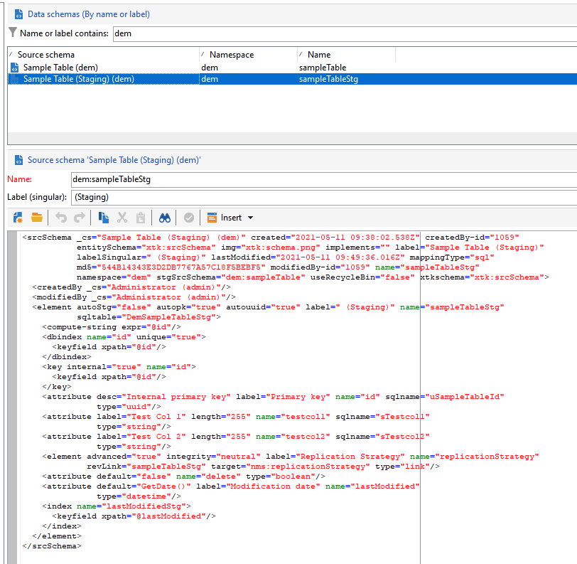

# Meccanismo di staging per le API di Campaign

Nel contesto di un&#39;implementazione [Enterprise (FFDA)](enterprise-deployment.md), la generazione di chiamate unitarie non è consigliata per quanto riguarda le prestazioni (latenza e concorrenza). A meno che non si invii un volume estremamente basso, è necessario utilizzare l&#39;operazione batch **1}.** Per migliorare le prestazioni, le API di acquisizione vengono reindirizzate al database locale.

La funzionalità di staging di Campaign è abilitata per impostazione predefinita su alcuni schemi incorporati. Possiamo anche abilitarlo su qualsiasi schema personalizzato. Meccanismo di staging in breve:

* La struttura dello schema dati viene duplicata nella tabella di staging locale
* Le nuove API dedicate all’acquisizione dei dati fluiscono direttamente nella tabella di staging locale. [Ulteriori informazioni](new-apis.md)
* Un flusso di lavoro pianificato viene attivato ogni ora e i dati vengono sincronizzati nuovamente con il database cloud. [Ulteriori informazioni](replication.md)

Alcuni schemi incorporati sono posizionati in staging per impostazione predefinita, ad esempio nmsSubscriptionRcp, nmsAppSubscriptionRcp, nmsRecipient.

Le API di Campaign Classic v7 sono ancora disponibili, ma non possono beneficiare di questo nuovo meccanismo di staging: le chiamate API arrivano direttamente al database Cloud. Adobe consiglia di utilizzare il più possibile il nuovo meccanismo di staging per ridurre la pressione complessiva e la latenza sul database di Campaign Cloud.

>[!CAUTION]
>
>* Con questo nuovo meccanismo, la sincronizzazione dei dati per rinuncia al canale, abbonamenti, annullamenti di abbonamenti o registrazione mobile è ora **asincrona**.
>
>* La gestione temporanea si applica solo agli schemi memorizzati nel database cloud. Non abilitare la gestione temporanea negli schemi replicati. Non abilitare Gestione temporanea negli schemi locali. Non abilitare la gestione temporanea in uno schema in attesa
>

## Passaggi di implementazione {#implement-staging}

Per implementare il meccanismo di staging di Campaign su una tabella specifica, segui i passaggi seguenti:

1. Crea uno schema personalizzato di esempio nel database Campaign Cloud. Nessuna gestione temporanea abilitata in questo passaggio.

   ```
   <srcSchema _cs="Sample Table (dem)" created="YYYY-DD-MM"
           entitySchema="xtk:srcSchema" img="xtk:schema.png" label="Sample Table"
           lastModified="YYYY-DD-MM HH:MM:SS.TZ" mappingType="sql" md5="XXX"
           modifiedBy-id="0" name="sampleTable" namespace="dem" xtkschema="xtk:srcSchema">
   <element autopk="true" autouuid="true" dataSource="nms:extAccount:ffda" label="Sample Table"
           name="sampleTable">
       <attribute label="Test Col 1" length="255" name="testcol1" type="string"/>
       <attribute label="Test Col 2" length="255" name="testcol2" type="string"/>
   </element>
   </srcSchema>
   ```

   Ulteriori informazioni sulla creazione di schemi personalizzati in [questa pagina](../dev/create-schema.md).

1. Salva e aggiorna la struttura del database.  [Ulteriori informazioni](../dev/update-database-structure.md)

1. Abilita il meccanismo di staging nella definizione dello schema aggiungendo il parametro **autoStg=&quot;true&quot;**.

   ```
   <srcSchema _cs="Sample Table (dem)" "YYYY-DD-MM"
           entitySchema="xtk:srcSchema" img="xtk:schema.png" label="Sample Table"
           lastModified="YYYY-DD-MM HH:MM:SS.TZ" mappingType="sql" md5="XXX"
           modifiedBy-id="0" name="sampleTable" namespace="dem" xtkschema="xtk:srcSchema">
   <element autoStg="true" autopk="true" autouuid="true" dataSource="nms:extAccount:ffda" label="Sample Table"
           name="sampleTable">
       <attribute label="Test Col 1" length="255" name="testcol1" type="string"/>
       <attribute label="Test Col 2" length="255" name="testcol2" type="string"/>
   </element>
   </srcSchema>
   ```

1. Salva la modifica. È disponibile un nuovo schema di staging, ovvero una copia locale dello schema iniziale.

   

1. Aggiornare la struttura del database. La tabella di staging verrà creata nel database locale di Campaign.
