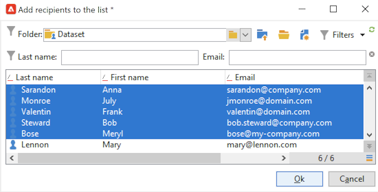

# Creare un pubblico in un elenco {#create-segments}

Utilizza gli elenchi di Campaign per creare e organizzare i tipi di pubblico.

Un elenco è un set statico di contatti che possono essere targetizzati nelle azioni di consegna o aggiornati durante un’importazione o un’altra azione del flusso di lavoro. Ad esempio, una popolazione estratta dal database tramite una query può essere memorizzata come elenco.

Gli elenchi vengono creati e gestiti tramite il collegamento **[!UICONTROL Lists]** nella scheda **[!UICONTROL Profiles and targets]**. Questi elenchi sono basati sulla tabella del profilo di Adobe Campaign predefinita (nms:recipient). [Ulteriori informazioni](../dev/datamodel.md#ootb-profiles.md)

È possibile creare un elenco utilizzando l&#39;attività **Aggiorna elenco** in un flusso di lavoro. Questa attività memorizza la popolazione risultante in un elenco. Utilizzalo per creare un nuovo elenco o aggiornarne uno esistente. Per creare elenchi contenenti tipi di dati diversi dalla tabella di profilo incorporata, è necessario eseguire un flusso di lavoro. Ad esempio, utilizzando una query nella tabella dei visitatori e aggiornando l’elenco, puoi creare un elenco di visitatori. [Ulteriori informazioni](#create-a-list-wf).

Guarda questo video per ulteriori informazioni sulla gestione degli elenchi in Adobe Campaign.

>[!VIDEO](https://video.tv.adobe.com/v/334909?quality=12)

## Creare un elenco di contatti {#create-a-list-of-contacts}

Per creare un elenco di contatti, effettuare le seguenti operazioni:

1. Fare clic sul pulsante **[!UICONTROL Create]** e selezionare **[!UICONTROL New list]**.

   

1. Immettere le informazioni nella scheda **[!UICONTROL Edit]** della finestra di creazione dell&#39;elenco.

   

   * Immettere il nome elenco nel campo **[!UICONTROL Label]** e, se necessario, modificare il nome interno.
   * Aggiungere una descrizione per l&#39;elenco.
   * Puoi specificare una data di scadenza: una volta raggiunta tale data, l’elenco viene eliminato e rimosso automaticamente.

1. Nella scheda **[!UICONTROL Content]**, fare clic su **[!UICONTROL Add]** per selezionare i profili appartenenti all&#39;elenco.

   

   È possibile creare un nuovo profilo e aggiungerlo all&#39;elenco direttamente da questa finestra utilizzando l&#39;icona **[!UICONTROL Create]**. Il profilo verrà aggiunto al database.

1. Fare clic su **[!UICONTROL Save]** per salvare l&#39;elenco. Viene quindi aggiunto alla panoramica degli elenchi.

## Convertire i contatti filtrati in un elenco {#convert-data-to-a-list}

Puoi selezionare i profili e aggiungerli a un elenco. A tale scopo, segui i passaggi indicati di seguito:

1. Da Campaign Explorer, seleziona i profili e fai clic con il pulsante destro del mouse.

   Questi profili possono essere filtrati per soddisfare criteri specifici.

1. Seleziona **[!UICONTROL Actions > Associate selection with a list...]**.

   

1. Selezionare un elenco esistente o crearne uno nuovo e fare clic su **[!UICONTROL Next]**.

   

1. Fai clic sul pulsante **[!UICONTROL Start]**.

   

Selezionare l&#39;opzione **[!UICONTROL Recreate the list]** per eliminare il contenuto esistente dall&#39;elenco e ottimizzare la creazione dell&#39;elenco. Non è necessaria alcuna query per verificare se i profili sono già collegati all&#39;elenco.

Se si deseleziona l&#39;opzione **[!UICONTROL No trace of this job is saved in the database]**, è possibile selezionare o creare la cartella di esecuzione in cui verranno memorizzate le informazioni collegate al processo.

La sezione superiore della finestra consente di monitorare l’esecuzione. Il pulsante **[!UICONTROL Stop]** consente di arrestare il processo. I contatti già elaborati verranno collegati all&#39;elenco.

Al termine dell&#39;esecuzione, accedere al menu **[!UICONTROL Profiles and Targets > Lists]** e selezionare l&#39;elenco: la scheda **[!UICONTROL Content]** mostra i profili collegati a questo elenco.

## Creare un elenco con un flusso di lavoro  {#create-a-list-wf}

È possibile utilizzare l&#39;attività **[!UICONTROL List update]** per creare un elenco o aggiungere un gruppo a un elenco di destinatari.

Nell’esempio seguente, crea un elenco di tutti i destinatari tra 25 e 40.

1. Selezionare **[!UICONTROL Profiles and targets]** e **[!UICONTROL Targeting workflows]**, quindi creare un nuovo flusso di lavoro dal pulsante **[!UICONTROL Create]**.
1. Immettere un&#39;etichetta per il flusso di lavoro, ad esempio &#39;Contatti 25-40&#39;, aggiungere una descrizione e fare clic su **[!UICONTROL Next]**.

   

1. Inserire un&#39;attività **[!UICONTROL Query]** per definire la popolazione target e modificare la query.

   

1. Definisci le condizioni del filtro come segue:

   

   Scopri come creare una query in un flusso di lavoro in [questa sezione](https://experienceleague.adobe.com/docs/campaign/automation/workflows/wf-activities/targeting-activities/query.html?lang=it){target="_blank"}.

1. Aggiungi un’etichetta per questa query e salva le modifiche.
1. Aggiungi un&#39;attività **[!UICONTROL List update]** e modificala.

   

1. Immetti un’etichetta per l’attività.
1. Selezionare l&#39;opzione **[!UICONTROL Create the list if necessary (Computed name)]** per indicare che l&#39;elenco verrà creato una volta eseguito il primo flusso di lavoro, quindi aggiornato con le esecuzioni seguenti.
1. Seleziona una cartella e immetti un’etichetta per l’elenco.
1. Selezionare **[!UICONTROL Database of the targeting dimension]** per archiviare la tabella.
1. Lascia selezionata l&#39;opzione **[!UICONTROL Purge the list if it exists (otherwise add to the list)]** per eliminare i destinatari che non corrispondono ai criteri di targeting e per inserire i nuovi destinatari nell&#39;elenco.
1. Lascia selezionata anche l&#39;opzione **[!UICONTROL Create or use a list with its own table]**.
1. Lascia deselezionata l&#39;opzione **[!UICONTROL Generate an outbound transition]**.
1. Fare clic su **[!UICONTROL Ok]** e salvare il flusso di lavoro.
1. Avvia il flusso di lavoro.

   Viene quindi creato l’elenco dei destinatari corrispondenti. È possibile accedere a questo elenco dalla voce **[!UICONTROL Lists]** della home page.

   

   Puoi rendere ricorrente questo flusso di lavoro aggiungendo una pianificazione al flusso di lavoro. [Ulteriori informazioni](https://experienceleague.adobe.com/docs/campaign/automation/workflows/wf-activities/flow-control-activities/scheduler.html?lang=it){target="_blank"}.

## Rimuovere un profilo da un elenco {#remove-a-profile-from-a-list}

Per rimuovere un profilo da un elenco, modificarlo, selezionare il profilo nella scheda **[!UICONTROL Content]**, quindi fare clic sull&#39;icona **[!UICONTROL Delete]**.

## Eliminare un elenco di profili {#delete-a-list-of-profiles}

Per eliminare un elenco, selezionalo da Esplora campagne, selezionalo e fai clic con il pulsante destro del mouse. Scegli **[!UICONTROL Delete]**. Viene visualizzato un messaggio di avviso che richiede di confermare l&#39;eliminazione.

>[!NOTE]
>
>Quando elimini un elenco, i profili presenti nell’elenco non vengono interessati, ma i dati contenuti nel profilo vengono aggiornati.
