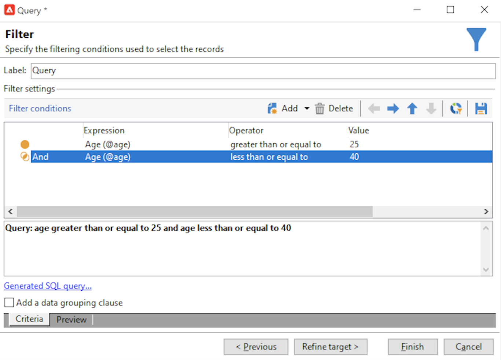

# Creare un pubblico in un elenco{#create-segments}

Utilizza gli elenchi di Campaign per creare e organizzare i tipi di pubblico.

Un elenco è un set statico di contatti che possono essere targetizzati nelle azioni di consegna o aggiornati durante un’importazione o un’altra azione del flusso di lavoro. Ad esempio, una popolazione estratta dal database tramite una query può essere memorizzata come elenco.

Gli elenchi vengono creati e gestiti tramite **[!UICONTROL Lists]** nel collegamento **[!UICONTROL Profiles and targets]** scheda . Questi elenchi si basano sulla tabella dei profili Adobe Campaign predefinita (nms:recipient). [Ulteriori informazioni](../dev/datamodel.md#ootb-profiles.md)

È possibile creare un elenco utilizzando **Aggiorna elenco** in un flusso di lavoro. Questa attività memorizza la popolazione risultante in un elenco. Utilizzalo per creare un nuovo elenco o per aggiornare un elenco esistente. Per creare elenchi contenenti altri tipi di dati rispetto alla tabella di profilo incorporata, devi eseguire un flusso di lavoro. Ad esempio, utilizzando una query sulla tabella dei visitatori e aggiornando l’elenco, puoi creare un elenco di visitatori. [Ulteriori informazioni](#create-a-list-wf).

Guarda questo video per ulteriori informazioni sulla gestione degli elenchi in Adobe Campaign.

>[!VIDEO](https://video.tv.adobe.com/v/334909?quality=12)

## Creare un elenco di contatti {#create-a-list-of-contacts}

Per creare un elenco di contatti, segui i passaggi seguenti:

1. Fai clic sul pulsante **[!UICONTROL Create]** e seleziona **[!UICONTROL New list]**.

   

1. Immetti le informazioni nella **[!UICONTROL Edit]** scheda della finestra di creazione dell’elenco.

   

   * Immetti il nome dell’elenco nella **[!UICONTROL Label]** e, se necessario, modificare il nome interno.
   * Aggiungi una descrizione per questo elenco.
   * Puoi specificare una data di scadenza: una volta raggiunta tale data, l’elenco viene eliminato e eliminato automaticamente.

1. In **[!UICONTROL Content]** scheda , fai clic su **[!UICONTROL Add]** per selezionare i profili appartenenti all’elenco.

   

   Puoi creare un nuovo profilo e aggiungerlo nell’elenco direttamente da questa finestra utilizzando la **[!UICONTROL Create]** icona. Il profilo verrà aggiunto al database.

1. Fai clic su **[!UICONTROL Save]** per salvare l&#39;elenco. Viene quindi aggiunto alla panoramica degli elenchi.

## Convertire contatti filtrati in un elenco {#convert-data-to-a-list}

Puoi selezionare i profili e aggiungerli a un elenco. Per eseguire questa operazione, effettua le seguenti operazioni:

1. Da Campaign Explorer, seleziona i profili e fai clic con il pulsante destro del mouse.

   Questi profili possono essere filtrati per soddisfare criteri specifici.

1. Seleziona **[!UICONTROL Actions > Associate selection with a list...]**.

   

1. Selezionare un elenco esistente o crearne uno nuovo e fare clic su **[!UICONTROL Next]**.

   

1. Fai clic sul pulsante **[!UICONTROL Start]**.

   

Seleziona la **[!UICONTROL Recreate the list]** per eliminare il contenuto esistente dall’elenco e ottimizzare la creazione dell’elenco (non è necessaria alcuna query per verificare se i profili sono già collegati all’elenco).

Se deselezioni **[!UICONTROL No trace of this job is saved in the database]** è possibile selezionare (o creare) la cartella di esecuzione in cui verranno memorizzate le informazioni collegate al processo.

La sezione superiore della finestra consente di monitorare l’esecuzione. La **[!UICONTROL Stop]** consente di interrompere il processo. I contatti già elaborati verranno collegati all&#39;elenco.

Al termine dell’esecuzione, accedi al **[!UICONTROL Profiles and Targets > Lists]** e seleziona l’elenco: la **[!UICONTROL Content]** mostra i profili collegati a questo elenco.

## Creare un elenco con un flusso di lavoro  {#create-a-list-wf}

È possibile utilizzare **[!UICONTROL List update]** attività per creare un elenco o aggiungere una popolazione a un elenco di destinatari.

Nell’esempio seguente, crea un elenco di tutti i destinatari compresi tra 25 e 40.

1. Seleziona **[!UICONTROL Profiles and targets]** e **[!UICONTROL Targeting workflows]**, quindi crea un nuovo flusso di lavoro dal **[!UICONTROL Create]** pulsante .
1. Inserisci un&#39;etichetta per questo flusso di lavoro, ad esempio &quot;25-40 contatti&quot;, aggiungi una descrizione e fai clic su **[!UICONTROL Next]**.

   

1. Inserisci un **[!UICONTROL Query]** per definire la popolazione target e modificare la query.

   

1. Definisci le condizioni del filtro come segue:

   

   Scopri come creare una query in un flusso di lavoro in [Documentazione di Campaign Classic v7](https://experienceleague.adobe.com/docs/campaign-classic/using/automating-with-workflows/targeting-activities/query.html#creating-a-query){target=&quot;_blank&quot;}

1. Aggiungi un’etichetta per la query e salva le modifiche.
1. Aggiungi un **[!UICONTROL List update]** e modificalo.

   

1. Immetti un’etichetta per l’attività.
1. Seleziona la **[!UICONTROL Create the list if necessary (Computed name)]** per mostrare che l’elenco verrà creato una volta eseguito il primo flusso di lavoro, quindi aggiornato con le esecuzioni seguenti.
1. Seleziona una cartella e immetti un’etichetta per l’elenco.
1. Seleziona la **[!UICONTROL Database of the targeting dimension]** per memorizzare la tabella.
1. Lascia la **[!UICONTROL Purge the list if it exists (otherwise add to the list)]** opzione selezionata per eliminare i destinatari che non corrispondono ai criteri di targeting e per inserire quelli nuovi nell’elenco.
1. Lascia anche il **[!UICONTROL Create or use a list with its own table]** opzione selezionata.
1. Lascia la **[!UICONTROL Generate an outbound transition]** deselezionata.
1. Fai clic su **[!UICONTROL Ok]** e salva il flusso di lavoro.
1. Avvia il flusso di lavoro.

   Viene quindi creato l’elenco dei destinatari corrispondenti. Puoi accedere a questo elenco dalla **[!UICONTROL Lists]** della home page.

   

   Puoi rendere ricorrente questo flusso di lavoro aggiungendo una pianificazione al flusso di lavoro. Ulteriori informazioni sono disponibili nella [documentazione di Campaign Classic v7](https://experienceleague.adobe.com/docs/campaign-classic/using/automating-with-workflows/flow-control-activities/scheduler.html){target=&quot;_blank&quot;}.

## Rimuovere un profilo da un elenco {#remove-a-profile-from-a-list}

Per rimuovere un profilo da un elenco, modificalo, selezionalo nella **[!UICONTROL Content]** , quindi fai clic sul pulsante **[!UICONTROL Delete]** icona.

## Eliminare un elenco di profili {#delete-a-list-of-profiles}

Per eliminare un elenco, collegalo a Esplora risorse di Campaign, selezionalo e fai clic con il pulsante destro del mouse su di esso. Scegli **[!UICONTROL Delete]**. Un messaggio di avviso richiede di confermare l’eliminazione.

>[!NOTE]
>
>Quando elimini un elenco, i profili presenti nell’elenco non vengono interessati ma i dati nel relativo profilo vengono aggiornati.
