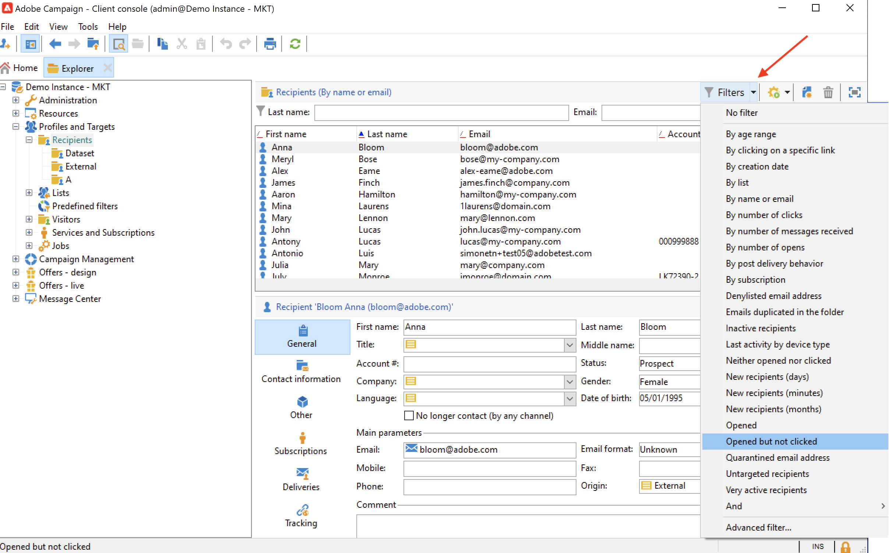
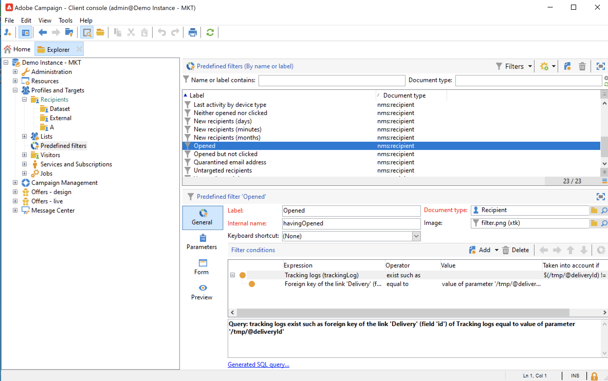
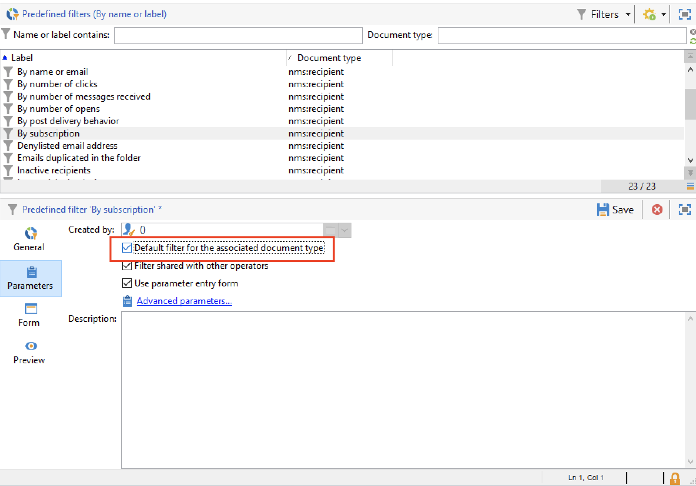
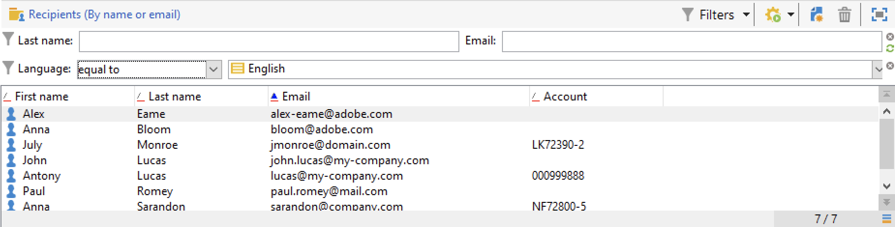
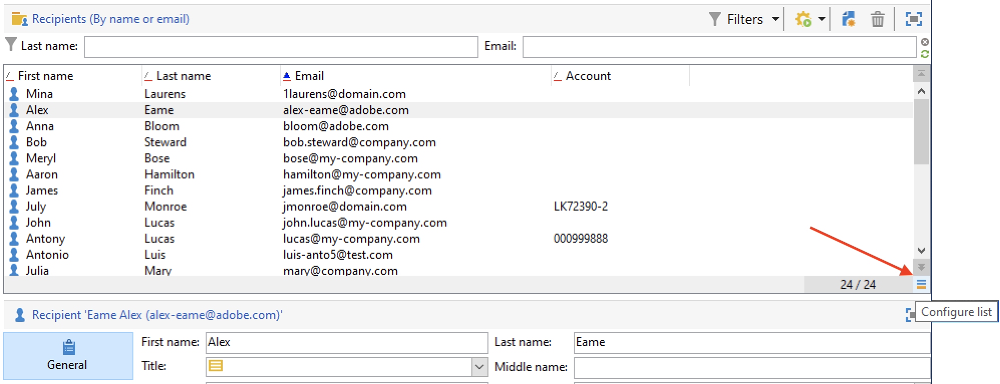
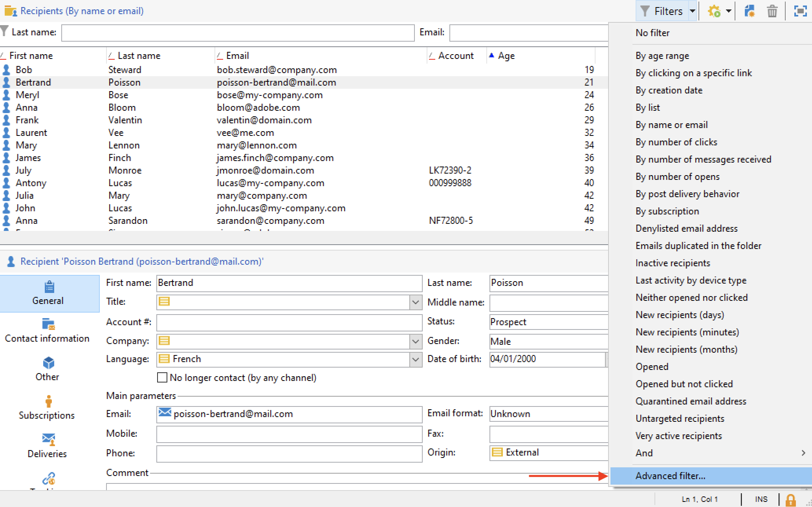
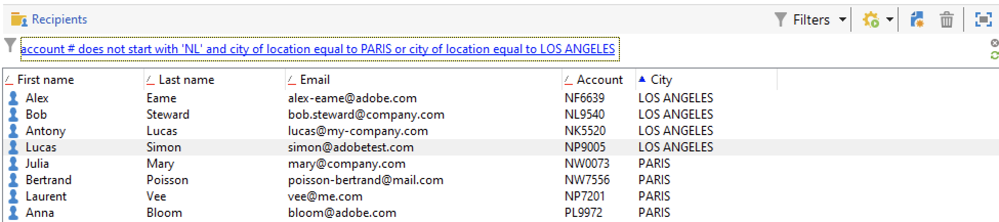

# Creare e gestire i filtri{#create-filters}

Il filtro dei dati è il processo di selezione di una parte più piccola del set di dati, solo i record che corrispondono a determinati criteri e di utilizzo di tale sottoinsieme per azioni specifiche (aggiornamenti, creazione di tipi di pubblico) o analisi.

Durante la navigazione in Campaign da **[!UICONTROL Explorer]**, i dati vengono visualizzati in elenchi. Puoi utilizzare i filtri incorporati esistenti per accedere a un sottoinsieme specifico di questi dati: indirizzi in quarantena, destinatari non mirati, un intervallo di età specifico o una data di creazione, ad esempio.

Puoi anche creare filtri personalizzati, salvarli per utilizzi futuri o condividerli con altri utenti di Campaign.

La configurazione del filtro consente di selezionare i dati da un elenco **[!UICONTROL dynamically]**: quando i dati vengono modificati, i dati filtrati vengono aggiornati.

>[!NOTE]
>
>Le impostazioni di configurazione dell’interfaccia utente sono definite localmente a livello di dispositivo. A volte può essere necessario pulire questi dati, in particolare se si verificano problemi durante l’aggiornamento dei dati. A tale scopo, utilizzare il menu **[!UICONTROL File > Clear the local cache]**.

In Adobe Campaign sono disponibili i seguenti tipi di filtro:

## Filtri preimpostati{#predefined-filters}

I filtri predefiniti sono disponibili dal pulsante **Filtri** sopra ogni elenco.

Ad esempio, per i profili, sono disponibili i seguenti filtri incorporati:

È possibile accedere ai dettagli dei filtri nel nodo **[!UICONTROL Profiles and Targets > Pre-defined filters]** di Explorer.

>[!NOTE]
>
>Per tutti gli altri elenchi di dati, i filtri predefiniti sono memorizzati nel nodo **[!UICONTROL Administration > Configuration > Predefined filters]**.

Seleziona un filtro per visualizzarne la definizione.

Utilizza l’ultima scheda per visualizzare in anteprima i dati filtrati.

I filtri predefiniti incorporati sono:

<table> 
 <tbody> 
  <tr> 
   <td> <strong>Etichetta</strong>  </td> 
   <td> <strong>Query</strong>  </td> 
  </tr> 
  <tr> 
   <td> Aperto  </td> 
   <td> Seleziona i destinatari che hanno aperto una consegna.  </td> 
  </tr> 
  <tr> 
   <td> Aperto ma non selezionato  </td> 
   <td> Seleziona i destinatari che hanno aperto una consegna ma non hanno fatto clic su un collegamento.  </td> 
  </tr> 
  <tr> 
   <td> Destinatari inattivi  </td> 
   <td> Seleziona i destinatari che non hanno aperto una consegna in X mesi.  </td> 
  </tr> 
  <tr> 
   <td> Ultima attività per tipo di dispositivo  </td> 
   <td> Seleziona i destinatari che hanno fatto clic o aperto la consegna Y utilizzando il dispositivo X negli ultimi Z giorni.  </td> 
  </tr> 
  <tr> 
   <td> Ultima attività per tipo di dispositivo (tracciamento)  </td> 
   <td> Seleziona i destinatari che hanno fatto clic o aperto la consegna Y utilizzando il dispositivo X negli ultimi Z giorni.  </td> 
  </tr> 
  <tr> 
   <td> Destinatari non assegnati  </td> 
   <td> Seleziona i destinatari che non sono mai stati oggetto di targeting tramite il canale Y in X mesi.  </td> 
  </tr> 
  <tr> 
   <td> Destinatari molto attivi  </td> 
   <td> Seleziona i destinatari che hanno fatto clic su una consegna almeno X volte negli ultimi Y mesi.  </td> 
  </tr> 
  <tr> 
 <td> Inserire nell'elenco Bloccati Indirizzo e-mail  </td> 
    <td> Seleziona i destinatari il cui indirizzo e-mail si trova nel inserisco nell'elenco Bloccati di.  </td>
  </tr> 
  <tr> 
   <td> Indirizzo e-mail in quarantena  </td> 
   <td> Seleziona i destinatari il cui indirizzo e-mail è in quarantena.  </td> 
  </tr> 
  <tr> 
   <td> Indirizzi e-mail duplicati nella cartella  </td> 
   <td> Seleziona i destinatari il cui indirizzo e-mail è duplicato nella cartella.  </td> 
  </tr> 
  <tr> 
   <td> Non ha aperto né fatto clic su  </td> 
   <td> Seleziona i destinatari che non hanno aperto o fatto clic su una consegna.  </td> 
  </tr> 
  <tr> 
   <td> Nuovi destinatari (giorni)  </td> 
   <td> Seleziona i destinatari creati negli ultimi X giorni.  </td> 
  </tr> 
  <tr> 
   <td> Nuovi destinatari (minuti)  </td> 
   <td> Seleziona i destinatari creati negli ultimi X minuti.  </td> 
  </tr> 
  <tr> 
   <td> Nuovi destinatari (mesi)  </td> 
   <td> Seleziona i destinatari creati negli ultimi X mesi.  </td> 
  </tr> 
  <tr> 
   <td> Per sottoscrizione  </td> 
   <td> Seleziona i destinatari per sottoscrizione.  </td> 
  </tr> 
  <tr> 
   <td> Facendo clic su un collegamento specifico  </td> 
   <td> Seleziona i destinatari che hanno fatto clic su un URL particolare in una consegna.  </td> 
  </tr> 
  <tr> 
   <td> Per comportamento di recapito post  </td> 
   <td> Seleziona i destinatari in base al loro comportamento dopo la ricezione di una consegna.  </td> 
  </tr> 
  <tr> 
   <td> Per data di creazione  </td> 
   <td> Seleziona i destinatari per data di creazione, in un periodo che va da X mesi (data corrente meno n mesi) a Y mesi (data corrente meno n mesi).  </td> 
  </tr> 
  <tr> 
   <td> Per elenco  </td> 
   <td> Seleziona i destinatari per elenco.  </td> 
  </tr> 
  <tr> 
   <td> Per numero di clic  </td> 
   <td> Seleziona i destinatari che hanno fatto clic su una consegna negli ultimi X mesi.  </td> 
  </tr> 
  <tr> 
   <td> Per numero di messaggi ricevuti  </td> 
   <td> Seleziona i destinatari in base al numero di messaggi ricevuti.  </td> 
  </tr> 
  <tr> 
   <td> Per numero di aperture  </td> 
   <td> Seleziona i destinatari che hanno aperto tra le consegne X e Y nel tempo Z.  </td> 
  </tr> 
  <tr> 
   <td> Per nome o e-mail  </td> 
   <td> Seleziona i destinatari in base al nome o all'indirizzo e-mail.  </td> 
  </tr> 
  <tr> 
   <td> Per fascia di età  </td> 
   <td> Seleziona i destinatari in base alla loro età.  </td> 
  </tr> 
 </tbody> 
</table>

### Filtri predefiniti{#default-filters}

I campi sopra ogni elenco ti consentono di utilizzare il **filtro predefinito** per questo elenco. Per impostazione predefinita, per l’elenco dei destinatari puoi filtrare in base al nome e all’indirizzo e-mail.

>[!NOTE]
>
>Il carattere **%** sostituisce qualsiasi stringa di caratteri. Ad esempio, immetti `%@gmail.com` nel campo E-mail per visualizzare tutti i profili con un indirizzo Gmail. Immettere `%@L` nel campo Cognome per visualizzare tutti i profili il cui cognome contiene una L.

Per modificare il filtro predefinito per un elenco di destinatari, passare al nodo **[!UICONTROL Profiles and Targets > Predefined filters]**.

Per tutti gli altri tipi di dati, configurare il filtro predefinito tramite il nodo **[!UICONTROL Administration > Configuration > Predefined filters]**.

Applica i seguenti passaggi:

1. Seleziona il filtro da utilizzare per impostazione predefinita.
1. Fare clic sulla scheda **[!UICONTROL Parameters]** e selezionare **[!UICONTROL Default filter for the associated document type]**.

   

1. Deseleziona la stessa opzione per il filtro predefinito corrente.
1. Fare clic su **[!UICONTROL Save]** per applicare il filtro.
1. Individuare la cartella Destinatario e fare clic sull&#39;icona **[!UICONTROL Remove this filter]** a destra del filtro corrente. Il nuovo filtro predefinito è disponibile.
   

## Filtri rapidi{#quick-filters}

Utilizza e combina **Filtri rapidi** per definire filtri in campi specifici.

Una volta aggiunti, i campi filtro rapido vengono visualizzati sopra l’elenco dei dati, uno dopo l’altro. Possono essere cancellati indipendentemente l&#39;uno dall&#39;altro.

I filtri rapidi sono specifici di ciascun operatore e vengono reinizializzati ogni volta che l’operatore cancella la cache della propria console client.

Se devi riutilizzare un filtro, crea un **filtro avanzato** e salvalo. [Ulteriori informazioni](#advanced-filters).

Per creare un **filtro rapido**, eseguire la procedura seguente:

1. Fare clic con il pulsante destro del mouse sul campo da filtrare e selezionare **[!UICONTROL Filter on this field]**.

   

   I campi filtro predefiniti vengono visualizzati sopra l’elenco.

   

1. Seleziona le opzioni del filtro.
1. Se necessario, utilizza l’icona grigia sul lato destro di un filtro per rimuoverlo.
1. Puoi combinare i filtri per perfezionare il filtro.

   

Se devi filtrare un campo non disponibile nel modulo, selezionalo nelle colonne e applica un filtro a tale colonna. Per eseguire questa operazione,

1. Fare clic sull&#39;icona **[!UICONTROL Configure list]**.

   

1. Selezionare la colonna da visualizzare, ad esempio l&#39;età dei destinatari, e fare clic su **Ok**.

   

1. Fare clic con il pulsante destro del mouse sulla colonna **Età** nell&#39;elenco dei destinatari e selezionare **[!UICONTROL Filter on this column]**.

   

   Puoi quindi selezionare le opzioni di filtro della pagina. Aggiungi un altro filtro nella pagina per definire un intervallo.

   

## Filtri avanzati{#advanced-filters}

Combinare criteri complessi in **Filtri avanzati**. Utilizzare questi filtri per creare una query complessa o una combinazione di query sui dati. Questi filtri possono essere salvati e condivisi con altri utenti di Campaign.

### Creare un filtro avanzato{#create-adv-filters}

Per creare un **filtro avanzato**, fare clic sul pulsante **[!UICONTROL Filters]** e selezionare **[!UICONTROL Advanced filter...]**.

È inoltre possibile fare clic con il pulsante destro del mouse sull&#39;elenco dei dati e selezionare **[!UICONTROL Advanced filter...]**.

Definisci le condizioni di filtro. Nell’esempio seguente, filtrerai in base ai destinatari il cui numero di account non inizia con NL e che vivono a Parigi o Los Angeles.

1. Fare clic sull&#39;icona **[!UICONTROL Edit expression]** della colonna **[!UICONTROL Expression]**.

   

1. Seleziona il campo su cui filtrare.
1. Seleziona l’operatore da applicare dall’elenco a discesa.

   

1. Selezionare un valore previsto dalla colonna **[!UICONTROL Value]**. Puoi combinare diversi filtri per perfezionare la query. Per aggiungere una condizione di filtro, fare clic su **[!UICONTROL Add]**.

   

   >[!NOTE]
   >
   >È possibile assegnare una gerarchia alle espressioni o modificare l’ordine delle espressioni di query utilizzando le frecce della barra degli strumenti.

1. Per combinare le espressioni sono disponibili tre operatori: **And**, **Or**, **Except**. Fare clic sulla freccia per passare a **Or**.

   

1. Fare clic su **[!UICONTROL Ok]** per creare il filtro e applicarlo all&#39;elenco corrente.

Il filtro applicato viene visualizzato sopra l’elenco.

Per modificare o modificare questo filtro, fai clic sul relativo collegamento di descrizione in blu, sopra l’elenco.

### Salvare un filtro avanzato{#save-adv-filters}

Puoi salvare un filtro avanzato come [filtro predefinito](#predefined-filters), in modo da poterlo riutilizzare e condividerlo con gli altri utenti di Campaign.

Per salvare un filtro avanzato, effettua le seguenti operazioni:

1. Fai clic sulla descrizione del filtro per modificarlo.
1. Fare clic sull&#39;icona **[!UICONTROL Save as filter]** nella parte superiore destra della finestra.

   

1. Immettere un nome per il filtro e salvarlo.

   

Filtro aggiunto ai [filtri predefiniti](#predefined-filters). Può essere aggiornato da questo nodo.

>[!NOTE]
>
>È possibile aggiungere una scelta rapida per il filtro per attivarlo dalla tastiera.

Questo filtro è disponibile anche dai filtri predefiniti dell’elenco dei destinatari.

### Utilizzare un filtro per definire un segmento {#filter-as-segment}

Puoi utilizzare e combinare i filtri per creare un segmento di popolazione target.

Una volta salvati, i filtri avanzati sono disponibili quando si seleziona la popolazione target di un messaggio, nella sezione **[!UICONTROL User filters]**.

>[!NOTE]
>
>Utilizzare **[!UICONTROL Exclude recipients from this segment]** per eseguire il targeting solo dei contatti che non corrispondono ai criteri di filtro.

### Utilizzare le funzioni per creare filtri avanzati{#use-functions-adv-filters}

Per eseguire funzionalità di filtro avanzate, utilizza le funzioni per definire il contenuto del filtro. L’editor di filtri avanzato sfrutta tutte le funzionalità dell’editor di query di Campaign.

Scopri come creare query avanzate in questi esempi end-to-end:

* Scopri come eseguire il targeting sugli attributi dei destinatari semplici in [questa pagina](https://experienceleague.adobe.com/docs/campaign/automation/workflows/wf-activities/targeting-activities/query.html?lang=it){target="_blank"}.
* Scopri come filtrare i destinatari non contattati negli ultimi 7 giorni in [questa pagina](https://experienceleague.adobe.com/docs/campaign/automation/workflows/use-cases/designing-queries/query-many-to-many-relationship.html?lang=it){target="_blank"}.
* Scopri come ripristinare l&#39;elenco degli operatori filtrabile per account attivi in [questa pagina](https://experienceleague.adobe.com/docs/campaign/automation/workflows/use-cases/designing-queries/create-a-filter.html?lang=it){target="_blank"}.
* Scopri come creare un pubblico di e-mail di compleanno in [questa pagina](https://experienceleague.adobe.com/docs/campaign/automation/workflows/use-cases/deliveries/send-a-birthday-email.html?lang=it){target="_blank"}.

### Parametri avanzati per filtri predefiniti {#param-for-data-filters}

Per i filtri predefiniti sono disponibili parametri avanzati. Per accedervi, passare alla scheda **[!UICONTROL Parameters]** del filtro.

* Per visualizzare il filtro predefinito per tutti gli elenchi basati su questo tipo di documento, selezionare l&#39;opzione **[!UICONTROL Default filter for the associated document type]**.

  Ad esempio, il filtro **[!UICONTROL By name or login]** viene applicato agli operatori Questa opzione è selezionata, quindi il filtro viene sempre visualizzato in tutti gli elenchi di operatori.

* Per rendere disponibile un filtro per tutti gli operatori di Campaign, selezionare l&#39;opzione **[!UICONTROL Filter shared with other operators]**.

* Per definire un modulo per la selezione dei criteri di filtro, selezionare l&#39;opzione **[!UICONTROL Use parameter entry form]**. Il modulo deve essere immesso in formato XML nella scheda **[!UICONTROL Form]**. Ad esempio, il filtro predefinito incorporato **[!UICONTROL Recipients who have opened]**, disponibile nell&#39;elenco dei destinatari, visualizza un campo filtro che consente di selezionare la consegna a cui si applica il filtro.

* Il collegamento **[!UICONTROL Advanced parameters]** consente di definire impostazioni aggiuntive.

   * È possibile associare una tabella SQL al filtro per renderla comune a tutti gli editor che la condividono.
   * Per impedire a qualsiasi utente di ignorare il filtro, selezionare l&#39;opzione **[!UICONTROL Do not restrict the filter]**. Ad esempio, questa opzione è attiva per i filtri &quot;Destinatari di una consegna&quot; e &quot;Destinatari delle consegne appartenenti a una cartella&quot;, disponibili nella consegna guidata. Questi filtri non possono essere sovraccaricati.
