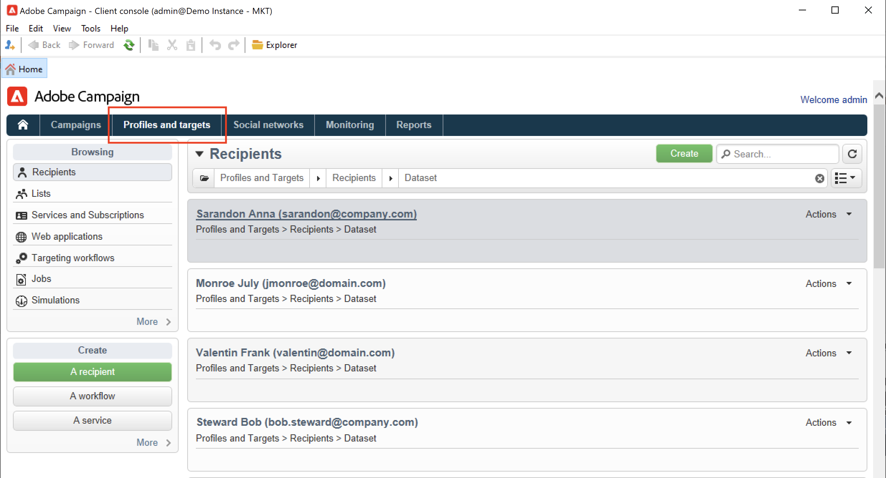

# Creare i profili manualmente{#create-profiles-manual}

Per popolare il database di Campaign, puoi [importare i profili](import-profiles.md) oppure aggiungerli manualmente come descritto di seguito.

Per creare manualmente un destinatario, effettua le seguenti operazioni:

1. Sfoglia per **[!UICONTROL Profiles and targets]** e seleziona la scheda **[!UICONTROL Recipients]** categoria.

   

   Per impostazione predefinita, i destinatari sono memorizzati in **[!UICONTROL Profiles and Targets > Recipients]** dell&#39;albero. Puoi anche creare i destinatari da questa vista.

1. Fai clic su **[!UICONTROL Create button]**.
1. Immetti i dati del profilo.

   

   Ulteriori informazioni sul modulo integrato del destinatario in [questa pagina](view-profiles.md#edit-a-profiles).

1. Clic **[!UICONTROL Save]**: il profilo viene aggiunto a Campaign, nella cartella dei destinatari predefinita.
