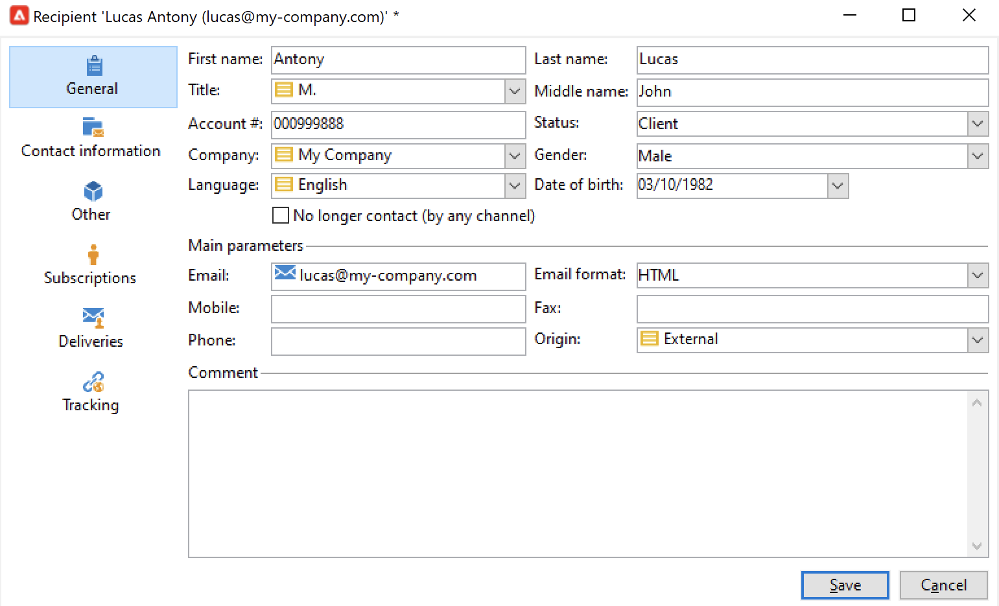

# Creare i profili manualmente{#create-profiles-manual}

Per popolare il database di Campaign, puoi [importare profili](import-profiles.md) o aggiungerli manualmente come descritto di seguito.

Per creare manualmente un destinatario, effettua le seguenti operazioni:

1. Passare alla scheda **[!UICONTROL Profiles and targets]** e selezionare la categoria **[!UICONTROL Recipients]**.

   

   Per impostazione predefinita, i destinatari sono archiviati nel nodo **[!UICONTROL Profiles and Targets > Recipients]** della struttura. Puoi anche creare i destinatari da questa vista.

1. Fare clic su **[!UICONTROL Create button]**.
1. Immetti i dati del profilo.

   

   Ulteriori informazioni sul modulo predefinito del destinatario in [questa pagina](view-profiles.md#edit-a-profiles).

1. Fare clic su **[!UICONTROL Save]**: il profilo viene aggiunto a Campaign, nella cartella dei destinatari predefinita.
